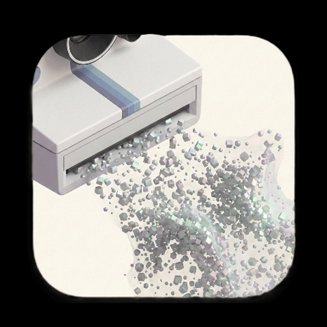

<div align="center">




# BrainDance | 流光 · 记

**“物理世界注定走向无序，而我们在比特世界重建永恒。”**

面向空间记忆的三维语义引擎与检索系统。

[English](./README.en.md) | [简体中文](README.md)

### 从采集到检索的三维记忆链路

#### An Anti-Entropy Engine for Human Memory

         

</div>

## 项目概述 (Overview)

**BrainDance (流光 · 记)** 是一个把真实空间保存为可浏览、可检索、可回访数字资产的项目。

它的出发点很简单：照片和视频能留下画面，但很难保住空间感。一个房间怎么摆、一个街角从哪看过去、某件东西当时放在什么位置，这些信息在 2D 媒介里通常会被压缩掉。

BrainDance 用 **3D Gaussian Splatting (高斯泼溅)** 等技术把真实场景重建成三维资产，再接入 **Multimodal AI (多模态大模型)** 与 **RAG (检索增强生成)**，让这些场景不只是“能看”，还可以被搜索、定位和回溯。可以把它理解成一个面向现实空间的记忆索引系统。

### 核心特性

- **📷 低门槛采集**：用手机视频或图片就能发起空间采集，重建计算放在云端完成。
- **🔍 空间语义检索**：结合多模态理解、向量检索和空间锚点，在三维场景里查找物体、位置和相关视角。
- **⏳ 时间维度回看**：围绕同一空间的多次扫描结果，比较不同时间下的变化。
- **📱 Marker AR 叠加**：基于打印纸板图像识别（MindAR），将 3DGS 重建的三维模型锚定到真实环境中，支持缩放、旋转和高度调节，在移动端 WebView 内完成完整 AR 交互。
- **☁️ 端云协同链路**：移动端负责采集与查看，Supabase 和 AI Worker 负责存储、调度与重建处理。

### 技术栈速览

**前端与交互**

        

**云服务与数据**

    

**AI 与三维重建**

      

## 为什么做这个项目

BrainDance 面向的是一个很具体的移动端问题：手机已经能高频记录生活，但现有记录方式大多停留在照片、视频和文字层面，真正和空间有关的信息很难被保存和再次利用。

照片和视频当然有价值，但它们记录的大多只是某个角度下的一帧。过几年再回看，你可能还记得画面，却很难重新找回那个空间本身的尺度、方向、布局，以及某件物品具体放在哪里。

我们希望把这件事做成一个真正能在手机场景里使用的应用链路：用户在移动端完成采集，云端完成三维重建与语义理解，再把结果返回到移动端和 Web 端进行浏览、检索和回看。项目使用 **3D Gaussian Splatting (高斯泼溅)**、**Multimodal AI (多模态大模型)** 和 **RAG (检索增强生成)**，目标不是单纯生成一个 3D 模型，而是把现实空间整理成可检索、可定位、可追溯的数字记忆资产。

## 应用价值：个人记忆、公共档案与长期留存

结合比赛强调的移动端创新、真实场景和落地能力，BrainDance 当前主要面向三类场景：

### 1. 微观尺度 (The Micro Scale)

- **个人见证 (Spatial Journal)**：
  - 比如毕业离开住了 4 年的宿舍，或者搬离住过很久的出租屋，用户可以在离开前用手机完成一次采集，把整个空间保存下来，之后再回看时看到的不只是一张照片，而是一个还能重新进入和检索的场景。
- **医疗辅助 (The Cure)**：
  - 在阿尔茨海默症等记忆障碍场景里，空间回访可能比平面照片更接近人对熟悉环境的真实感受，这类能力也更符合移动端随时采集、随时调取的使用方式。

### 2. 宏观尺度 (The Macro Scale)

- **众包档案馆 (Crowd-Sourced Archive)**：
  - 如果能持续汇聚用户扫描数据，就有机会把正在消失的街区、店铺和建筑保留下来，形成可进入、可浏览、可检索的三维档案。
- **集体记忆 (Collective Memory)**：
  - 这样留下来的内容，不只是文字和图片，而是后续可以真正走进去看、并支持语义检索的空间材料。

### 3. 时间尺度 (The Temporal Scale)

- **数字底片 (The Digital Negative)**：
  - 2D 视频的展示方式很容易过时，但空间资产可以随着终端能力提升继续被重新渲染，在后续设备上仍有复用价值。
- **面向未来 (Future-Proof)**：
  - 今天保存下来的不只是影像文件，也可能是未来 XR 设备仍然可以继续使用的空间数据。这让项目具备了从手机应用延展到空间计算场景的潜力。

## 核心能力与创新点

### 空间 RAG：像搜索文字一样搜索现实

对 BrainDance 来说，三维重建不是终点。更关键的是把场景里的物体、位置和时间信息整理成可检索的数据，让用户可以像搜索文字一样搜索现实空间。接入 **Multimodal LLM (多模态大语言模型)** 后，用户不需要手动翻看每个场景，而是可以直接用自然语言发起查询。

- **User Query**: "爷爷留下的那块怀表在哪？"
- **System Action**: 语义理解 -> 空间索引匹配 -> 摄像机自动飞越 -> **显示最相关的空间位置与视角**

### 时光剥离：在同一空间里回看不同时间

BrainDance 不只想记录一个静态场景，也想记录同一空间在不同时间下的变化。对于房间布置、成长记录、装修过程和城市更新这类场景，在同一坐标系里对比前后变化，往往比按时间顺序翻照片更直观。

### Agent Recall：把检索升级成可解释的多轮空间助理

当前仓库已经在 `supabase/functions/agent-recall` 上落地统一 Agent 入口，并把核心编排能力收敛到共享
Core `supabase/functions/_shared/agent-core/spatialAgent.ts`。这条链路不再只返回“搜到了什么”，而是会根据查询在多种模式之间路由，并把结构化结果直接交给 Flutter Recall 页消费。

- **统一入口与共享 Core**：`agent-recall`、`spatial-search-agent` 共享同一套 Agent Core，避免协议和能力散落在多个函数里。
- **多模式能力**：当前已覆盖 `spatial_search`、`asset_metadata`、`time_compare`、`creative`、`memory_graph` 五类模式。
- **稳定动作协议**：正式前端动作已经统一为 `open_scene`、`fly_to_pose`，降低 Flutter / Viewer 接口漂移。
- **多轮续聊与预览确认**：返回 `session_state`、`conversation_summary`、`follow_up`，支持“先预览，再确认执行”的资产写操作闭环。
- **流式过程可视化**：`agent-recall` 已支持 `text/event-stream` 与 `application/x-ndjson`，Recall 页会展示状态、工具调用和最终结果时间线。

### 技术亮点

- **移动端轻采集，云端重计算**：用户在手机端完成视频或图片采集，计算密集型重建任务放在 GPU Worker 执行，更符合移动应用的性能边界。
- **从 3D 重建走向 3D 检索**：项目不只生成三维模型，还把场景理解、对象标注和向量检索整合进链路，形成可查询的空间记忆系统。
- **从检索接口走向 Agent 编排**：在 `search-models` 之上新增 LangChain / Agent 统一入口，把空间检索、资产整理、时间对比、创作准备与弱图谱摘要纳入同一协议。
- **从桌面 3D 走向 AR/VR 沉浸式查看**：新增独立 VR 渲染端 `vr-3dgs-viewer`，基于 WebXR 标准，支持 Desktop / Stereo / WebXR 三种预览模式，可在 SteamVR 头显（PICO Neo 2 等）中完成手柄抓取缩放、HUD 操作、导航点跳转、标记查看与空间测量等全链路 VR 交互；新增 Marker AR 模式（`spark-3dgs-viewer`），基于 MindAR 图像识别与 Spark 3DGS 渲染，通过打印纸板将重建模型锚定到真实环境，支持智能主后置摄像头选择、实时 AR 变换控制（缩放 / 旋转 / 偏移）和 Flutter WebView 摄像头权限桥接。
- **端云协同的完整闭环**：从素材上传、任务调度、状态回传，到模型浏览和语义搜索，当前仓库已经覆盖完整的软件链路，而不是单点算法演示。
- **支持多种重建流水线**：除了常规 `video_3dgs`，还接入了 `single_image_sam3d`、`single_image_sharp`、`da3_sugar`、`da3_2dgs`、`sparse2dgs` 等任务类型，便于根据不同输入场景切换方案。

## 技术架构与实现 (Technical Architecture)

本项目采用 **Supabase BaaS 架构**，实现了从移动端采集到云端重建，再到多端检索与浏览的端云协同流程。

### 🧪 基于知识蒸馏的端侧“近极低幻觉”大模型引擎

为了在移动端极为有限的算力下实现完全断网、隐私安全的空间检索，项目放弃了传统的云端黑盒大模型 API 路径，自主完成了端侧小模型（Qwen3-1.7B）的全链路针对性微调与量化落地：

- **Teacher-Student 知识蒸馏**：利用超大模型（GPT-5.4 级）强大的逻辑能力，离线生成涵盖困难样本（如局部命中、完全无关语境）的合成数据集。通过 LoRA 流水线有监督微调（SFT）将强对齐规则注入小模型，让其在极受限算力下实现**极高可靠性**的指令遵循与“极低幻觉”控制拒答。
- **低比特量化与重要性矩阵 (imatrix) 保真**：在 GGUF 跨平台格式之上，创造性引入 `imatrix` 激活分布校准，将 3.3GB 模型极限压缩至 1.2GB（Q5_K_M，适配 OPPO 等主流设备常驻内存），同时在严格多源回归评测中，使实体召回等关键指标对比全量基线仅衰退不到 1%，达到了“体积与智商”的平衡。
- **端侧多重约束路由机制**：融合大模型能力与确定性工程，构筑了意图格式化（Formatters）与字面量兜底（Lexical Fallback）等双保险模块。

> 完整的模型探索、蒸馏微调流程、严格无泄露 OOD 基准测试，以及由于量化评估诞生的 Part 1 到 Part 30 全面技术演进记录，请参阅 [`docs/04-本地问答与微调/`](docs/04-本地问答与微调/) 记录架构文档与其对应的 `ai_engine/finetune_qwen3/` 工程模块。

系统当前由四个核心部分组成，并通过 **Supabase** 做任务、数据和状态解耦：

1. **Client (Flutter)**  
   负责素材采集、上传、任务创建、状态查看与模型浏览。客户端直接连接 Supabase Storage / DB，并通过 Realtime 获取任务进度，是整条用户链路的交互入口。

2. **Backend as a Service (Supabase)**  
   提供 PostgreSQL、Storage、Auth、Realtime 与 Edge Functions：
   - **PostgreSQL + pgvector**：存储任务、资产与语义向量。
   - **业务表**：当前主链路依赖 `processing_tasks`、`model_assets`、`memory_poses`、`community_posts`、`worker_nodes`。
   - **Storage**：统一管理原始素材、缩略图、模型文件和相关输出。
   - **Realtime**：为移动端与 Dashboard 提供状态同步。
   - **RLS**：基于数据库策略控制用户资产访问权限，并为 Dashboard 提供只读读表策略。

3. **Edge Functions (Deno)**  
   当前仓库已不只包含基础搜索函数，还形成了“基础检索 + 统一 Agent 入口 + 实验入口”的分层：
   - `supabase/functions/search-models`：基础语义搜索能力，负责 Embedding、时间解析与向量检索。
   - `supabase/functions/agent-recall`：正式统一入口，负责多模式路由、流式事件输出、稳定动作协议与前端会话状态。
   - `supabase/functions/spatial-search-agent`：LangChain / Agent 实验入口，复用共享 Core。
   - `supabase/functions/time-compare-agent`：面向双时间窗口的专用时间对比能力。

4. **AI Worker (Python)**  
   部署在 Linux / WSL GPU 节点，监听 `processing_tasks`，根据 `task_type` 执行不同流水线，上传结果并回写日志、评分、标签和资产信息，承担项目主要的 AI 和 3D 重建计算。

### 当前已接入的主要任务类型

- `video_3dgs`
- `multi_image`
- `single_image_sam3d`
- `single_image_sharp`
- `da3_feed_forward_3dgs`
- `da3_sugar` / `da3+sugar`
- `da3_2dgs` / `da3+2dgs`
- `sparse2dgs`

## 系统组成 (Project Structure)

本项目采用 **Monorepo** 结构，把移动端、云服务、AI 引擎和可视化工具放在同一仓库中，方便统一开发、联调和演示：

```text
BrainDance/
├── app/                  # [Flutter] 移动端客户端
│   ├── lib/              #   - 登录、录制、Recall、Community、设置等页面与服务
│   ├── assets/           #   - 图标、字体、内置 WebGL 资源
│   └── pubspec.yaml      #   - Flutter 依赖定义
│
├── ai_engine/            # [Python] 核心算法引擎
│   ├── 3dgs/             #   - GPU Worker 与 3D/2D 重建流水线
│   │   ├── src/core/     #       - Worker、工厂、主流程
│   │   ├── src/pipelines/#       - 各类 Pipeline 实现
│   │   ├── src/libs/     #       - nerfstudio / SuGaR / SHARP 等子模块
│   │   ├── tests/        #       - 测试脚本
│   │   ├── requirements.txt
│   │   └── main.py
│   ├── demo/             #   - 演示脚本与实验代码
│   └── finetune_qwen3/   #   - Qwen3 本地问答微调、量化、评测与部署候选验证
│
├── supabase/             # [BaaS] 本地后端基础设施
│   ├── migrations/       #   - SQL 迁移
│   ├── functions/        #   - Edge Functions
│   │   ├── search-models/#       - 基础语义搜索函数
│   │   ├── agent-recall/#        - 统一 Agent Recall 入口
│   │   ├── spatial-search-agent/# - LangChain 试验入口
│   │   ├── time-compare-agent/#  - 双时间窗口对比
│   │   └── _shared/agent-core/#  - 共享 Agent Core 与工具
│   ├── config.toml
│   └── README.md
│
├── dashboard/            # [Vue 3 + Vite] 系统状态看板
│   ├── src/              #   - Dashboard 前端代码
│   ├── .env.example      #   - 环境变量模板
│   └── package.json
│
├── 3dgs_viewer/          # [Tools] 3DGS 查看器与辅助工具
│   ├── my-3dgs-viewer/   #   - Vue 3 桌面端 3DGS 查看器（自由/轨道/电影模式）
│   ├── spark-3dgs-viewer/#   - Spark 查看器前端（含 Marker AR 纸板锚定模式）
│   └── *.py              #   - 位姿导出、图片同步、标签等辅助脚本
├── vr-3dgs-viewer/       # [VR] Vue 3 VR 查看器（Desktop/Stereo/WebXR 三模式）
├── docs/                 # [Doc] 项目文档与技术报告
└── README.md
```

这套结构对应的是一条完整的软件链路，而不是单一算法仓库：`app/` 负责采集与交互，`supabase/` 负责存储和任务流转，`ai_engine/` 负责重建与理解，`dashboard/` 和 `3dgs_viewer/` 负责观测、调试和展示。

## 快速开始 (Quick Start)

### 环境要求 (Prerequisites)

- **AI Engine**: NVIDIA GPU，CUDA 12.8，Python 3.10+
- **Hardware**: 具体显卡、CPU 与内存要求见下方“测试环境”
- **Infrastructure**: Docker, Supabase CLI
- **Client**: Flutter SDK, Android Studio / Xcode
- **Dashboard**: Node.js 18+

### 最短启动路径

如果只想快速跑通主链路，按下面的顺序启动即可：

1. 在 `supabase/` 中运行本地服务。
2. 在 `ai_engine/3dgs/` 中启动 Worker。
3. 在 `dashboard/` 中启动状态看板。
4. 在 `app/` 中启动移动端应用并创建任务。

### 测试环境 (Testing Environment)

#### 移动端测试设备

- **OPPO Find X8**
- **OPPO Reno 14**

#### 服务器配置

- **当前 AI Engine 测试/推荐服务器（本机，2026-03-09 实测）**
- **CPU**: Intel Xeon Platinum 8260 × 2（双路，96 线程）
- **内存**: 503GiB（约 512GB）
- **显卡**: NVIDIA L20 46GB × 2（双卡）
- **操作系统**: Ubuntu 22.04.5 LTS（Kernel 6.8.0-100-generic）

**AI Engine 最低配置（兼容基线）**
- **CPU**: Intel Core i5-14600KF
- **内存**: 64GB RAM
- **显卡**: NVIDIA RTX 5070 12GB

### 启动步骤 (Runbook)

#### 0. 获取完整代码（含子模块与 LFS）

```bash
git lfs install
git clone --recurse-submodules https://github.com/tianxingleo/BrainDance.git
cd BrainDance
git lfs pull
git submodule foreach --recursive 'git lfs pull || true'
```

#### 1. 启动基础设施 (Supabase Local)

```bash
cd supabase
supabase start
```

启动后记下：

- `API URL`
- `anon key`
- `service_role key`

#### 2. 启动计算引擎 (AI Worker)

```bash
conda create -n braindance python=3.10
conda activate braindance
cd ai_engine/3dgs
pip install -r requirements.txt
pip uninstall -y nerfstudio
pip install -e src/libs/nerfstudio
python main.py
```

如需本地调试单个视频：

```bash
cd ai_engine/3dgs
python main.py /path/to/video.mp4
```

#### 3. 启动 Dashboard

先在 `dashboard/.env` 中配置：

```env
VITE_SUPABASE_URL=http://127.0.0.1:54321
VITE_SUPABASE_ANON_KEY=YOUR_SUPABASE_ANON_KEY
VITE_STORAGE_BUCKETS=braindance-assets
VITE_SUPABASE_EDGE_FUNCTIONS=search-models,agent-recall,spatial-search-agent,time-compare-agent,test-timeout
```

然后运行：

```bash
cd dashboard
npm install
npm run dev
```

#### 4. 启动 VR 查看器（可选）

VR 查看器是独立 Vue 3 前端，支持 Desktop / Stereo / WebXR 三种模式：

```bash
cd vr-3dgs-viewer
npm install
npm run dev
```

日常调试可打开 `https://127.0.0.1:5174/?preview=desktop` 先在普通屏幕上确认模型加载与朝向。启动 SteamVR 后，用 PC Chrome / Edge 打开 `https://127.0.0.1:5174/?preview=webxr`，点击 `Enter VR` 进入沉浸式查看。真实模型建议通过 `payload=<encoded-json>` 传入 `ply / poses / sceneId`。

桌面端查看器：

```bash
cd 3dgs_viewer/my-3dgs-viewer
npm install
npm run dev
```

##### Marker AR 模式（可选）

Marker AR 模式基于 MindAR 图像识别，将 3DGS 模型通过打印纸板锚定到真实环境中。该模式集成在 `spark-3dgs-viewer` 内，通过 URL 参数 `mode=marker-ar` 激活：


移动端 Flutter 应用中，可在模型查看页面右上角点击 AR 按钮一键切换到 Marker AR 模式，系统会自动请求摄像头权限并通过 WebView 加载 AR 场景。

使用前需准备：

1. 生成 MindAR 目标描述文件（`.mind`），放入 `public/targets/`
2. 打印对应的目标纸板图像
3. 在移动端打开模型查看器，切换到 Marker AR 模式后对准纸板

#### 5. 启动移动端 (App)

在 `app/.env` 中填入客户端所需的 Supabase 配置后运行：

```bash
cd app
flutter pub get
flutter run
```

当前移动端主链路已经包括：

- 登录与会话管理
- 视频上传与任务创建
- 任务状态页
- Recall 资产页
- 基于 WebView 的移动端 WebGL 模型查看
- Marker AR 纸板锚定模式（一键切换，自动请求摄像头权限）
- `agent-recall` 驱动的 Agent 检索、多轮续聊与流式步骤面板
- 端侧本地问答模型下载、选择与受约束问答

如需单独验证搜索 / Agent 链路，可分别在本地启动以下函数：

```bash
cd supabase/functions/search-models
supabase functions serve search-models --no-verify-jwt --env-file .env.local
```

```bash
cd supabase/functions/agent-recall
supabase functions serve agent-recall --no-verify-jwt
```

搜索接口的测试方法见 [tests/README.md](/ltx-data/BrainDance/tests/README.md)。

## 数据流与存储约定

Storage 目前分成两个主要 bucket：

- `braindance-assets`：3D 生成任务的原始素材、中间结果和输出模型
- `braindance-models`：Flutter Recall 本地 AI 下载用的端侧模型发布仓

`braindance-assets` 常见路径约定如下：

```text
{user_id}/{scene_id}/raw/video.mp4
{user_id}/{scene_id}/raw/image.png
{user_id}/{scene_id}/raw/images.zip
{user_id}/{scene_id}/raw/thumbnail.jpg

{user_id}/{scene_id}/output/point_cloud.ply
{user_id}/{scene_id}/output/point_cloud.splat
{user_id}/{scene_id}/output/point_cloud.ksplat
{user_id}/{scene_id}/output/transforms.json
```

`braindance-models` 当前约定如下：

```text
catalog/model_catalog.json

releases/qwen3-1.7b-braindance-q5-k-m-imatrix.gguf
releases/qwen3-1.7b-braindance-q5-k-m.gguf
releases/qwen3-1.7b-braindance-q4-k-m.gguf
releases/qwen3-1.7b-braindance-merged/*
releases/qwen3-0.6b-braindance-round1/*
```

其中 Flutter Recall 本地 AI 默认下载地址当前指向：

```text
{Supabase_URL}/storage/v1/object/public/braindance-models/releases/qwen3-1.7b-braindance-q5-k-m-imatrix.gguf
```

数据库中的关键表包括：

- `processing_tasks`：任务状态、日志、质量分数、任务类型、参数与 `display_name`
- `model_assets`：模型路径、描述、标签、对象、Embedding，以及 `place_id`、`memory_thread_id`、`summary_title`、`agent_meta` 等 Agent 辅助字段
- `memory_poses`：帧级空间锚点与向量
- `related_model_links`：模型间弱关系，如同地点、同事件、前后变化
- `memory_collections` / `memory_collection_items`：记忆专题、时间线与集合成员
- `community_posts`：社区贴文与地理位置索引
- `worker_nodes`：Worker 注册、心跳与控制状态

## 语义搜索与 Agent 编排

当前仓库已包含 `supabase/functions/search-models`，用于承载自然语言搜索接口。它主要负责：

1. 解析自然语言中的检索目标与时间条件。
2. 调用 Embedding 接口生成向量。
3. 通过 `pgvector` 与数据库函数检索相关场景和空间锚点。

在此基础上，`supabase/functions/agent-recall` 已进一步把检索能力升级为统一 Agent 入口：

1. 统一路由 `spatial_search`、`asset_metadata`、`time_compare`、`creative`、`memory_graph` 多种模式。
2. 输出稳定结构 `answer + evidence + actions + top_candidates + tool_trace`。
3. 支持 `selectedModelIds`、`executionMode`、`sessionState`、`conversationSummary` 等上下文参数。
4. 支持 `SSE / NDJSON` 流式协议，便于 Flutter 展示过程态与最终答案。
5. 通过 `follow_up` 和 `session_state` 支持多轮续聊、候选确认和写操作预览重放。

本地运行示例：

```bash
cd supabase/functions/search-models
supabase functions serve search-models --no-verify-jwt --env-file .env.local
```

## 文档导航 (Documentation)

如果你是第一次接触这个项目，建议按下面的顺序阅读：

- 入门与部署：[docs/01-入门指南/快速开始.md](./docs/01-入门指南/快速开始.md)、[docs/01-入门指南/本地部署.md](./docs/01-入门指南/本地部署.md)
- 后端与基础设施：[supabase/README.md](./supabase/README.md)
- LangChain / Agent 专题：[docs/09-LangChain专题/README.md](./docs/09-LangChain专题/README.md)、[docs/09-LangChain专题/LangChain实现现状-2026-03-26.md](./docs/09-LangChain专题/LangChain实现现状-2026-03-26.md)
- AI 引擎与重建流水线：[ai_engine/3dgs/README.md](./ai_engine/3dgs/README.md)
- 第三方依赖与引用：[ai_engine/3dgs/THIRD_PARTY_ATTRIBUTIONS.md](./ai_engine/3dgs/THIRD_PARTY_ATTRIBUTIONS.md)
- 项目设计文档：[docs/02-架构设计/项目架构.md](./docs/02-架构设计/项目架构.md)

## 参考与致谢 (Acknowledgements)

BrainDance 的三维重建与语义理解能力建立在多个优秀开源项目和研究工作的基础上。这里保留项目级简版致谢，详细论文引用、许可证与上游说明见 [`ai_engine/3dgs/THIRD_PARTY_ATTRIBUTIONS.md`](./ai_engine/3dgs/THIRD_PARTY_ATTRIBUTIONS.md)。

### 核心算法与三维重建

- [Nerfstudio](https://github.com/nerfstudio-project/nerfstudio) - 模块化 NeRF / 3DGS 训练框架，本项目训练管线基于 `splatfacto` 模型修改
- [gsplat](https://github.com/nerfstudio-project/gsplat) - 超快 CUDA 光栅化后端，为云端训练提供性能保障
- [3D Gaussian Splatting (Inria)](https://github.com/graphdeco-inria/gaussian-splatting) - Inria 原始论文实现，奠定 3DGS 理论基础
- [2D Gaussian Splatting](https://github.com/hbb1/2d-gaussian-splatting) - 2DGS 表达与几何重建
- [Sparse2DGS](https://github.com/Wuuu3511/Sparse2DGS) - 稀疏视角下的 2DGS 重建
- [SuGaR](https://github.com/Anttwo/SuGaR) - 面向网格提取与精修的 Gaussian 表达
- [Depth Anything 3](https://github.com/ByteDance-Seed/Depth-Anything-3) - 深度估计与视图空间恢复
- [SHARP](https://github.com/apple/ml-sharp) - Apple 单图快速视图合成与 Gaussian 生成
- [SAM 3D Objects](https://github.com/facebookresearch/sam-3d-objects) - 单图 / 少图 3D 物体生成
- [MoGe (Microsoft)](https://github.com/microsoft/MoGe) - 单目几何估计，SAM 3D Objects 的深度后端
- [COLMAP](https://colmap.github.io/) - 结构化运动恢复 (SfM)，Nerfstudio 训练管线的前置依赖
- [GLOMAP](https://github.com/colmap/glomap) - 全局 SfM 重建
- [PyTorch](https://github.com/pytorch/pytorch) - 深度学习框架，AI 引擎的基础
- [Ultralytics YOLO](https://github.com/ultralytics/ultralytics) - 目标检测与图像分割

### Web 渲染与查看器

- [Three.js](https://github.com/mrdoob/three.js) - WebGL 3D 渲染引擎，所有 Web 查看器的基础
- [GaussianSplats3D (mkkellogg)](https://github.com/mkkellogg/GaussianSplats3D) - 基于 Three.js 的 Web 3DGS 查看器，移动端 WebView 渲染的灵感来源
- [Spark (@sparkjsdev)](https://github.com/sparkjsdev/spark) - 3DGS Web 渲染引擎
- [antimatter15/splat](https://github.com/antimatter15/splat) - 优秀的 WebGL 3DGS 实现，早期概念参考
- [MindAR.js](https://github.com/hiukim/mind-ar-js) - Web AR 图像识别与跟踪
- [GSAP](https://gsap.com/) - 专业级 Web 动画库
- [MediaPipe (Google)](https://github.com/google-ai-edge/mediapipe) - 视觉任务处理（手势识别等）

### 基础设施与 AI 服务

- [Supabase](https://github.com/supabase/supabase) - Auth、Storage、Realtime 与 Edge Functions 基础设施
- [pgvector](https://github.com/pgvector/pgvector) - PostgreSQL 向量扩展，为项目提供高性能 RAG 检索能力
- [LangChain](https://github.com/langchain-ai/langchain) - Agent 编排框架，项目后端智能路由与工具调用的核心
- [OpenAI API](https://github.com/openai/openai-python) - LLM API 服务
- [Qwen-VL](https://github.com/QwenLM/Qwen-VL) - 通义千问多模态大模型，为 3D 场景提供自动标签与描述能力
- [DashScope (阿里云)](https://help.aliyun.com/dashscope) - 通义千问模型服务
- [Deno](https://github.com/denoland/deno) - Supabase Edge Functions 运行时

### 移动端与前端

- [Flutter](https://github.com/flutter/flutter) - 移动端跨平台框架
- [Vue.js](https://github.com/vuejs/core) - 前端框架，Web 查看器与 Dashboard 均基于 Vue 3
- [TDesign Flutter (腾讯)](https://github.com/Tencent/tdesign-flutter) - Flutter UI 组件库
- [Riverpod](https://github.com/riverpod/riverpod) - Flutter 状态管理
- [Element Plus](https://github.com/element-plus/element-plus) - Vue 3 UI 组件库
- [ECharts](https://github.com/apache/echarts) - 数据可视化图表库
- [llama.cpp](https://github.com/ggerganov/llama.cpp) - 端侧 LLM 推理（通过 llamadart Dart 绑定）

## 版权与开源协议 (License & Copyright)

**BrainDance (流光·记)** 的所有核心工程架构与业务代码的知识产权均归属原作者及项目贡献者所有。

本项目采用 **[PolyForm Noncommercial License 1.0.0](https://polyformproject.org/licenses/noncommercial/1.0.0/)** 协议对外公开源码。

- ✅ **允许**：个人学习、学术研究、非营利组织使用以及二次修改
- ❌ **严禁任何商业用途**：包括但不限于企业内部生产使用、收费服务、闭源商业集成等

> **第三方依赖特别声明**
> 本项目 AI 引擎部分集成了多个上游研究项目与子模块，使用时需同时遵守其各自许可证与非商业研究协议。
