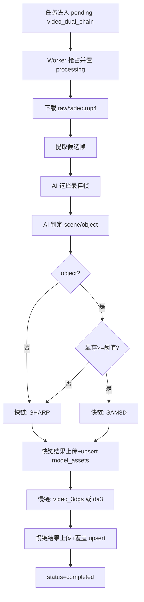

# BrainDance 快慢双链实现方案（V1 已落地）

## 1. 背景与目标

在现有 `processing_tasks -> CloudWorker -> PipelineFactory -> model_assets` 链路中，原本只能提交单条重建任务。  
“快慢双链”要解决的问题是：

1. 用户提交视频后，希望尽快看到可预览的 3D 结果（时效性）。
2. 同时仍保留高质量慢链重建结果（质量上限）。
3. 前端展示不应出现“双份场景卡片”，而是同一场景渐进更新（先快后慢）。

本次 V1 采用“**同源双任务编排（单任务入口）**”策略：  
一次视频提交只创建一个任务，但 Worker 内部按“快链 -> 慢链”顺序编排执行。

---

## 2. 方案决策（已确认并实现）

### 2.1 总体策略

1. 提交入口统一为 `task_type=video_dual_chain`。
2. 快链先执行，慢链自动接续。
3. 慢链每次只跑一条（默认 `video_3dgs`，可切 `da3_feed_forward_3dgs`）。
4. 结果展示采用“时间优先覆盖”：
   - 快链先写 `model_assets`；
   - 慢链完成后再次 upsert 同 `scene_id`，覆盖快链结果。

### 2.2 快链路由规则

快链从视频中抽样帧后自动做两类判断：

1. **最佳帧选择**：从候选帧中挑一张最适合快速重建的图。
2. **场景/单物体判定**：
   - `scene` -> `single_image_sharp`
   - `object` -> 显存检测：
     - 显存 `>= 25GB`：`single_image_sam3d`
     - 显存 `< 25GB`：降级到 `single_image_sharp`

### 2.3 失败处理策略

1. 快链失败：记录日志，继续执行慢链。
2. 慢链失败且快链成功：任务最终仍记 `completed`（保证可交付）。
3. 快链与慢链都失败：任务记 `failed`。

---

## 3. 数据契约与参数

## 3.1 processing_tasks.task_type

新增任务类型：

- `video_dual_chain`：视频快慢双链任务（Worker 内部自动编排）。

## 3.2 task_params（video_dual_chain）

| 参数名 | 类型 | 默认值 | 说明 |
|---|---|---|---|
| `slow_pipeline` | string | `video_3dgs` | 慢链类型：`video_3dgs` 或 `da3_feed_forward_3dgs` |
| `sam3d_vram_threshold_gb` | int | `25` | SAM3D 显存门槛（GB） |
| `best_frame_sample_count` | int | `8` | 视频候选帧抽样数量 |
| `delivery_format` | string | `splat` | 交付格式（复用既有逻辑） |

---

## 4. 执行流程（Worker 侧）

---

## 5. 代码落点（已实现）

## 5.1 Worker 编排与通用能力抽取

文件：`ai_engine/3dgs/src/core/worker.py`

新增/调整要点：

1. 新增参数解析：`_parse_task_params`
2. 新增元数据同步：`_sync_task_metadata`
3. 新增压缩封装：`_compress_if_needed`
4. 新增上传与资产 upsert：`_upload_and_upsert_assets`
5. 新增单次 pipeline 运行封装：`_run_pipeline_once`
6. 新增显存检测：`_detect_total_vram_gb`
7. 新增候选帧提取：`_extract_candidate_frames`
8. 新增双链主编排：`_run_video_dual_chain`
9. 主流程 `_process_task` 中增加 `task_type == "video_dual_chain"` 分支

## 5.2 场景分析器能力扩展

文件：`ai_engine/3dgs/src/modules/scene_analyzer.py`

新增接口：

1. `select_best_image(image_paths)`：从候选图片中挑最佳帧。
2. `classify_scene_or_object(image_path)`：判定 `scene/object`。

这两个接口基于现有 VL 模型能力，失败时有默认回退（默认 scene / 第一帧）。

## 5.3 工厂兜底映射

文件：`ai_engine/3dgs/src/core/factory.py`

新增映射：

- `video_dual_chain -> Video3DGSPipeline`（兜底）

说明：正常情况下 `video_dual_chain` 由 Worker 直接编排，不会走到工厂；该映射用于防止异常路径报“未知 task_type”。

## 5.4 前端提交与展示

文件：`app/lib/pages/video_submit.dart`

视频提交任务改为：

- `task_type: video_dual_chain`
- 默认 `task_params` 写入：
  - `slow_pipeline: video_3dgs`
  - `sam3d_vram_threshold_gb: 25`
  - `best_frame_sample_count: 8`

文件：`app/lib/pages/task_list.dart`

新增任务类型展示：

- 图标：`video_dual_chain -> Icons.hub`
- 标签：`Dual Chain`

## 5.5 接口文档更新

文件：`docs/API_DOC.md`

已补充：

1. `task_type` 新增 `video_dual_chain`
2. `task_params(video_dual_chain)` 字段说明
3. Dart 创建任务示例改为双链提交示例

---

## 6. 结果一致性与展示策略

V1 使用现有 `model_assets(scene_id UNIQUE)` 机制，不新增版本表：

1. 快链先 upsert 一次 -> Recall 可尽快看到模型；
2. 慢链完成后再 upsert -> 自动覆盖同一场景；
3. 前端只有一张场景卡片，满足“单场景渐进更新”。

该策略天然满足“时间优先”，实现简单、风险低。

---

## 7. 运维与配置说明

1. 若希望慢链改为 DA3，可在任务里设置：
   - `task_params.slow_pipeline = "da3_feed_forward_3dgs"`
2. 若目标机器显存较大/较小，可调整：
   - `task_params.sam3d_vram_threshold_gb`
3. 若想加快快链前处理，可调小：
   - `task_params.best_frame_sample_count`

---

## 8. 已知限制（V1）

1. 当前快链判定依赖 VL 模型输出，极端情况下可能误判 `scene/object`。
2. 使用“时间优先覆盖”后，默认不保留快慢链多版本切换 UI。
3. 双链链路尚未引入独立“链路阶段状态字段”，当前阶段信息主要通过 `logs` 观察。

---

## 9. 后续演进建议（V2）

1. 增加 `model_versions` 表，显式保存 fast/slow 版本并支持前端切换。
2. 增加任务阶段字段（如 `phase=fast|slow`）用于更精准进度条。
3. 为 `video_dual_chain` 增加专项自动化测试：
   - 快链成功慢链失败
   - 快链失败慢链成功
   - 双失败
   - 显存门槛切换

