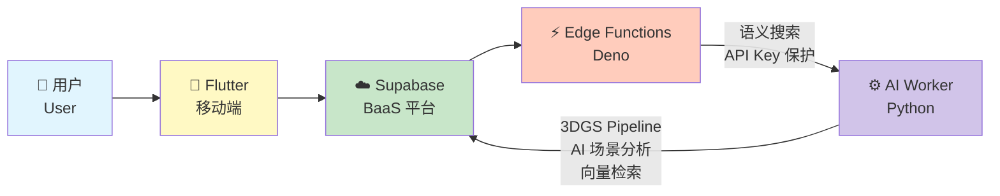
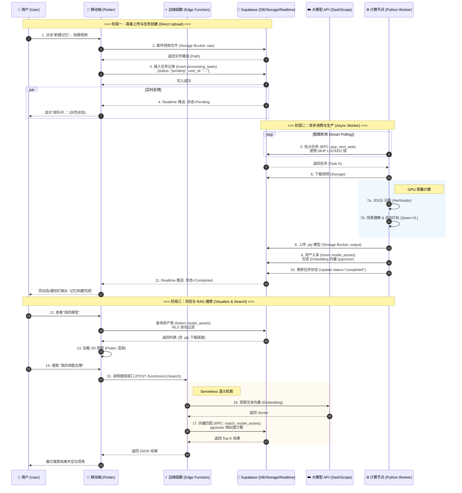

# BrainDance 技术栈清单

> **BrainDance (流光 · 记)** 采用 **Supabase BaaS 架构**，彻底移除了传统中间件（Go、Redis、MinIO、MySQL），实现 Serverless 计算模式。

---

## 一、总体架构

### 架构模式

- **Supabase BaaS 架构**：Backend as a Service，移除传统后端服务器
- **Serverless 计算模式**：Edge Functions (Deno) + Python Worker
- **一体化数据存储**：PostgreSQL + pgvector 扩展
- **端云协同渲染**：Mobile 采集 → Cloud 高性能计算 → Mobile/XR 轻量化查看

### 系统组成



---

## 二、技术栈分层

### 1. 移动端 (Flutter Client)

**职责**：用户交互、视频采集、任务管理、3D 渲染、语义搜索

| 技术 | 版本 | 用途 |
|------|------|------|
| **Flutter** | 3.10+ | 跨平台移动开发框架 |
| **Supabase Flutter SDK** | Latest | 数据库连接、实时通信、认证 |
| **webview_flutter** | Latest | 嵌入 Web 3D 查看器 |
| **Material Design 3** | - | UI 组件库 |

**3D 渲染方案**：
- **@mkkellogg/gaussian-splats-3d** (Three.js)：WebGL 3DGS 渲染库
- **Vue 3 + TypeScript + Vite**：嵌入式 3D 查看器框架

---

### 2. BaaS 平台 (Supabase)

**职责**：数据存储、文件管理、实时通信、身份认证、边缘计算

#### 2.1 PostgreSQL 数据库

| 技术 | 版本 | 用途 |
|------|------|------|
| **PostgreSQL** | 15+ | 主数据库 |
| **pgvector** | Latest | 向量相似度搜索扩展 |
| **RLS** | - | 行级安全策略（Row Level Security） |

**核心表结构**：
- `processing_tasks`：任务队列表（使用 `FOR UPDATE SKIP LOCKED` 实现原子性任务分发）
- `model_assets`：3D 资产表（含 pgvector 语义向量）
- `rag_docs`：RAG 文档表
- `tasks`：通用任务表

**任务队列实现**：
```sql
-- 使用 SKIP LOCKED 实现高性能任务队列
SELECT *
FROM processing_tasks
WHERE status = 'pending'
ORDER BY created_at
LIMIT 1
FOR UPDATE SKIP LOCKED;
```

#### 2.2 Supabase Storage

| 组件 | 说明 |
|------|------|
| **Bucket** | `braindance-assets` |
| **目录结构** | `{user_id}/{scene_id}/{raw,output}/...` |
| **访问控制** | Storage Policy（公开/私有访问权限） |

**存储内容**：
- **raw/**：原始视频流 (`.mp4`)、原始图片 (`.jpg`)
- **output/**：训练完成的 3D 模型 (`.ply`, `.splat`)

#### 2.3 Supabase Auth

- **认证方式**：Email/Password、OAuth（Google、GitHub 等）
- **JWT Token**：自动处理 Access Token / Refresh Token
- **RLS 集成**：基于 `auth.uid()` 的行级权限控制

#### 2.4 Supabase Realtime

- **WebSocket**：实时推送任务状态变化
- **CDC (Change Data Capture)**：监听数据库变更事件
- **应用场景**：
  - 任务进度推送（pending → processing → completed）
  - 多端状态同步
  - 灵动岛 / Live Activities 集成

#### 2.5 Edge Functions (Deno)

| 技术 | 版本 | 用途 |
|------|------|------|
| **Deno** | 1.x+ | Serverless 运行时 |
| **TypeScript** | - | 函数编写语言 |

**当前函数**：
- `search-models`：语义搜索接口
  - 调用 DashScope API 生成查询向量
  - 使用 pgvector 进行相似度匹配
  - 保护 API Key 不泄露给客户端

**优势**：
- ✅ 保护 API Key（密钥在服务端）
- ✅ 降低延迟（边缘计算，就近部署）
- ✅ Serverless（按需执行，无空闲成本）

---

### 3. AI 计算节点 (Python Worker)

**职责**：3DGS 训练、AI 场景理解、向量检索

| 技术 | 版本 | 用途 |
|------|------|------|
| **Python** | 3.10+ | 主要编程语言 |
| **CUDA** | 11.8+ / 12.x | GPU 加速 |
| **PyTorch** | 2.x+ | 深度学习框架 |

#### 3.1 3DGS 核心引擎

| 技术 | 用途 |
|------|------|
| **Nerfstudio** | 模块化 3DGS 训练框架 |
| **Splatfacto** | Nerfstudio 的 3DGS 模型实现 |
| **gsplat** | 极速 CUDA 光栅化后端 |
| **Diff-Gaussian-Rasterization** | 底层 CUDA 加速光栅化器 |

**训练流程**：
```
视频流 → 抽帧 (FFmpeg) → 位姿解算 (COLMAP/GLOMAP) → 3DGS 训练 (Nerfstudio) → point_cloud.ply
```

#### 3.2 单图重建技术

| 技术 | 用途 |
|------|------|
| **SAM 3D** | 从单张照片重建 3DGS 模型 |
| **SHARP** | Apple 高质量单图 3DGS 生成模型（通过神经网络预测高斯参数） |

#### 3.3 位姿估计

| 技术 | 用途 |
|------|------|
| **GLOMAP** | 全局位姿估计（鲁棒性强） |
| **COLMAP** | 稀疏重建（特征点匹配、相机位姿解算） |

#### 3.4 多模态 AI

| 技术 | 用途 |
|------|------|
| **Qwen-VL** | 场景理解与自动打标（描述场景内容、物体位置） |
| **DashScope API** (阿里云) | 生成文本 Embedding 向量 |

**AI 工作流**：
```
视频关键帧 → Qwen-VL 场景理解 → 自动生成标签 → DashScope Embedding → 存入 pgvector
```

#### 3.5 向量检索

| 技术 | 用途 |
|------|------|
| **pgvector** | PostgreSQL 一体化向量存储（无需独立向量数据库） |
| **知识库** | 本地向量索引 + 语义相似度匹配 |

**语义搜索流程**：
```sql
-- pgvector 相似度搜索
SELECT scene_id, ply_path, description,
       embedding <=> '[查询向量]' AS distance
FROM model_assets
ORDER BY distance
LIMIT 10;
```

#### 3.6 本地问答微调（实验）

> 状态说明：本节记录 `ai_engine/finetune_qwen3` 的实验链路，当前尚未并入正式业务主流程。

| 技术/模块 | 用途 |
|------|------|
| **Qwen/Qwen3-1.7B** | 本地问答基座模型 |
| **LoRA SFT** | 参数高效微调，学习“基于证据回答” |
| **run_real_chain_debug.py** | 检索链路调试与路由观测 |
| **interactive_debug_chat.py** | 交互调试、反馈标注与问题归因 |
| **local_qa_cli.py** | 最小可用本地问答入口 |
| **test_part17/18/local_qa_cli** | 检索、formatter 与 CLI 回归测试 |

对应文档：

- `ai_engine/finetune_qwen3/README.md`
- `docs/04-本地问答与微调/本地问答微调文档补充说明.md`

---

### 4. Web 3D 查看器

**职责**：在 WebView 或独立浏览器中渲染 3DGS 模型，支持视角控制与 VR 沉浸式交互。

#### 4.1 桌面端 3DGS 查看器 (my-3dgs-viewer)

| 技术 | 版本 | 用途 |
|------|------|------|
| **Vue 3** | Latest | 前端框架（Composition API） |
| **TypeScript** | Latest | 类型安全 |
| **Vite** | Latest | 构建工具（快速打包） |
| **Three.js** | Latest | 3D 图形库 |
| **@mkkellogg/gaussian-splats-3d** | Latest | 3DGS 渲染库 |

**渲染流程**：
```
Flutter 加载 WebView → 注入 PLY 下载链接 → Three.js 加载模型 → GaussianSplats3D 渲染 → 用户交互（旋转/缩放）
```

#### 4.2 VR 3DGS 查看器 (vr-3dgs-viewer)

**职责**：独立 PC 端 VR 沉浸式查看器，不嵌入 Flutter，通过浏览器直接运行。

| 技术 | 版本 | 用途 |
|------|------|------|
| **Vue 3 + TypeScript** | Latest | 前端框架 |
| **Vite** | Latest | 构建工具（含 basic SSL 插件） |
| **Three.js** | Latest | 3D 图形库与 WebXR 支持 |
| **WebXR Device API** | Latest | 沉浸式 VR 会话、头显追踪、手柄输入 |
| **SteamVR** | Latest | 系统级 VR 运行时，驱动 PCVR 头显 |
| **@mkkellogg/gaussian-splats-3d** | Latest | 3DGS 渲染 |
| **@supabase/supabase-js** | Latest | 模型数据获取与登录态同步 |

**三种预览模式**：
| 模式 | URL 参数 | 说明 |
|------|----------|------|
| Desktop | `?preview=desktop` | 普通桌面预览，OrbitControls 鼠标交互 |
| Stereo | `?preview=stereo` | 左右眼并排立体预览，检查双眼视差 |
| WebXR | `?preview=webxr` | 沉浸式 VR，需 SteamVR + 头显 |

**VR 交互能力**：
- 手柄 Trigger 沿视线方向前进/后退移动
- 摇杆水平方向移动与视角转向
- 单手 Grip 抓取/拖拽/旋转模型
- 双手 Grip 距离缩放
- 随身中文 HUD + 手柄光标点选
- 模型列表、搜索结果、空间标记导航
- 旁观窗口：浏览器端同步展示头显画面

**HTTPS 代理与网络**：
- Vite 开发代理实现 HTTPS→HTTP Supabase 透明转发
- 解除浏览器 mixed-content 策略对 HTTP 后端的拦截
- 通过 `VITE_BD_SUPABASE_PROXY_TARGET` 环境变量配置目标

**Payload 协议**：
```
URL ?payload=<encoded-json>
  → ply / modelUrl: 模型 URL
  → poses / posesUrl: 位姿 JSON
  → modelList: 多模型列表
  → markers: 空间标记
  → searchResults: 搜索结果
  → authSession: 登录态

全局钩子：
  window.loadViewerPayload()
  window.setViewerSession()
  window.setViewerModelList()
  window.setViewerMarkers()
  window.setViewerSearchResults()
```

---

## 三、数据流转协议

### 1. 上传链路 (The Upload Flow)

**核心目标**：将大文件从手机高效传输到云端，不阻塞业务网关。

| 步骤 | 源 | 目标 | 协议/方式 | 数据内容 |
|------|-----|------|----------|----------|
| **1. 直传文件** | Flutter | Supabase Storage | HTTPS (PUT) | 视频流 Binary |
| **2. 创建任务** | Flutter | processing_tasks 表 | Supabase SDK | `{status: "pending", user_id: "..."}` |
| **3. 实时推送** | Supabase | Flutter | WebSocket (Realtime) | 状态=Pending |

**技术点**：
- ✅ **直传**：流量直接走 Storage，不经过业务服务器
- ✅ **断点续传**：支持大文件分片上传
- ✅ **实时反馈**：用户立即看到"排队中"状态

---

### 2. 加工链路 (The Processing Flow)

**核心目标**：异步处理重计算任务，结合本地算力与云端智能。

| 步骤 | 组件 | 动作描述 | 涉及工具/协议 |
|------|------|----------|---------------|
| **1. 抢占任务** | Worker ← PostgreSQL | `SELECT ... FOR UPDATE SKIP LOCKED` | PostgreSQL (原子性) |
| **2. 下载数据** | Worker ← Storage | 拉取原始视频 | Supabase SDK |
| **3a. 3DGS 训练** | Worker | GPU 密集计算（约 20 分钟） | Nerfstudio / CUDA |
| **3b. AI 分析** | Worker → DashScope | 场景理解与打标 | Qwen-VL API |
| **4. 上传模型** | Worker → Storage | 上传 `.ply` 文件 | Supabase SDK |
| **5. 向量入库** | Worker → pgvector | 存储语义向量 | SQL (INSERT) |
| **6. 状态更新** | Worker → PostgreSQL | 更新任务状态为 `completed` | SQL (UPDATE) |
| **7. 实时推送** | Supabase → Flutter | WebSocket 推送完成通知 | Realtime |

**关键技术点**：
- ✅ **SKIP LOCKED**：多个 Worker 并发安全，原子性任务分发
- ✅ **并行处理**：3DGS 训练与 AI 分析同时进行
- ✅ **一体化存储**：向量数据与业务数据在同一事务中

---

### 3. 搜索链路 (The Consumption Flow)

**核心目标**：通过自然语言搜索现实世界（空间 RAG）。

| 步骤 | 源 | 目标 | 动作描述 | 协议/方式 |
|------|-----|------|----------|----------|
| **1. 发起搜索** | Flutter | Edge Function | `POST /functions/v1/search-models` | HTTPS (REST) |
| **2. 生成向量** | Edge Function → DashScope | 调用 Embedding API | HTTPS |
| **3. 向量匹配** | Edge Function → pgvector | 余弦相似度搜索 | SQL (`<=>` 操作符) |
| **4. 返回结果** | Edge Function → Flutter | Top-K 匹配结果 | JSON |

**用户查询示例**：
```
输入: "我的钥匙在哪？"
  ↓
DashScope: [查询向量]
  ↓
pgvector: 匹配到场景 "书桌"，相似度 0.92
  ↓
Flutter: 镜头自动飞向书桌上的钥匙位置
```

---

## 四、关键技术决策

### 1. 为什么选择 Supabase BaaS？

| 传统架构 (Go + Redis + MinIO + MySQL) | Supabase BaaS | 优势 |
|--------------------------------------|---------------|------|
| 需要编写 Go 后端代码 | Edge Functions (Deno) | ✅ 减少代码量 80% |
| 需要维护 Redis 集群 | PostgreSQL 表 + SKIP LOCKED | ✅ 减少一个中间件 |
| 需要部署 MinIO 对象存储 | Supabase Storage | ✅ 开箱即用 |
| 需要实现 JWT 鉴权 | Supabase Auth + RLS | ✅ 零后端代码实现鉴权 |
| 需要 Nginx 配置 WebSocket | Supabase Realtime | ✅ 自动 CDC |
| 需要购买云服务器 | Serverless 按需付费 | ✅ 降低成本 50%+ |

**总结**：
- ✅ **简化架构**：移除 4+ 个中间件，降低运维复杂度
- ✅ **降低成本**：Serverless 按需付费，无需常驻服务器
- ✅ **提升安全性**：RLS 原生行级安全，零后端代码实现鉴权
- ✅ **加快开发**：开箱即用的 Auth、Storage、Realtime

---

### 2. 为什么选择 pgvector 而非独立向量数据库？

| 方案 | 优势 | 劣势 |
|------|------|------|
| **pgvector (PostgreSQL 扩展)** | ✅ 统一存储（减少一个独立服务）<br/>✅ ACID 支持（向量数据与业务数据在同一事务中）<br/>✅ 性能优秀（中小规模数据）<br/>✅ 无需额外运维 | ⚠️ 大规模数据（>1000 万向量）性能略逊于专用向量库 |
| **ChromaDB / Pinecone** | ✅ 大规模数据性能更优<br/>✅ 专用的向量索引算法 | ❌ 需要额外部署和维护<br/>❌ 数据分散在两个系统<br/>❌ 跨系统事务复杂 |

**BrainDance 选择 pgvector 的原因**：
1. **中小规模场景**：个人用户的记忆库规模通常在 1-10 万个场景，pgvector 性能完全满足
2. **数据一致性**：3D 资产元数据与语义向量在同一事务中，避免数据不一致
3. **简化运维**：减少一个独立服务，降低运维复杂度

---

### 3. 为什么使用 Edge Functions？

| 优势 | 说明 |
|------|------|
| ✅ **保护 API Key** | 密钥在服务端，客户端无法直接访问 DashScope API |
| ✅ **降低延迟** | 部署在全球边缘节点，用户就近访问 |
| ✅ **Serverless** | 按需执行，无空闲成本（仅在搜索时计费） |
| ✅ **易于扩展** | 自动扩容，无需手动配置负载均衡 |

**典型应用场景**：
- **语义搜索**：保护 DashScope API Key
- **数据聚合**：多个数据源查询结果的聚合
- **轻量级业务逻辑**：用户权限校验、数据脱敏等

---

### 4. 为什么选择 Nerfstudio / Splatfacto？

| 方案 | 优势 | 劣势 |
|------|------|------|
| **Nerfstudio** | ✅ 模块化最强<br/>✅ 社区活跃<br/>✅ 支持多种 3DGS 模型<br/>✅ 易于定制和扩展 | ⚠️ 学习曲线较陡 |
| **gaussian-splatting (原始实现)** | ✅ 官方实现，性能最优 | ❌ 难以定制和扩展 |
| **Luma AI / Tripo SR** | ✅ 在线服务，无需本地 GPU | ❌ 成本高，无法私有化部署 |

**BrainDance 选择 Nerfstudio 的原因**：
1. **灵活性**：支持自定义 Pipeline（如单图 SAM3D、视频 3DGS）
2. **社区支持**：大量教程和预训练模型
3. **性能优秀**：Splatfacto 模型在质量和速度上达到最佳平衡

---

## 五、技术栈速查表

### 前端技术栈

| 分类 | 技术 | 用途 |
|------|------|------|
| **移动端框架** | Flutter 3.10+ | 跨平台开发 |
| **3D 渲染** | @mkkellogg/gaussian-splats-3d | WebGL 3DGS 渲染 |
| **VR 沉浸式** | WebXR + SteamVR | 头显追踪与手柄交互 |
| **网络通信** | Supabase Flutter SDK | 数据库连接 |
| **Web 容器** | webview_flutter | 嵌入 3D 查看器 |

---

### 后端技术栈

| 分类 | 技术 | 用途 |
|------|------|------|
| **BaaS 平台** | Supabase | 后端即服务 |
| **数据库** | PostgreSQL 15+ | 主数据库 |
| **向量检索** | pgvector | 向量相似度搜索 |
| **对象存储** | Supabase Storage | 文件存储 |
| **实时通信** | Supabase Realtime | WebSocket |
| **身份认证** | Supabase Auth | 用户认证 |
| **边缘函数** | Deno | Serverless 函数 |

---

### AI 技术栈

| 分类 | 技术 | 用途 |
|------|------|------|
| **编程语言** | Python 3.10+ | 主要编程语言 |
| **深度学习** | PyTorch 2.x+ | 深度学习框架 |
| **3DGS 训练** | Nerfstudio / Splatfacto | 3DGS 模型训练 |
| **光栅化** | gsplat | CUDA 加速渲染 |
| **位姿估计** | COLMAP / GLOMAP | 相机位姿解算 |
| **多模态 AI** | Qwen-VL | 场景理解与打标 |
| **Embedding** | DashScope API (阿里云) | 文本向量化 |
| **单图重建** | SAM 3D / SHARP | 单图 3DGS 生成 |

---

### 开发工具

| 工具 | 用途 |
|------|------|
| **Docker** | 容器化部署 |
| **Supabase CLI** | 本地开发环境 |
| **Conda** | Python 环境管理 |
| **Git** | 版本控制 |

---

## 六、系统架构图

### 数据流转时序图



---

## 七、相关文档

- [项目主文档](../../README.md) - 项目概述
- [系统架构](./系统架构.md) - 详细架构说明
- [API 接口文档](../03-API参考/API接口指南.md) - API 使用说明
- [数据库设计](../03-API参考/数据库设计.md) - 数据库表结构
- [快速开始](../01-入门指南/快速开始.md) - 开发环境搭建
- [Supabase 后端文档](../../supabase/README.md) - Supabase 配置指南

---

*最后更新: 2026-05-13*
