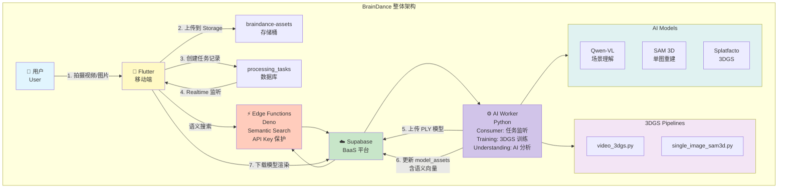
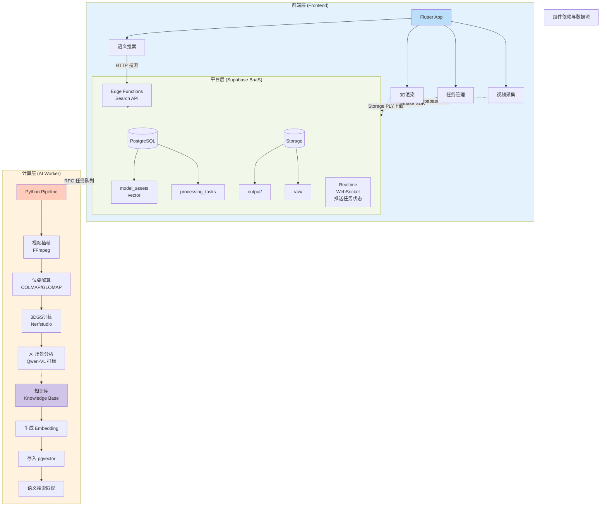
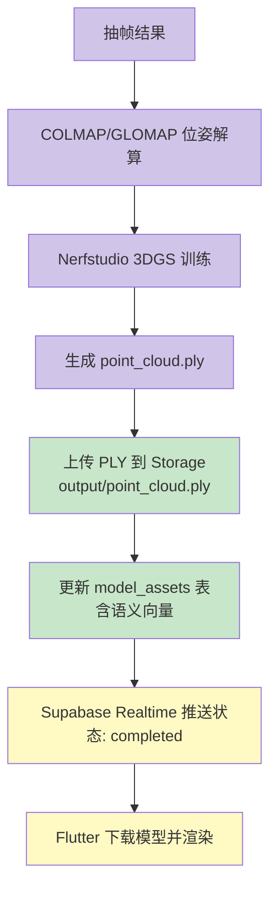
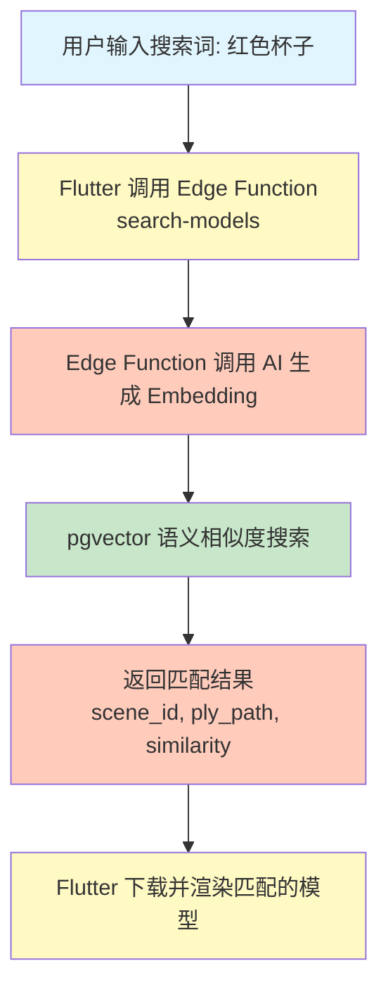

# BrainDance 系统架构文档

> 本文档详细描述 BrainDance 项目的系统架构、组件关系和数据流转。

## 📋 目录

- [整体架构图](#整体架构图)
- [组件关系图](#组件关系图)
- [数据流转](#数据流转)
- [技术栈](#技术栈)

---

## 🏗️ 整体架构图



### 核心组件说明

| 组件 | 说明 | 职责 |
|------|------|------|
| **Flutter Client** | 移动端 App | 视频采集、任务管理、3D渲染、语义搜索 |
| **Supabase** | BaaS 平台 | 数据库、存储、实时通信、身份认证 |
| **Edge Functions** | Deno Serverless | 语义搜索接口、API Key 保护 |
| **AI Worker** | Python 计算节点 | 任务监听、3DGS训练、AI场景分析 |

---

## 📊 组件关系图



### 组件职责

#### 前端层 (Flutter)
- **视频采集**: 拍摄/上传视频或图片
- **任务管理**: 创建、监控、取消任务
- **3D渲染**: 加载并渲染 PLY 模型
- **语义搜索**: 通过自然语言搜索模型

#### 平台层 (Supabase)
- **PostgreSQL**: 任务队列、资产存储、向量数据库
- **Storage**: 原始素材、输出模型文件管理
- **Realtime**: WebSocket 实时推送任务状态
- **Edge Functions**: Serverless 语义搜索接口

#### 计算层 (AI Worker)
- **视频抽帧**: 使用 FFmpeg 从视频提取关键帧
- **位姿解算**: 使用 COLMAP/GLOMAP 计算相机位姿
- **3DGS训练**: 使用 Nerfstudio/Splatfacto 训练模型
- **AI分析**: 使用 Qwen-VL 进行场景理解和自动打标

---

## 📋 数据流转

### 数据流转总览

| 阶段 | 数据 | 来源 | 目标 | 说明 |
|------|------|------|------|------|
| 1 | 视频/图片 | Flutter | Storage | 用户上传原始素材 |
| 2 | 任务记录 | Flutter | processing_tasks | 创建处理任务 |
| 3 | 视频下载 | Worker | 本地磁盘 | AI Worker 拉取任务 |
| 4 | 抽帧结果 | Worker | processed/ | 视频关键帧提取 |
| 5 | PLY 模型 | Worker | Storage | 3DGS 训练结果 |
| 6 | 资产记录 | Worker | model_assets | 语义向量入库 |
| 7 | 模型下载 | Flutter | 本地缓存 | 前端渲染展示 |
| 8 | 搜索请求 | Flutter | Edge Function | 语义搜索 |
| 9 | 搜索结果 | Edge Function | Flutter | 返回匹配模型 |

### 详细数据流说明

#### 阶段 1-4: 任务创建与视频处理

```mermaid
graph TD
    A[用户拍摄视频] --> B[Flutter 上传到 Storage<br/>braindance-assets/{user_id}/{scene_id}/raw/video.mp4]
    B --> C[Flutter 创建任务记录<br/>INSERT INTO processing_tasks]
    C --> D[Supabase Realtime 推送状态: pending]
    D --> E[Worker 监听并抢占任务<br/>SKIP LOCKED]
    E --> F[Worker 从 Storage 下载视频到本地]
    F --> G[Worker 抽帧处理<br/>FFmpeg]

    style A fill:#e1f5fe
    style B fill:#fff9c4
    style C fill:#fff9c4
    style D fill:#c8e6c9
    style E fill:#d1c4e9
    style F fill:#d1c4e9
    style G fill:#d1c4e9
```

#### 阶段 5-7: 3DGS 训练与模型生成



#### 阶段 8-9: 语义搜索



---

## 🛠️ 技术栈

### 前端
| 技术 | 用途 |
|------|------|
| Flutter | 移动端开发框架 |
| Three.js / @mkkellogg/gaussian-splats-3d | WebGL 3DGS 渲染 |
| Supabase Flutter SDK | 数据库连接 |

### 平台 (Supabase)
| 技术 | 用途 |
|------|------|
| PostgreSQL | 关系型数据库 |
| pgvector | 向量相似度搜索 |
| Storage | 对象存储 |
| Realtime | WebSocket 实时通信 |
| Edge Functions (Deno) | Serverless 函数 |
| Auth | 身份认证 |
| RLS | 行级安全策略 |

### 后端 (AI Worker)
| 技术 | 用途 |
|------|------|
| Python 3.10 | 编程语言 |
| Nerfstudio / Splatfacto | 3DGS 训练框架 |
| COLMAP / GLOMAP | 位姿估计 |
| FFmpeg | 视频处理 |
| Qwen-VL | 多模态 AI 场景理解 |
| SAM 3D | 单图 3D 重建 |
| Supabase Python SDK | 数据库连接 |

---

## 📁 相关文档

- [项目主文档](../../README.md)
- [API 接口文档](../3.API文档/API接口.md)
- [数据库设计](../3.API文档/数据库设计.md)
- [本地部署指南](../4.部署运维/本地部署.md)
- [Supabase 后端文档](../../supabase/README.md)

---

*最后更新: 2026-01-20*
