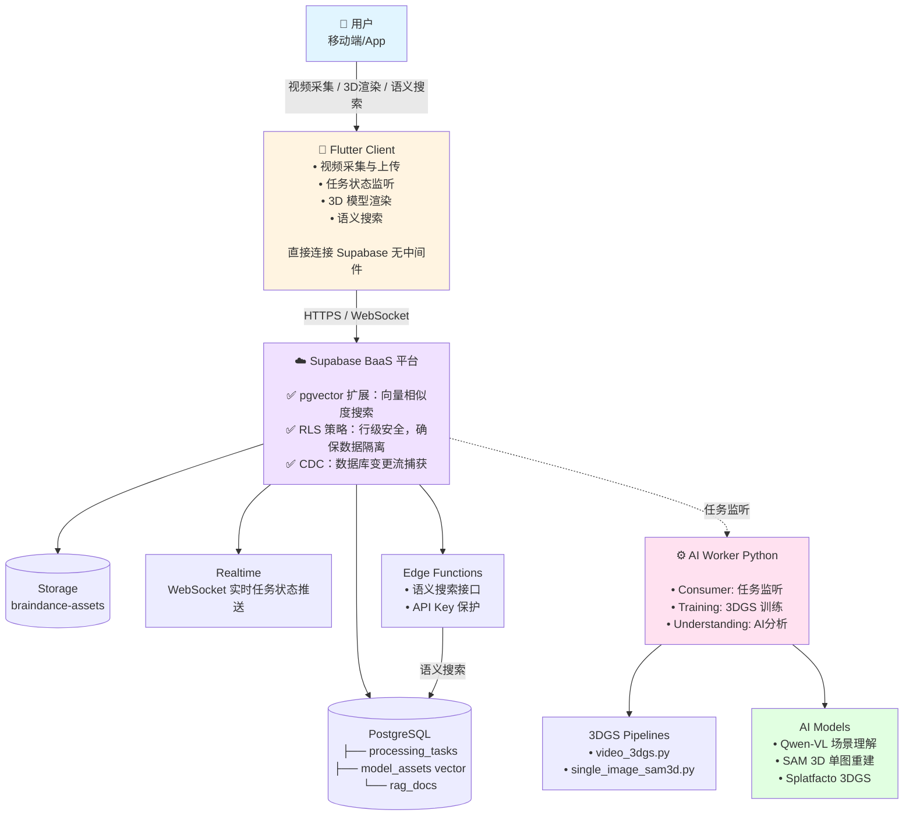
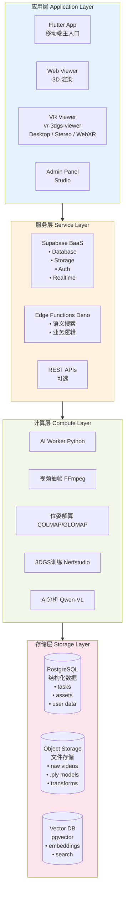
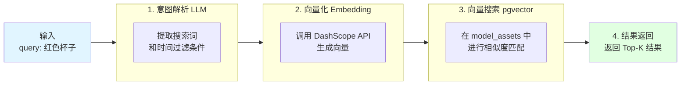
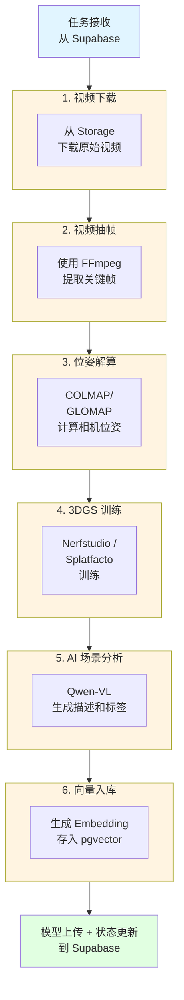
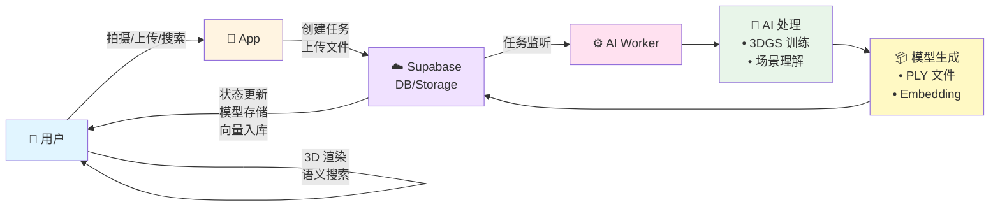

# 🏗️ BrainDance 项目架构总览

> BrainDance 项目的系统架构、组件关系与数据流转全景视图

本文档提供 BrainDance 项目的整体架构概览，帮助开发者快速理解系统的组成模块、组件间的交互关系以及数据的流转方式。通过本文档，您将获得对整个系统宏观的认识，为后续深入学习各个模块打下基础。

---

## 📋 目录

- [项目概述](#项目概述)
- [整体架构图](#整体架构图)
- [核心组件详解](#核心组件详解)
- [数据流转](#数据流转)
- [技术栈概览](#技术栈概览)
- [架构决策说明](#架构决策说明)
- [模块依赖关系](#模块依赖关系)
- [扩展性与性能](#扩展性与性能)

---

## 🎯 项目概述

### 核心定位

BrainDance（流光·记）是一个**面向空间计算时代的三维语义记忆引擎**，旨在为用户提供"可检索的三维记忆库"服务。与传统相册只能记录二维画面不同，BrainDance 利用 3D Gaussian Splatting（3DGS）技术，将现实空间以 1:1 的高保真度转化为数字资产，并结合多模态 AI 实现"搜索现实世界"的能力。

### 核心特性

- **📷 移动端低成本扫描**：降低 3DGS 建模门槛，使普通用户也能轻松创建高质量 3D 模型
- **🔍 空间语义检索 (Spatial RAG)**：结合多模态大模型理解场景内容，实现自然语言搜索物理世界
- **⏳ 时光剥离 (Time Peeling)**：支持多时间切片叠加，实现从"现在"回溯到"过去"的视觉体验
- **☁️ 端云协同渲染**：Mobile 采集 → Cloud 高性能计算 → Mobile/XR 轻量化查看

### 价值主张

**"物理世界注定走向无序，而我们在比特世界重建永恒。"**

BrainDance 不仅仅是一个 App，它是人类对抗时间熵增的通用工具。我们试图捕获光的场域，在数字世界里建立负熵，为每个人、每座城，留下一份可以穿越时间的**空间档案**。

### Agent 演进方向

在现有 Spatial RAG 基础上，项目已经明确将 Agent 方向作为下一阶段能力演进重点。当前规划不是直接引入一个脱离业务边界的通用 Agent，而是沿着既有的 Supabase 在线链路，把空间检索升级为“工具调用 + 空间证据 + 前端动作”的可控 Agent Runtime。详细规划见：[Agent规划与LangChain实践路线](./Agent规划与LangChain实践路线.md)。

---

## 🏗️ 整体架构图

### 系统架构概览



### 技术架构分层



---

## 🧩 核心组件详解

### 1. Flutter Client (移动端)

**职责**：用户交互入口，负责视频采集、任务管理、3D 渲染和语义搜索。

| 功能模块 | 说明 | 技术实现 |
|----------|------|----------|
| **视频采集** | 拍摄/上传视频或图片 | Flutter Camera + 设备存储 |
| **任务管理** | 创建、监控、取消任务 | Supabase SDK + Realtime |
| **3D 渲染** | 加载并渲染 PLY 模型 | Three.js + WebGL (WebView) |
| **语义搜索** | 自然语言搜索 3D 场景 | 调用 Edge Function API |
| **用户认证** | 注册、登录、会话管理 | Supabase Auth |

**架构特点**：
- **直接连接 Supabase**：无需中间业务服务器，减少延迟和复杂度
- **WebView 嵌入**：使用 Vue3 + Three.js 渲染 3D 模型
- **Realtime 监听**：通过 WebSocket 实时获取任务状态

### 2. VR Viewer (VR 查看器)

**职责**：独立 PC 端 VR 沉浸式查看器，基于 WebXR 标准，支持 SteamVR 驱动的主流头显。

| 功能模块 | 说明 | 技术实现 |
|----------|------|----------|
| **多模式预览** | Desktop / Stereo / WebXR 三种模式 | Vue 3 + Three.js + WebXR API |
| **手柄交互** | Trigger 视线移动、Grip 抓取缩放旋转、摇杆导航 | WebXR Gamepad API |
| **随身 HUD** | 每个手柄上方显示中文操作说明，支持光标点选 | Canvas 纹理叠加 |
| **模型加载** | 支持 .ply/.splat/.ksplat/.spz 格式，压缩格式优先 | @mkkellogg/gaussian-splats-3d |
| **Payload 协议** | URL 参数、全局钩子函数注入模型/位姿/标记/搜索结果 | BrainDanceViewerPayload |
| **旁观窗口** | 头显画面浏览器端全屏同步展示 | 独立 spectatorRenderer |
| **本地文件加载** | 网页端直接选择本地模型与位姿文件 | FileReader + URL.createObjectURL |
| **Supabase 代理** | HTTPS→HTTP 透明转发，兼容 mixed-content 策略 | Vite 开发代理 |

**架构特点**：
- **独立运行**：不嵌入 Flutter 页面，通过浏览器直接启动
- **Payload 协议复用**：与 Flutter WebView 查看器共享同一套数据注入协议
- **三种调试模式**：desktop（OrbitControls 鼠标）/ stereo（双眼并排）/ webxr（沉浸式）
- **HTTPS 必需**：WebXR 强制安全上下文，开发环境通过 Vite basic SSL 提供

### 3. Supabase (BaaS 平台)

**职责**：作为系统的"数据中台"，提供数据库、存储、实时通信和身份认证。

#### PostgreSQL

| 数据表 | 用途 | 关键字段 |
|--------|------|----------|
| `processing_tasks` | 任务队列管理 | id, user_id, scene_id, status, logs |
| `model_assets` | 3D 资产存储 | id, scene_id, embedding, ply_path |
| `rag_docs` | RAG 文档存储 | id, content, embedding, metadata |
| `tasks` | 通用任务队列 | id, user_id, source_path, status |

#### Storage

| 存储桶 | 用途 | 访问权限 |
|--------|------|----------|
| `braindance-assets` | 主存储桶 | RLS 策略控制 |
| → `raw/` | 原始视频 | 用户私有 |
| → `output/` | 生成模型 | 用户私有/公开 |

#### Realtime

- **WebSocket 连接**：客户端订阅数据库变更流
- **任务状态推送**：实时推送 pending → processing → completed
- **多端同步**：支持多设备状态一致

#### Edge Functions (Deno)

**核心功能**：语义搜索接口



### 4. AI Worker (Python)

**职责**：监听任务队列、执行 3DGS 训练、AI 场景分析。

#### Pipeline 类型

| Pipeline | 输入 | 输出 | 说明 |
|----------|------|------|------|
| `video_3dgs` | 视频文件 | PLY 模型 | 视频转 3DGS（传统流程） |
| `single_image_sam3d` | 单张图片 | PLY 模型 | 单图转 3DGS（SAM3D） |
| `single_image_sharp` | 单张图片 | PLY 模型 | 单图转 3DGS（SHARP） |

#### 核心处理流程



#### 核心模块

| 模块 | 路径 | 职责 |
|------|------|------|
| `ImageProcessor` | `src/modules/image_proc.py` | 图像预处理、质量清洗 |
| `GlomapRunner` | `src/modules/glomap_runner.py` | 相机位姿解算 |
| `SceneAnalyzer` | `src/modules/scene_analyzer.py` | AI 场景理解 |
| `AISegmentor` | `src/modules/ai_segmentor.py` | 语义分割 |
| `NerfEngine` | `src/modules/nerf_engine.py` | 3DGS 训练 |
| `KnowledgeBase` | `src/modules/knowledge_base.py` | 向量存储与检索 |
| `SAM3DEngine` | `src/modules/sam3d_engine/` | 单图 3DGS 生成 |

---

## 📊 数据流转

### 整体数据流



### 详细数据流

#### 阶段 1: 任务创建与上传

```
1. 用户拍摄视频
   │
   ▼
2. App 上传到 Storage (braindance-assets/{user_id}/{scene_id}/raw/video.mp4)
   │
   ▼
3. App 创建任务记录 (INSERT INTO processing_tasks)
   status = 'pending'
   │
   ▼
4. Supabase Realtime 推送状态: pending
   │
   ▼
5. Worker 监听并抢占任务 (SKIP LOCKED)
```

#### 阶段 2: AI 处理与模型生成

```
抽帧结果 (FFmpeg)
      │
      ▼
COLMAP/GLOMAP 位姿解算
      │
      ▼
Nerfstudio 3DGS 训练
      │
      ▼
生成 point_cloud.ply
      │
      ▼
上传 PLY 到 Storage (output/point_cloud.ply)
      │
      ▼
更新 model_assets 表 (含语义向量)
      │
      ▼
Supabase Realtime 推送状态: completed
```

#### 阶段 3: 浏览与搜索

```
用户输入搜索词: "红色杯子"
      │
      ▼
App 调用 Edge Function (search-models)
      │
      ▼
Edge Function 调用 AI 生成 Embedding
      │
      ▼
pgvector 语义相似度搜索
      │
      ▼
返回匹配结果 (scene_id, ply_path, similarity)
      │
      ▼
App 下载并渲染匹配的模型
```

### 数据流转矩阵

| 阶段 | 数据 | 来源 | 目标 | 说明 |
|------|------|------|------|------|
| 1 | 视频/图片 | Flutter | Storage | 用户上传原始素材 |
| 2 | 任务记录 | Flutter | processing_tasks | 创建处理任务 |
| 3 | 视频下载 | Worker | 本地磁盘 | AI Worker 拉取任务 |
| 4 | 抽帧结果 | Worker | processed/ | 视频关键帧提取 |
| 5 | PLY 模型 | Worker | Storage | 3DGS 训练结果 |
| 6 | 资产记录 | Worker | model_assets | 语义向量入库 |
| 7 | 模型下载 | Flutter | 本地缓存 | 前端渲染展示 |
| 8 | 搜索请求 | Flutter | Edge Function | 语义搜索 |
| 9 | 搜索结果 | Edge Function | Flutter | 返回匹配模型 |

---

## 🛠️ 技术栈概览

### 前端 (Frontend)

| 技术 | 用途 | 说明 |
|------|------|------|
| **Flutter** | 移动端开发框架 | 一套代码跨 Android/iOS |
| **Dio** | HTTP 客户端 | 文件上传、网络请求 |
| **webview_flutter** | Web 容器 | 嵌入 Vue3 页面 |
| **Vue 3** | 前端框架 | Composition API |
| **Three.js** | 3D 渲染 | WebGL 3DGS 渲染 |
| **@mkkellogg/gaussian-splats-3d** | 3DGS 加载器 | .ply/.splat/.ksplat 文件加载 |
| **WebXR Device API** | VR 沉浸式渲染 | 头显追踪、手柄输入、立体渲染 |
| **SteamVR** | VR 运行时 | 驱动头显与手柄，浏览器 WebXR 委托 |

### 平台 (Supabase)

| 技术 | 用途 | 说明 |
|------|------|------|
| **PostgreSQL** | 关系型数据库 | 核心数据存储 |
| **pgvector** | 向量数据库 | 语义相似度搜索 |
| **Storage** | 对象存储 | 原始视频、PLY 模型 |
| **Realtime** | WebSocket | 实时任务状态推送 |
| **Edge Functions** | Serverless | 语义搜索接口 |
| **Auth** | 身份认证 | 用户注册/登录 |
| **RLS** | 行级安全 | 数据隔离策略 |

### 后端 (AI Worker)

| 技术 | 用途 | 说明 |
|------|------|------|
| **Python 3.10** | 编程语言 | 核心开发语言 |
| **Nerfstudio** | 3DGS 训练框架 | 模块化训练管线 |
| **Splatfacto** | 3DGS 模型 | Gaussian Splatting 训练 |
| **COLMAP/GLOMAP** | 位姿估计 | 相机位姿计算 |
| **FFmpeg** | 视频处理 | 抽帧、编码 |
| **Qwen-VL** | 多模态 AI | 场景理解与描述 |
| **SAM 3D** | 单图重建 | 单张照片 3D 生成 |
| **Supabase Python SDK** | 数据库连接 | 任务队列监听 |

### 基础设施

| 技术 | 用途 | 说明 |
|------|------|------|
| **Docker** | 容器化 | Supabase 本地开发 |
| **CUDA** | GPU 加速 | 深度学习训练 |
| **Conda** | 环境管理 | Python 环境隔离 |
| **Git** | 版本控制 | 代码管理 |

---

## 📝 架构决策说明

### 1. 为什么选择 Supabase BaaS？

**决策**：采用 Supabase 作为后端服务，移除传统中间件（Redis、Go）。

**优点**：
- ✅ **零运维**：无需管理服务器，自动扩缩容
- ✅ **集成度高**：DB + Auth + Storage + Realtime 一站式
- ✅ **成本低**：按使用量付费，适合初创项目
- ✅ **开发快**：快速原型开发，专注于业务逻辑

**缺点**：
- ❌ **定制化受限**：某些高级功能可能受限
- ❌ **厂商锁定**：依赖 Supabase 生态
- ❌ **性能上限**：大规模场景可能需要迁移

**结论**：对于 BrainDance 当前阶段（MVP 到小规模用户），Supabase 是最佳选择。

### 2. 为什么选择 3D Gaussian Splatting？

**决策**：采用 3DGS 而非 NeRF 或传统 3D 重建。

**优点**：
- ✅ **实时渲染**：30+ FPS，远超 NeRF
- ✅ **训练快速**：分钟级 vs 小时级
- ✅ **轻量化**：模型小，易于存储和传输
- ✅ **移动端友好**：可在移动设备上运行

**缺点**：
- ❌ **新技术**：生态不如传统方法成熟
- ❌ **渲染质量**：极端光照下可能有瑕疵
- ❌ **适用场景**：静态场景为主

**结论**：3DGS 是空间计算时代的最佳选择，平衡了质量、速度和可访问性。

### 3. 为什么选择 pgvector 而非独立向量数据库？

**决策**：使用 PostgreSQL 的 pgvector 扩展，一体化存储向量数据与业务数据。

**为什么放弃独立向量数据库（如 ChromaDB/Milvus）**：
- ❌ 增加运维复杂度（需要维护额外的向量服务）
- ❌ 数据分散在两个系统（向量库 + 业务库）
- ❌ 跨系统事务复杂，数据一致性难保证

**优点**：
- ✅ **简化架构**：无需维护额外服务
- ✅ **数据一致性**：向量与业务数据同一库
- ✅ **SQL 强大**：复杂查询更便捷
- ✅ **成本低**：减少服务开销

**缺点**：
- ❌ **性能**：大规模向量检索可能不如专用向量库
- ❌ **功能**：缺少某些高级向量操作

**结论**：对于中小规模（百万级向量），pgvector 完全够用，且简化了架构。

### 4. 为什么选择 Python 而非 Go/Rust？

**决策**：AI Worker 使用 Python 开发。

**优点**：
- ✅ **AI 生态**：PyTorch、Nerfstudio 等库丰富
- ✅ **开发效率**：快速迭代，丰富的第三方支持
- ✅ **科学计算**：NumPy、SciPy 等工具链完善

**缺点**：
- ❌ **性能**：计算密集型任务可能不如 Go/Rust
- ❌ **并发**：全局解释器锁限制多线程

**结论**：AI 领域 Python 是事实标准，性能可通过优化和异步处理弥补。

### 5. 为什么选择 Supabase Edge Function 而非传统 Go 后端？

**决策**：使用 Supabase Edge Function (Deno) 实现业务逻辑，替代传统的 Go 微服务。

**背景**：
BrainDance 项目采用 **Supabase BaaS 架构**，通过 Supabase 提供的数据库、存储、认证和 Realtime 能力，大幅简化了后端开发的复杂度。传统的架构需要维护 Go 后端服务来处理业务逻辑，但这种模式在轻量级应用中会带来不必要的复杂性。

**核心洞察**：

> *"基本 curl 都能通过 Supabase 解决，只有一些业务逻辑要自己写后端。如果只有一点点的业务，直接写 Supabase Edge Function (Deno) 就行了，完全不用写 Go。"*

**传统 Go 后端方案的问题**：

| 问题 | 说明 |
|------|------|
| **认证集成复杂** | Go 后端正常无法直接访问 Supabase 的认证环境，拿不到用户信息 |
| **密钥管理** | 要接入认证需要走 secret key 管理环境，增加运维负担 |
| **数据同步风险** | 裸操作 Go 可能会导致数据库某些地方没同步到，引发数据一致性问题 |
| **过度设计** | 对于只有少量业务逻辑的项目，Go 后端是"大炮打蚊子" |

**Edge Function (Deno) 方案的优势**：

| 优势 | 说明 |
|------|------|
| **内置认证上下文** | Edge Function 直接获取用户认证信息，无需额外配置 |
| **声明式 RLS** | 利用 Supabase 的 Row Level Security 策略，声明式定义数据访问规则 |
| **Serverless** | 自动扩缩容，无需运维服务器 |
| **轻量级** | 适合轻量级业务逻辑，开发效率高 |
| **零运维** | 部署在 Supabase 平台，自动管理基础设施 |

**技术优势对比**：

| 维度 | 传统 Go 后端 | Edge Function (Deno) |
|------|--------------|----------------------|
| **认证获取** | 需要额外配置 Secret Key | 自动获取用户上下文 |
| **数据库访问** | 需要自己管理连接池 | 直接使用 Supabase SDK |
| **权限控制** | 需要在代码中实现 | 声明式 RLS 策略 |
| **部署** | 需要部署 Go 服务 | 平台自动管理 |
| **扩展性** | 需要自己实现 | 自动扩缩容 |
| **开发效率** | 需要编写大量样板代码 | 专注业务逻辑 |

**适用场景**：

| 场景 | 推荐方案 |
|------|----------|
| **轻量级业务逻辑**（如：简单搜索、消息推送） | ✅ Edge Function |
| **认证增强**（如：用户数据过滤、权限校验） | ✅ Edge Function + RLS |
| **复杂业务逻辑**（如：支付流程、工作流引擎） | 可考虑 Go 后端 |
| **高性能要求**（如：实时通信、高频 API） | 可考虑 Go 后端 |

**实际案例**：

BrainDance 的语义搜索功能通过 Edge Function 实现：

```
用户输入搜索词
    │
    ▼
Edge Function (Deno)
    │
    ├── 1. 自动获取用户认证信息
    ├── 2. 调用 DashScope API 生成向量
    ├── 3. 通过 pgvector 执行相似度搜索
    ├── 4. 返回结果（自动应用 RLS 策略过滤）
    │
    ▼
返回 JSON 结果

整个过程无需 Go 后端，代码量 < 100 行
```

**声明式 Schema 实践**：

Supabase 强调声明式 schema 定义，通过 RLS 语句控制数据访问：

```sql
-- 示例：用户只能访问自己的 3D 模型
CREATE POLICY "用户只能访问自己的模型"
ON model_assets FOR SELECT
USING (auth.uid() = user_id);

-- 示例：任务创建者可以更新任务状态
CREATE POLICY "创建者可以更新任务"
ON processing_tasks FOR UPDATE
USING (auth.uid() = user_id);
```

**结论**：

对于 BrainDance 这样的项目，**90% 的场景都可以通过 Supabase Edge Function + RLS 策略解决**。只有在以下情况才需要考虑 Go 后端：

- 需要复杂的事务处理
- 需要高性能实时通信
- 需要与外部非 Supabase 服务深度集成
- 需要复杂的业务工作流

这种架构选择让 BrainDance 能够：
- 🚀 **快速迭代**：无需维护后端服务
- 💰 **降低成本**：无需服务器运维
- 🔒 **安全可靠**：声明式权限控制
- 📈 **自动扩展**：Serverless 架构

**架构模式**：这是典型的 **MLOps + BaaS** 模式：

- **AI Worker**：MLOps 模式，容器化部署（可无缝对接阿里云 PAI 等平台）
- **Edge Functions**：BaaS 模式，处理轻量级业务逻辑
- **Supabase**：提供数据持久化和认证服务

这种组合让 BrainDance 兼具**云原生 AI 的强大能力**和**Serverless 的简洁性**，是中小型 AI 应用的理想架构选择。

---

## 🔗 模块依赖关系

```
Flutter Client
    │
    ├──► Supabase SDK
    │       │
    │       ├──► PostgreSQL
    │       ├──► Storage
    │       ├──► Realtime
    │       └──► Auth
    │
    └──► WebView (Vue3 + Three.js)
            │
            ├──► Three.js
            └──► @mkkellogg/gaussian-splats-3d


VR Viewer (vr-3dgs-viewer)
    │
    ├──► Vue 3 + TypeScript + Vite
    │
    ├──► Three.js
    │       │
    │       ├──► WebXR Device API
    │       └──► SteamVR (运行时)
    │
    ├──► @mkkellogg/gaussian-splats-3d
    │
    ├──► Supabase JS SDK
    │       │
    │       ├──► Storage (模型下载)
    │       └──► Auth (登录态)
    │
    └──► Vite Proxy (HTTPS→HTTP Supabase 转发)


AI Worker (Python)
    │
    ├──► Supabase SDK
    │       │
    │       ├──► PostgreSQL (任务队列)
    │       └──► Storage (文件下载/上传)
    │
    ├──► Nerfstudio / Splatfacto
    │       │
    │       ├──► PyTorch
    │       ├──► COLMAP/GLOMAP
    │       └──► gsplat
    │
    ├──► DashScope SDK
    │       │
    │       ├──► Qwen-VL (场景理解)
    │       └──► text-embedding-v2 (向量生成)
    │
    └──► SAM 3D (单图重建)
            │
            ├──► PyTorch
            └──► OpenCV


Edge Functions (Deno)
    │
    ├──► Supabase JS SDK
    │       │
    │       ├──► PostgreSQL
    │       └──► pgvector (向量搜索)
    │
    └──► DashScope API
            │
            ├──► qwen-plus (意图解析)
            └──► text-embedding-v2 (向量生成)
```

---

## 📈 扩展性与性能

### 水平扩展

| 组件 | 扩展方式 | 难度 |
|------|----------|------|
| **Supabase** | 自动扩缩容（云端） | 易 |
| **AI Worker** | 增加 GPU 服务器 | 中 |
| **Edge Functions** | 自动扩缩容 | 易 |

### 性能指标

| 操作 | 预期延迟 | 备注 |
|------|----------|------|
| **任务创建** | < 100ms | 数据库插入 |
| **视频下载** | 取决于文件大小 | 内网传输，Gbps 级别 |
| **3DGS 训练** | 10-30 分钟 | 取决于视频长度和 GPU |
| **AI 场景分析** | 30-60 秒 | API 调用延迟 |
| **语义搜索** | < 500ms | 向量匹配 |
| **模型渲染** | < 2 秒 | 网络传输 + 渲染 |

### 性能优化策略

| 优化点 | 策略 |
|--------|------|
| **视频上传** | 断点续传、分片上传 |
| **3DGS 训练** | 增量训练、模型蒸馏 |
| **语义搜索** | 向量索引优化、缓存 |
| **模型渲染** | LOD 多级细节、渐进式加载 |
| **数据库查询** | 读写分离、连接池 |

---

## 📚 相关文档

### 深入阅读

- [系统架构](./系统架构.md) - 详细架构说明
- [API 接口文档](../03-API参考/API接口指南.md) - API 接口规范
- [数据库设计](../03-API参考/数据库设计.md) - DDL 和数据模型
- [Supabase 后端文档](../supabase/README.md) - Supabase 详细配置
- [AI Engine 文档](../ai_engine/README.md) - AI 引擎模块说明

### 快速开始

- [快速开始指南](快速开始指南.md) - 5 步启动开发环境
- [开发环境配置](开发环境配置.md) - 详细环境配置
- [本地部署指南](LOCAL_DEPLOYMENT.md) - 本地 Supabase 部署

### 开发规范

- [项目协作规范](../05-开发规范/协作规范.md) - 团队协作协议
- [技术栈清单](./技术栈清单.md) - 技术栈详情

---

## 🔗 外部参考

- [Supabase 官方文档](https://supabase.com/docs)
- [Nerfstudio 文档](https://docs.nerfstudio.org/)
- [3D Gaussian Splatting 论文](https://repo-sam.inria.fr/funkshame/gaussian-splatting/)
- [pgvector GitHub](https://github.com/pgvector/pgvector)
- [Qwen-VL GitHub](https://github.com/QwenLM/Qwen-VL)

---

<div align="center">

**BrainDance 架构总览**

*宏观视角，理解系统全貌*

</div>
