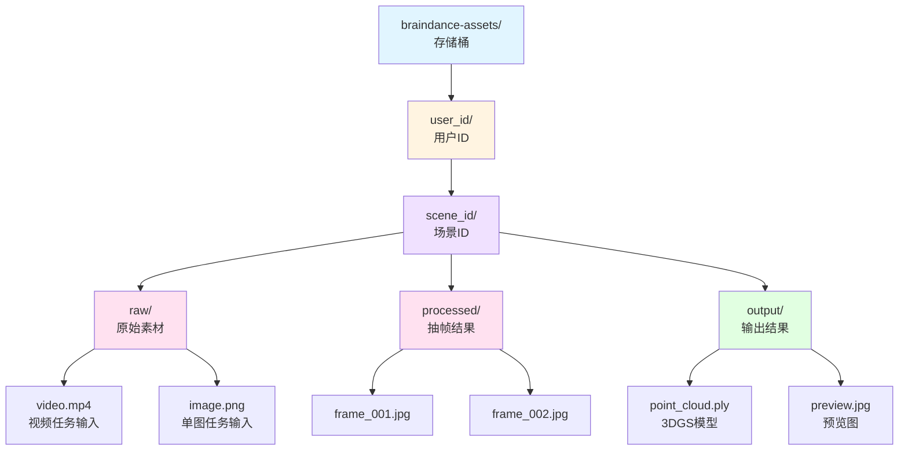
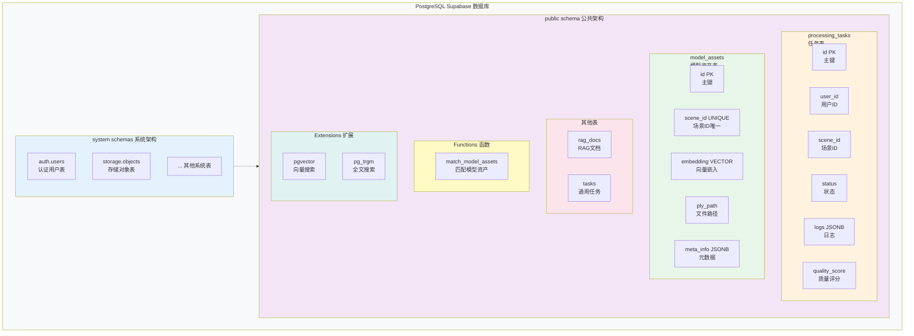

# BrainDance 数据库设计文档 (DDL)

> 本文档描述 BrainDance 项目的数据库 schema 设计，包括表结构、索引、函数和权限配置。

## 📋 概览

BrainDance 使用 **Supabase (PostgreSQL + pgvector)** 作为后端数据库，主要包含以下核心表：

| 表名 | 用途 | 说明 |
|------|------|------|
| `processing_tasks` | 任务队列 | 管理 3D 生成任务的生命周期 |
| `model_assets` | 资产库 | 存储完成的 3D 模型及其语义向量 |
| `memory_poses` | 空间锚点 | 存储帧级位姿、描述与向量，用于 Recall / Search |
| `community_posts` | 社区贴文 | 存储 Community 页贴文与地点索引 |
| `worker_nodes` | Worker 集群 | 存储实例注册、心跳与控制状态 |
| `tasks` | 通用任务 | 备用任务队列 |
| `rag_docs` | RAG 文档 | 检索增强生成的文档存储 |

**核心扩展：**
- `pgvector`: 向量相似度搜索
- `pg_trgm`: 模糊匹配（用于文本搜索）

---

## 📊 表结构详解

### 1. processing_tasks（任务队列表）

用于管理 3D 生成任务的生命周期，支持状态流转和实时日志。

```sql
CREATE TABLE processing_tasks (
    id              UUID            PRIMARY KEY DEFAULT gen_random_uuid(),
    user_id         TEXT            NOT NULL,        -- 用户ID
    scene_id        TEXT            NOT NULL,        -- 场景/项目ID
    display_name    TEXT,                            -- 任务展示名称（用于前端列表）
    task_type       TEXT            DEFAULT 'video_3dgs', -- 任务类型
    task_params     JSONB           DEFAULT '{}',    -- 任务参数
    status          TEXT            DEFAULT 'pending',  -- 状态
    created_at      TIMESTAMPTZ     DEFAULT NOW(),    -- 创建时间
    updated_at      TIMESTAMPTZ     DEFAULT NOW(),    -- 更新时间
    logs            JSONB           DEFAULT '[]',     -- 实时日志
    tags            TEXT[]          DEFAULT '{}',     -- 标签
    quality_score   INT             DEFAULT 0,        -- AI 质检评分
    quality_reason  TEXT,                            -- 质检原因
    subject         TEXT,                            -- 主体描述
    category        TEXT,                            -- 分类
    description     TEXT,                            -- 详细描述
    keywords        TEXT[]          DEFAULT '{}'      -- 关键词
);

-- 索引
CREATE UNIQUE INDEX processing_tasks_pkey ON processing_tasks USING btree (id);

-- RLS（行级安全策略）
ALTER TABLE processing_tasks ENABLE ROW LEVEL SECURITY;

-- 状态流转：pending → processing → completed / failed
```

**status 状态说明：**

| 状态 | 说明 | 可执行操作 |
|------|------|-----------|
| `pending` | 等待处理 | Worker 抢占 |
| `processing` | 处理中 | 任务执行中 |
| `completed` | 已完成 | 可下载模型 |
| `failed` | 失败 | 可重试 |

**logs 字段结构：**

```json
[
  {
    "ts": 1704067200,
    "msg": "开始下载视频...",
    "level": "info"
  },
  {
    "ts": 1704067205,
    "msg": "视频下载完成，共 500 张图片",
    "level": "info"
  }
]
```

---

### 2. model_assets（3D 资产表）

用于存储已完成的 3D 模型及其语义向量，支持 RAG 语义搜索。

```sql
CREATE TABLE model_assets (
    id                  UUID            PRIMARY KEY DEFAULT gen_random_uuid(),
    scene_id            TEXT            NOT NULL,        -- 场景ID（唯一）
    user_id             TEXT,                            -- 用户ID
    source_task_id      UUID,                            -- 来源任务ID
    description         TEXT,                            -- AI 生成的场景描述
    objects             TEXT[],                          -- 物体清单
    tags                TEXT[],                          -- 环境标签
    embedding           VECTOR(1536),                    -- 语义向量（1536维）
    ply_path            TEXT,                            -- PLY 文件路径
    preview_img_path    TEXT,                            -- 预览图路径
    meta_info           JSONB        DEFAULT '{}',       -- 元数据
    created_at          TIMESTAMPTZ  NOT NULL DEFAULT NOW()
);

-- 索引
CREATE UNIQUE INDEX model_assets_pkey ON model_assets USING btree (id);
CREATE UNIQUE INDEX unique_scene_id ON model_assets USING btree (scene_id);

-- 向量索引（HNSW 近似最近邻搜索）
CREATE INDEX model_assets_embedding_idx
ON model_assets USING hnsw (embedding public.vector_cosine_ops);

-- RLS（行级安全策略）
-- 用户只能访问自己的资产
```

**meta_info 字段示例：**

```json
{
  "quality_score": 85,
  "quality_reason": "光照充足，物体清晰",
  "engine_version": "nerfstudio-splatfacto-1.1.5",
  "training_iterations": 15000,
  "source_type": "video",  -- video | single_image
  "processing_time_seconds": 1200
}
```

**embedding 生成策略：**

```text
核心物体: [物品A]。 [物品A]。     <-- 重复两次，增加权重
详细描述: [AI生成的长难句...]。
包含物品: [物品A, 物品B...]。
环境标签: [标签1, 标签2...]。
```

---

### 3. tasks（通用任务表）

备用任务队列，用于通用任务处理。

```sql
CREATE TABLE tasks (
    id              UUID            PRIMARY KEY DEFAULT gen_random_uuid(),
    user_id         UUID            NOT NULL,        -- 用户ID
    source_path     TEXT            NOT NULL,        -- 源文件路径
    status          TEXT            DEFAULT 'pending',  -- 状态
    worker_id       TEXT,                            -- 执行Worker ID
    result_data     JSONB,                            -- 结果数据
    created_at      TIMESTAMPTZ     DEFAULT NOW(),    -- 创建时间
    updated_at      TIMESTAMPTZ     DEFAULT NOW()     -- 更新时间
);

-- 索引
CREATE UNIQUE INDEX tasks_pkey ON tasks USING btree (id);

-- RLS
ALTER TABLE tasks ENABLE ROW LEVEL SECURITY;
```

---

### 4. memory_poses（空间锚点表）

用于存储视频流水线拆出的关键帧位姿、描述和向量，支撑 Recall 空间检索和 `match_memory_poses`。

```sql
CREATE TABLE memory_poses (
    id              UUID            PRIMARY KEY DEFAULT gen_random_uuid(),
    model_id        UUID            NOT NULL REFERENCES public.model_assets(id) ON DELETE CASCADE,
    frame_index     INT             NOT NULL,
    image_path      TEXT,
    pose_data       JSONB,
    caption         TEXT,
    tags            TEXT[],
    embedding       VECTOR(1536),
    created_at      TIMESTAMPTZ     NOT NULL DEFAULT NOW()
);

CREATE INDEX memory_poses_model_id_idx ON memory_poses(model_id);
CREATE INDEX memory_poses_embedding_idx
ON memory_poses USING hnsw (embedding public.vector_cosine_ops);
```

该表最近配套补齐了 Dashboard 只读 RLS 策略，便于前端监控页直接统计记录数。

---

### 5. community_posts（社区贴文表）

用于 Community 页的公共贴文流与地图探索。

```sql
CREATE TABLE community_posts (
    id              UUID             PRIMARY KEY DEFAULT gen_random_uuid(),
    user_id         TEXT,
    model_asset_id  UUID             REFERENCES public.model_assets(id) ON DELETE SET NULL,
    model_name      TEXT,
    title           TEXT             NOT NULL,
    caption         TEXT             NOT NULL DEFAULT '',
    place_name      TEXT             NOT NULL,
    latitude        DOUBLE PRECISION NOT NULL,
    longitude       DOUBLE PRECISION NOT NULL,
    cover_image_url TEXT,
    metadata        JSONB            NOT NULL DEFAULT '{}',
    created_at      TIMESTAMPTZ      NOT NULL DEFAULT NOW(),
    updated_at      TIMESTAMPTZ      NOT NULL DEFAULT NOW()
);

CREATE INDEX community_posts_created_at_idx ON community_posts(created_at DESC);
CREATE INDEX community_posts_place_idx ON community_posts(place_name);
CREATE INDEX community_posts_geo_idx ON community_posts(latitude, longitude);
```

当前迁移里该表使用开发态全开放策略，方便移动端直接发布和读取贴文。

---

### 6. worker_nodes（Worker 节点表）

用于 AI Engine Worker 实例注册、心跳和 Dashboard 集群控制。

```sql
CREATE TABLE worker_nodes (
    worker_id            TEXT PRIMARY KEY,
    hostname             TEXT,
    pid                  INTEGER,
    status               TEXT        NOT NULL DEFAULT 'starting',
    current_task_id      UUID,
    current_scene_id     TEXT,
    desired_state        TEXT        NOT NULL DEFAULT 'run',
    control_note         TEXT,
    control_requested_at TIMESTAMPTZ,
    last_heartbeat       TIMESTAMPTZ NOT NULL DEFAULT timezone('utc', now()),
    started_at           TIMESTAMPTZ NOT NULL DEFAULT timezone('utc', now()),
    stopped_at           TIMESTAMPTZ,
    metadata             JSONB       NOT NULL DEFAULT '{}'
);

CREATE INDEX worker_nodes_last_heartbeat_idx ON worker_nodes(last_heartbeat DESC);
CREATE INDEX worker_nodes_status_idx ON worker_nodes(status);
```

`desired_state` 当前约定值：

- `run`：保持运行
- `pause`：停止接新任务并优雅退出
- `interrupt`：请求更强的中断语义

---

### 7. rag_docs（RAG 文档表）

用于存储检索增强生成的文档内容。

```sql
CREATE TABLE rag_docs (
    id              BIGSERIAL        PRIMARY KEY,
    content         TEXT,                            -- 文档内容
    metadata        JSONB,                            -- 元数据
    embedding       VECTOR(1536)                     -- 语义向量
);

-- 索引
CREATE UNIQUE INDEX rag_docs_pkey ON rag_docs USING btree (id);
```

---

## 🔧 数据库函数

### match_model_assets（语义搜索函数）

用于在 model_assets 中进行向量相似度搜索。

```sql
CREATE OR REPLACE FUNCTION match_model_assets(
    query_embedding     public.vector,
    match_threshold     double precision,
    match_count         integer,
    filter_start        timestamptz DEFAULT NULL,
    filter_end          timestamptz DEFAULT NULL
)
RETURNS TABLE(
    id          uuid,
    scene_id    text,
    description text,
    ply_path    text,
    created_at  timestamptz,
    similarity  double precision
)
LANGUAGE plpgsql
SECURITY DEFINER
AS $$
begin
  RETURN QUERY
  SELECT
    model_assets.id,
    model_assets.scene_id,
    model_assets.description,
    model_assets.ply_path,
    model_assets.created_at,
    1 - (model_assets.embedding <=> query_embedding) as similarity
  FROM model_assets
  WHERE 1 - (model_assets.embedding <=> query_embedding) > match_threshold
    AND (filter_start IS NULL OR model_assets.created_at >= filter_start)
    AND (filter_end IS NULL OR model_assets.created_at <= filter_end)
  ORDER BY model_assets.embedding <=> query_embedding
  LIMIT match_count;
END;
$$;
```

**使用示例：**

```sql
-- 搜索相似度 > 0.8 的模型，最多返回 10 个
SELECT * FROM match_model_assets(
  '[0.1, 0.2, ...]',  -- 查询向量
  0.8,                 -- 相似度阈值
  10                   -- 返回数量
);

-- 带时间过滤的搜索（搜索最近一周的）
SELECT * FROM match_model_assets(
  '[0.1, 0.2, ...]',
  0.7,
  10,
  NOW() - INTERVAL '7 days',  -- 开始时间
  NOW()                        -- 结束时间
);
```

---

## 📦 存储配置

### Storage Bucket: braindance-assets

**目录结构：**



**访问权限：**

| 操作 | 权限 | 说明 |
|------|------|------|
| 上传 | 登录用户 | 只能上传到自己的目录 |
| 下载 | 登录用户 | 只能下载自己的文件 |
| 删除 | 登录用户 | 只能删除自己的文件 |

**文件URL拼接：**

```
{Supabase_URL}/storage/v1/object/public/braindance-assets/{ply_path}
```

示例：
```
http://127.0.0.1:54321/storage/v1/object/public/braindance-assets/user_123/scene_001/output/point_cloud.ply
```

### Storage Bucket: braindance-models

**用途：**

- 托管 Flutter Recall 本地 AI 下载用的 GGUF / HF merged / LoRA release 模型产物
- 维护统一的模型发布清单 `catalog/model_catalog.json`

**当前目录结构：**

```text
catalog/model_catalog.json

releases/qwen3-1.7b-braindance-q5-k-m-imatrix.gguf
releases/qwen3-1.7b-braindance-q5-k-m.gguf
releases/qwen3-1.7b-braindance-q4-k-m.gguf
releases/qwen3-1.7b-braindance-merged/*
releases/qwen3-0.6b-braindance-round1/*
```

**默认下载对象：**

```
{Supabase_URL}/storage/v1/object/public/braindance-models/releases/qwen3-1.7b-braindance-q5-k-m-imatrix.gguf
```

---

## 🔐 安全策略 (RLS)

### 处理任务访问控制

```sql
-- 开发环境：允许所有访问
CREATE POLICY "Allow all for dev" ON processing_tasks
FOR ALL TO PUBLIC USING (true);
```

### 存储文件访问控制

```sql
-- 用户只能访问自己的文件夹
CREATE POLICY "Allow user view own folder" ON storage.objects
FOR SELECT TO PUBLIC USING (
  bucket_id = 'braindance-assets'
  AND (auth.uid())::text = (storage.foldername(name))[1]
);

CREATE POLICY "Allow user upload own folder" ON storage.objects
FOR INSERT TO PUBLIC WITH CHECK (
  bucket_id = 'braindance-assets'
  AND (auth.uid())::text = (storage.foldername(name))[1]
);

CREATE POLICY "Allow user delete own folder" ON storage.objects
FOR DELETE TO PUBLIC USING (
  bucket_id = 'braindance-assets'
  AND (auth.uid())::text = (storage.foldername(name))[1]
);
```

---

## 📊 权限配置

### 表权限矩阵

| 表名 | anon | authenticated | service_role | postgres |
|------|------|---------------|--------------|-----------|
| processing_tasks | SELECT, INSERT, UPDATE | 全部 | 全部 | 全部 |
| model_assets | 全部 | 全部 | 全部 | 全部 |
| memory_poses | 受 RLS 控制，Dashboard 额外只读 | 受 RLS 控制，Dashboard 额外只读 | 全部 | 全部 |
| community_posts | 全部（开发态） | 全部（开发态） | 全部 | 全部 |
| worker_nodes | 全部（开发态） | 全部（开发态） | 全部 | 全部 |
| tasks | 全部 | 全部 | 全部 | 全部 |
| rag_docs | 全部 | 全部 | 全部 | 全部 |

---

## 🗄️ 数据库架构图



---

## 📝 变更历史

| 版本 | 日期 | 变更说明 |
|------|------|---------|
| 1.0 | 2026-01-18 | 初始 schema 创建 |
| 1.1 | 2026-03-07 | `processing_tasks` 新增 `display_name` |
| 1.2 | 2026-03-17 | 新增 `community_posts` 社区贴文表 |
| 1.3 | 2026-03-20 | 新增 `worker_nodes`，并为 Dashboard 补齐只读 RLS 策略 |

---

## 🔗 相关文档

- [API 接口文档](API_DOC.md)
- [Supabase 官方文档](https://supabase.com/docs)
- [pgvector 使用指南](https://github.com/pgvector/pgvector)

---

*最后更新: 2026-03-20*
