# Qwen3-1.7B+LoRA 严格无泄漏对标评测报告（2026-03-22）

## 1. 目标

本报告用于回答一个更严格的问题：  
在“去重 + 改写 + OOD”的无泄漏评测集上，`工程优化 + LoRA + 1.7B` 到底能对标到多大参数量模型。

## 2. 严格评测集说明

### 2.1 原始 benchmark

- 来源：`ai_engine/finetune_qwen3/data/braindance_qwen3_benchmark.jsonl`
- 原始规模：80 题
- 分组：`recent_hit` / `must_answer` / `partial_coverage` / `stability` / `no_hit`
- 评测侧重点：证据利用、错误拒答、partial coverage 正反判断、幻觉控制、回答聚焦

### 2.2 严格集构建流程（去重 + 改写 + OOD）

脚本：`ai_engine/finetune_qwen3/scripts/build_strict_no_leak_benchmark.py`

输入训练集（用于去重）：
- `ai_engine/finetune_qwen3/data/braindance_qwen3_round4_train.jsonl`
- `ai_engine/finetune_qwen3/data/braindance_qwen3_sft_train.jsonl`
- `ai_engine/finetune_qwen3/data/real_chain_failures_round4_1_patch_plus_round4_train.jsonl`

构建策略：
1. 先做精确去重：问题文本规范化后与训练集命中即剔除。  
2. 再做近似去重：`difflib` 相似度阈值 `0.95`。  
3. 对保留样本进行问题改写（同语义不同问法）。  
4. 对缺失组别做“强改写回填”（保证组别覆盖）。  
5. 再扩充 OOD 问法（口语化、噪声化、非标准表达）。  

严格集产物：
- 数据：`ai_engine/finetune_qwen3/data/braindance_qwen3_benchmark_strict_no_leak_ood_20260322_v3.jsonl`
- 摘要：`ai_engine/finetune_qwen3/data/braindance_qwen3_benchmark_strict_no_leak_ood_20260322_v3_summary.json`

构建统计（v3）：
- 原始 80 题
- 精确去重移除：37
- 近似去重移除：1
- 去重后保留：49
- 强改写回填：7
- OOD 扩充：15
- 最终规模：64
- 组别分布：
  - must_answer: 9
  - no_hit: 9
  - partial_coverage: 18
  - recent_hit: 9
  - stability: 19

## 3. 评测设置

- 评测脚本：
  - 本地：`ai_engine/finetune_qwen3/scripts/evaluate_benchmark.py`
  - 云端（有工程优化口径）：`ai_engine/finetune_qwen3/scripts/evaluate_cloud_benchmark.py`
  - 云端（无工程无微调口径）：`ai_engine/finetune_qwen3/scripts/evaluate_cloud_no_opt_benchmark.py`
- 关键指标：
  - 低为好：`false_no_answer_rate`、`partial_hallucination_rate`、`partial_false_negative_rate`、`partial_missing_negation_rate`
  - 高为好：`evidence_utilization_rate`、`partial_hit_precision`、`must_answer_focus_rate`

## 4. 结果总表（严格集 v3）

| 模型 | false_no_answer | partial_hallucination | evidence_utilization | partial_precision | partial_false_negative | partial_missing_negation | must_answer_focus | natural_style | composite |
|---|---:|---:|---:|---:|---:|---:|---:|---:|---:|
| Local LoRA 1.7B | **0.0000** | **0.0000** | **1.0000** | **1.0000** | **0.0000** | **0.0000** | 0.8889 | 0.8281 | **98.89** |
| Cloud qwen2.5-32b (opt) | **0.0000** | 0.0556 | **1.0000** | 0.9474 | **0.0000** | 0.0556 | **1.0000** | 0.9219 | 97.54 |
| Cloud qwen3-32b (opt) | 0.0364 | 0.1111 | 0.9636 | 0.8889 | 0.1111 | 0.1111 | **1.0000** | 0.9219 | 92.62 |
| Cloud qwen3-8b (opt) | 0.0364 | 0.1667 | 0.9636 | 0.8421 | 0.1111 | 0.1667 | **1.0000** | 0.8750 | 90.25 |
| Cloud qwen-turbo (opt) | **0.0000** | 0.1111 | 0.9091 | 0.8824 | 0.1667 | 0.5556 | 0.8889 | **1.0000** | 86.32 |
| Local Base 1.7B | 0.0545 | 0.3889 | 0.9455 | 0.6818 | 0.1667 | 0.7222 | **1.0000** | 0.9688 | 76.65 |
| Cloud qwen3-8b (no-opt) | **0.0000** | 0.6667 | 0.7091 | 0.5385 | 0.2222 | 0.6667 | 0.5556 | 0.5781 | 62.05 |
| Cloud qwen3-32b (no-opt) | **0.0000** | 0.6667 | 0.7455 | 0.5385 | 0.2222 | 0.7222 | 0.5556 | 0.5156 | 62.04 |
| Cloud qwen2.5-32b (no-opt) | **0.0000** | 0.8333 | 0.7091 | 0.4828 | 0.2222 | 0.7222 | 0.2222 | 0.4844 | 53.99 |

说明：`composite` 为任务导向加权分（0-100），用于排序，不替代单项指标。

## 4.0.1 本地部署变体补充总表（严格集新增）

为了让严格集报告也能覆盖当前所有本地可部署版本，补充加入：

- `0.6B LoRA`
- `0.6B full SFT`
- `1.7B merged`
- `1.7B Q4_K_M GGUF`

它们在 **strict_no_leak_ood_v3（64 题）** 上的结果如下：

| 本地版本 | false_no_answer | partial_hallucination | evidence_utilization | partial_precision | partial_false_negative | partial_missing_negation | must_answer_focus | natural_style |
|---|---:|---:|---:|---:|---:|---:|---:|---:|
| 1.7B LoRA（当前主模型） | **0.0000** | **0.0000** | **1.0000** | **1.0000** | **0.0000** | **0.0000** | 0.8889 | 0.8281 |
| 0.6B LoRA | **0.0000** | 0.0556 | **1.0000** | 0.9474 | **0.0000** | 0.0556 | **1.0000** | 0.8281 |
| 0.6B full SFT | **0.0000** | 0.0556 | **1.0000** | 0.9474 | **0.0000** | 0.0556 | **1.0000** | **0.9375** |
| 1.7B merged | **0.0000** | **0.0000** | **1.0000** | **1.0000** | **0.0000** | **0.0000** | 0.6667 | 0.7812 |
| 1.7B Q4 GGUF | **0.0000** | 0.0556 | **1.0000** | 0.9474 | **0.0000** | 0.0556 | 0.6667 | 0.7188 |

补充说明：

- `0.6B LoRA` 严格集日志：`ai_engine/finetune_qwen3/logs/benchmark_strict_v3_qwen3_0p6b_lora_gpu1.json`
- `0.6B full` 严格集日志：`ai_engine/finetune_qwen3/logs/benchmark_strict_v3_qwen3_0p6b_full_gpu1.json`
- `1.7B merged` 严格集日志：`ai_engine/finetune_qwen3/logs/benchmark_strict_v3_qwen3_1p7b_merged_gpu1.json`
- `1.7B Q4 GGUF` 严格集日志：`ai_engine/finetune_qwen3/logs/benchmark_strict_v3_qwen3_1p7b_q4_gguf_gpu1.json`

这里最重要的补充观察是：

1. `0.6B LoRA` 在严格集上并没有崩，反而维持了相当强的正确性
2. `0.6B full` 在严格集上没有拉高任务风险，且把 `natural_style` 从 `0.8281` 提到了 `0.9375`
3. `1.7B merged` 在严格集上与当前 `1.7B LoRA` 的任务指标几乎对齐，但体验侧更弱
4. `1.7B Q4 GGUF` 在严格集上相比原始 benchmark 没有继续大幅恶化，但 `natural_style` 与 `must_answer_focus` 仍弱于非量化版本
5. 因此从严格集口径看，`0.6B full` 更像“风格增强但任务正确性基本打平”的支线版本，`Q4` 更接近“正确性基本保住、体验侧回撤”的版本

### 4.0.2 本地 4 版本图表（严格集新增）

先看综合分：

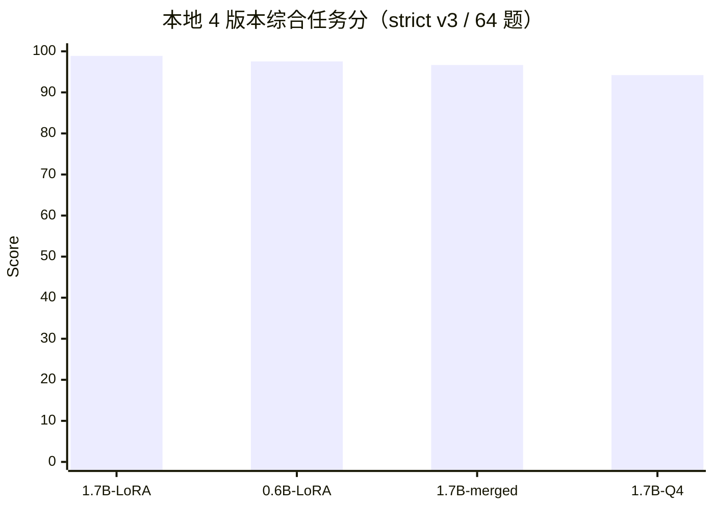

再看关键任务指标：

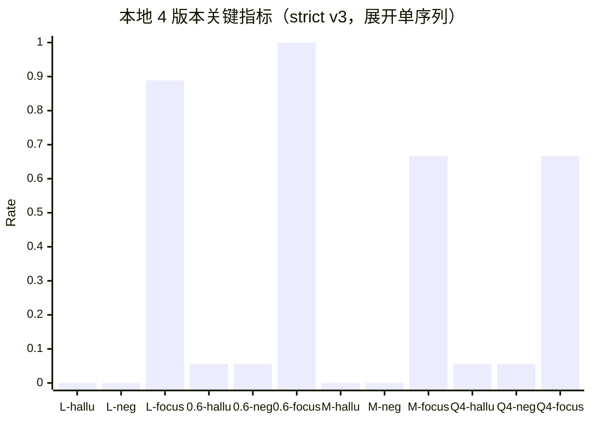

注：

- `hallu` = `partial_hallucination_rate`
- `neg` = `partial_missing_negation_rate`
- `focus` = `must_answer_focus_rate`
- `L` = `1.7B LoRA`
- `M` = `1.7B merged`

### 4.0.3 strict v3 下 Q4_K_M vs Q5_K_M（新增）

同一套 strict v3（64 题）下，再额外比较 `Q4_K_M` 和 `Q5_K_M`：

| 量化版本 | false_no_answer | partial_hallucination | partial_precision | partial_missing_negation | must_answer_focus | natural_style | 综合分 |
|---|---:|---:|---:|---:|---:|---:|---:|
| Q4_K_M | 0.0000 | 0.0556 | 0.9474 | 0.0556 | 0.6667 | 0.7188 | 94.21 |
| Q5_K_M | 0.0000 | 0.2222 | 0.8182 | 0.4444 | 1.0000 | 0.9062 | 88.38 |

这里的结论与原始集不同：

- `Q5_K_M` 在 strict 集上没有继续改善 `Q4_K_M`
- 相反，`partial_hallucination / partial_precision / partial_missing_negation` 都明显变差
- 它只在 `must_answer_focus` 与 `natural_style` 上更好

因此，当前更稳妥的结论不是“Q5 一定优于 Q4”，而是：

- `Q5` 在原始集上看起来更像修复
- 但在 strict 集上并不稳，不能作为当前默认升级方向

这意味着接下来如果继续推进端侧量化，不能只看原始 benchmark，必须同时看 strict 口径。

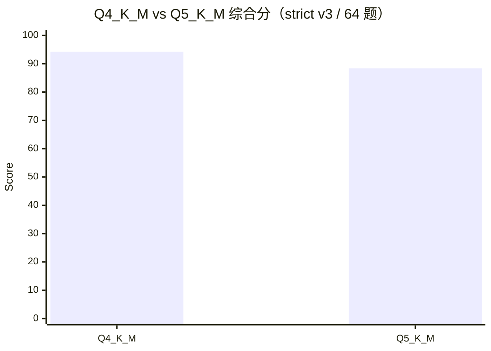

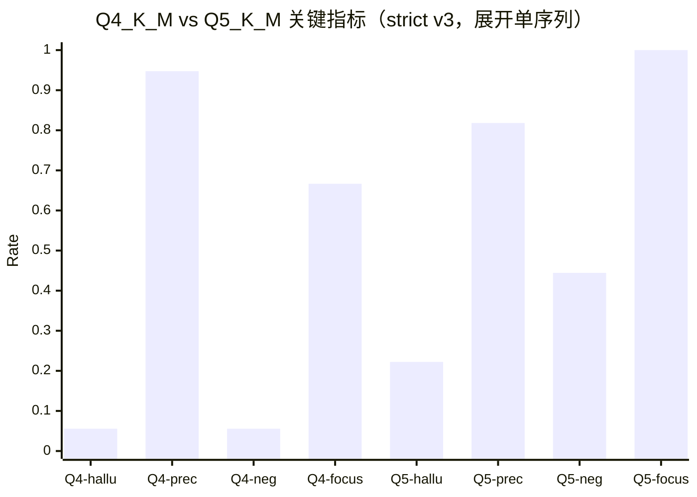

注：

- `hallu` = `partial_hallucination_rate`
- `prec` = `partial_hit_precision`
- `neg` = `partial_missing_negation_rate`
- `focus` = `must_answer_focus_rate`

### 4.0.4 Q5 strict 回退原因定位（新增）

针对“为什么 `Q5_K_M` 在 strict 集明显退化”这个问题，已经把临时分析固化成了正式脚本：

- `ai_engine/finetune_qwen3/scripts/analyze_q4_q5_regression.py`

基于：

- `benchmark_strict_v3_qwen3_1p7b_q4_gguf_gpu1.json`
- `benchmark_strict_v3_qwen3_1p7b_q5_gguf_gpu1.json`

生成分析结果：

- `ai_engine/finetune_qwen3/logs/q4_vs_q5_strict_regression_analysis.json`
- `ai_engine/finetune_qwen3/logs/q4_vs_q5_strict_regression_analysis.md`

正式统计结论：

1. 共享 `64` 个 case 中，`Q5` 相对 `Q4` 有 `9` 个回退 case
2. 其中 `7` 个集中在 `partial_coverage`
3. 回退主因不是“整体失真”，而是：
   - `partial_missing_negation`: `7` 次
   - `partial_hallucination`: `3` 次

也就是说，`Q5` 更像是在做“更自然、更聚焦命中对象”的回答，但对 BrainDance 当前 strict 规则要求的“必须对未命中对象显式否定”遵守得更差。

典型现象：

- `Q4`：`发现过地毯，但没见到打印机；暂无打印机相关记录。`
- `Q5`：`目前只查到地毯这条记录。`

因此，`Q5` strict 集退化的真实原因，不是 retrieval 失效，而是回答风格偏移到了“不补显式否定”。

### 4.0.5 importance matrix 量化复测（新增）

为验证这个问题是否能通过量化修复，又补做了一轮 `importance matrix` 量化。

设置：

- 校准语料：`benchmark + strict benchmark + sft_train`
- 样本数：`256`
- `llama-imatrix`：`128 chunks`
- 产物：
  - `Q4_K_M + imatrix`
  - `Q5_K_M + imatrix`

strict v3 / 64 题结果如下：

| 量化版本 | partial_hallucination | partial_precision | partial_false_negative | partial_missing_negation | must_answer_focus | natural_style | 综合分 |
|---|---:|---:|---:|---:|---:|---:|---:|
| Q4_K_M | 0.0556 | 0.9474 | 0.0000 | 0.0556 | 0.6667 | 0.7188 | 94.21 |
| Q5_K_M | 0.2222 | 0.8182 | 0.0000 | 0.4444 | 1.0000 | 0.9062 | 88.38 |
| Q4_K_M + imatrix | 0.1111 | 0.8947 | 0.0556 | 0.2222 | 0.7778 | 0.6562 | 91.20 |
| Q5_K_M + imatrix | 0.0556 | 0.9474 | 0.0000 | 0.0556 | 0.6667 | 0.7969 | 94.21 |

关键判断：

1. `Q4_K_M + imatrix` 没有变好，反而比原始 `Q4_K_M` 更差
2. `Q5_K_M + imatrix` 把原始 `Q5_K_M` 的 strict 退化几乎全部修回来了
3. `Q5_K_M + imatrix` 在核心任务指标上已经追平 `Q4_K_M`
4. 它的 `natural_style` 仍高于 `Q4_K_M`

所以更准确的结论不是“imatrix 一定有用”，而是：

- `imatrix` 对 `Q5` 有效
- `imatrix` 对 `Q4` 无效

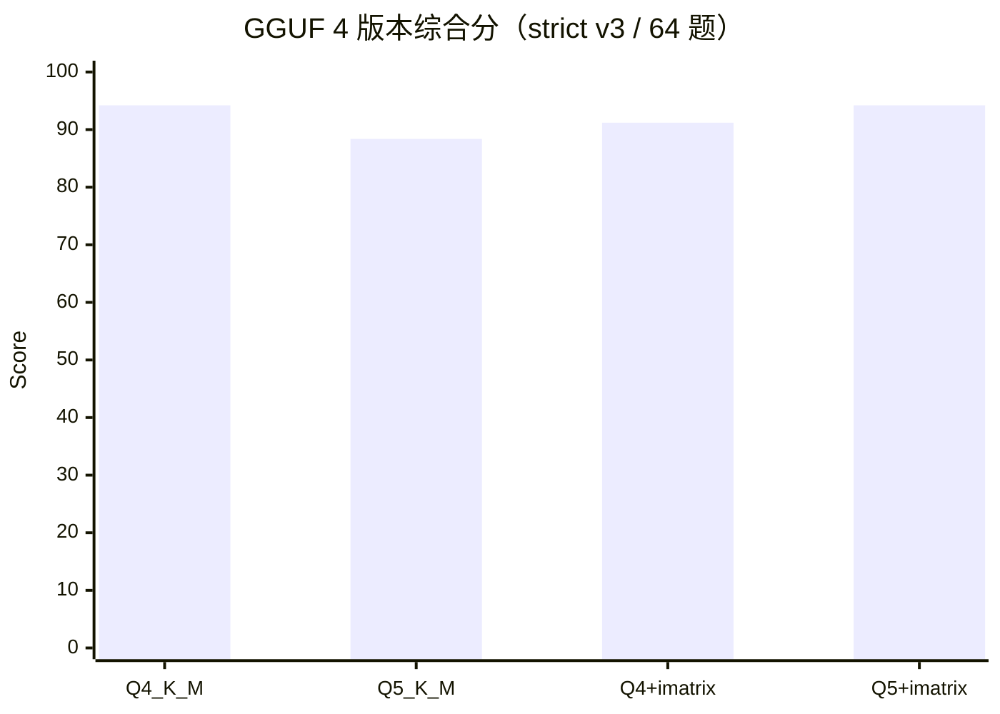

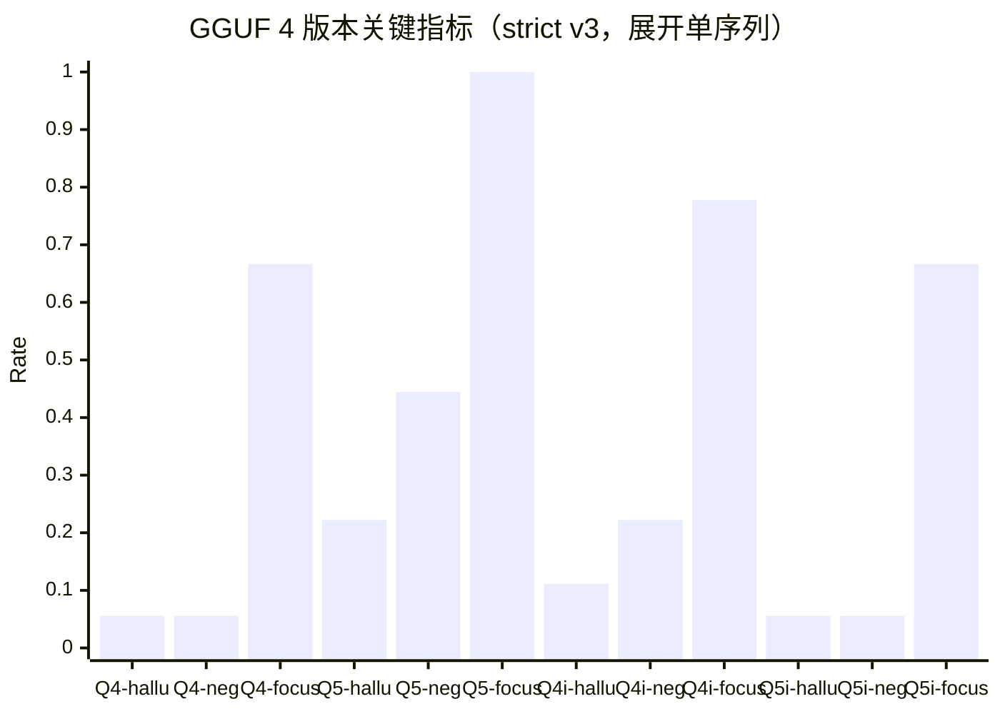

注：

- `Q4i` = `Q4_K_M + imatrix`
- `Q5i` = `Q5_K_M + imatrix`
- `hallu` = `partial_hallucination_rate`
- `neg` = `partial_missing_negation_rate`
- `focus` = `must_answer_focus_rate`

如果只从当前 strict 口径出发，新的工程建议应该是：

1. 不要推进 `Q4_K_M + imatrix`
2. 可以把 `Q5_K_M + imatrix` 作为新的 GGUF 候选主线
3. 后续继续观察它在真实调用链下的 `must_answer_focus` 表达是否还需要模板侧约束

## 4.1 1.7B 四象限对照（你要求的核心对比）

同一 `Qwen3-1.7B` 基座，做“微调前后 × 有无工程优化”四象限：

| 组合 | false_no_answer | partial_hallucination | evidence_utilization | partial_precision | partial_false_negative | partial_missing_negation | must_answer_focus | natural_style | composite |
|---|---:|---:|---:|---:|---:|---:|---:|---:|---:|
| Base + Opt | 0.0545 | 0.3889 | 0.9455 | 0.6818 | 0.1667 | 0.7222 | 1.0000 | 0.9688 | 76.65 |
| Base + NoOpt | 0.0000 | 0.6667 | 0.6182 | 0.4286 | 0.5000 | 0.5000 | 0.2222 | 0.2031 | 54.59 |
| LoRA + Opt | **0.0000** | **0.0000** | **1.0000** | **1.0000** | **0.0000** | **0.0000** | 0.8889 | 0.8281 | **98.89** |
| LoRA + NoOpt | 0.0000 | 0.7222 | 0.6727 | 0.5000 | 0.2778 | 0.6667 | 0.3333 | 0.0781 | 57.03 |

## 5. 图表

### 5.1 全模型同台竞技（综合分）

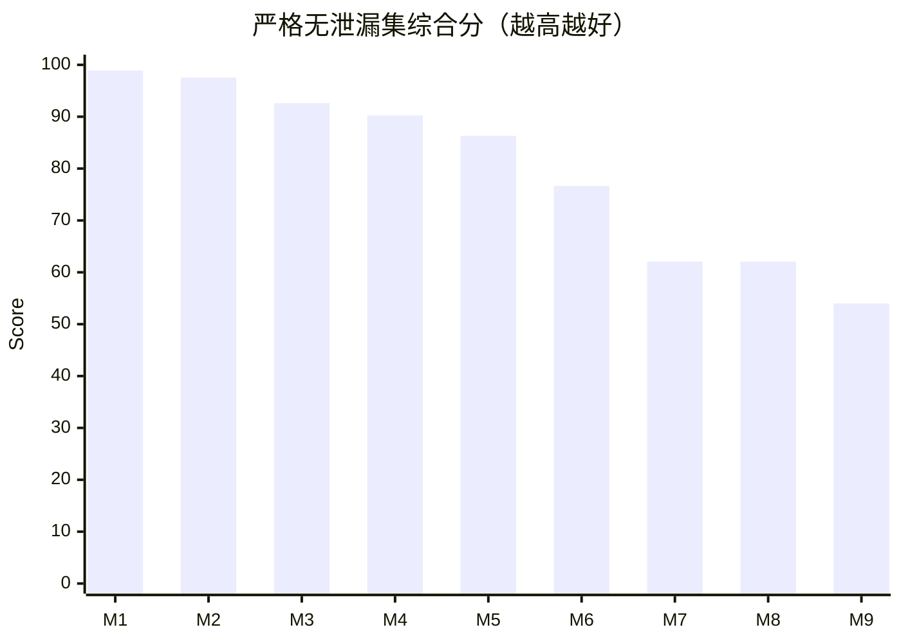

模型映射：
- `M1`: LoRA-1.7B
- `M2`: Qwen2.5-32B(opt)
- `M3`: Qwen3-32B(opt)
- `M4`: Qwen3-8B(opt)
- `M5`: Turbo(opt)
- `M6`: Base-1.7B
- `M7`: Qwen3-8B(noopt)
- `M8`: Qwen3-32B(noopt)
- `M9`: Qwen2.5-32B(noopt)

### 5.1.1 1.7B 四象限同台图（微调前后 × 有无工程）

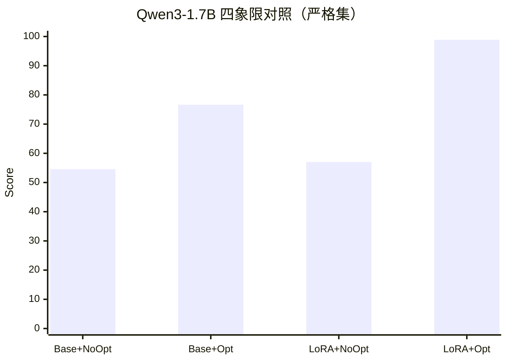

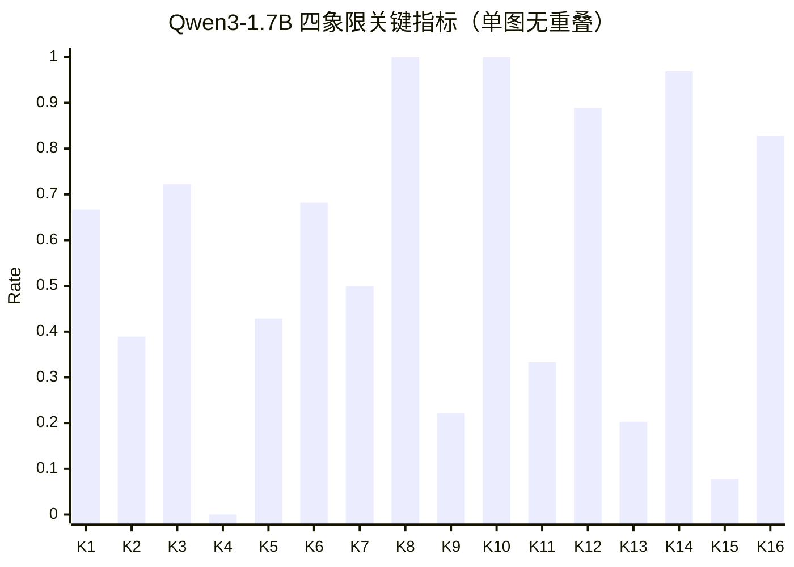

指标映射（按指标分组）：
- `K1..K4`: hallucination = `Base+NoOpt` / `Base+Opt` / `LoRA+NoOpt` / `LoRA+Opt`
- `K5..K8`: partial_precision = `Base+NoOpt` / `Base+Opt` / `LoRA+NoOpt` / `LoRA+Opt`
- `K9..K12`: must_answer_focus = `Base+NoOpt` / `Base+Opt` / `LoRA+NoOpt` / `LoRA+Opt`
- `K13..K16`: natural_style = `Base+NoOpt` / `Base+Opt` / `LoRA+NoOpt` / `LoRA+Opt`

### 5.2 有无优化同台竞技（同模型正面对打）

```mermaid
xychart-beta
  title "同模型有无优化对打（综合分）"
  x-axis ["Qwen3-8B","Qwen3-32B","Qwen2.5-32B"]
  y-axis "Score" 0 --> 100
  bar [90.25,92.62,97.54]
  bar [62.05,62.04,53.99]
```

注：第一组柱为 `opt`，第二组柱为 `no-opt`。

### 5.3 多模型关键指标同台（精度与抗幻觉）

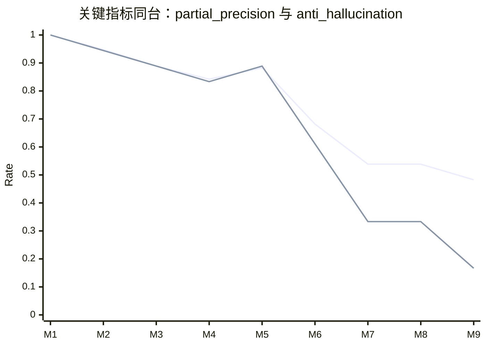

注：第二条线 `anti_hallucination = 1 - partial_hallucination_rate`（越高越好）。
模型映射：
- `M1`: LoRA-1.7B
- `M2`: Qwen2.5-32B(opt)
- `M3`: Qwen3-32B(opt)
- `M4`: Qwen3-8B(opt)
- `M5`: Turbo(opt)
- `M6`: Base-1.7B
- `M7`: Qwen3-8B(noopt)
- `M8`: Qwen3-32B(noopt)
- `M9`: Qwen2.5-32B(noopt)

### 5.4 参数量维度竞技（Qwen3 系列）

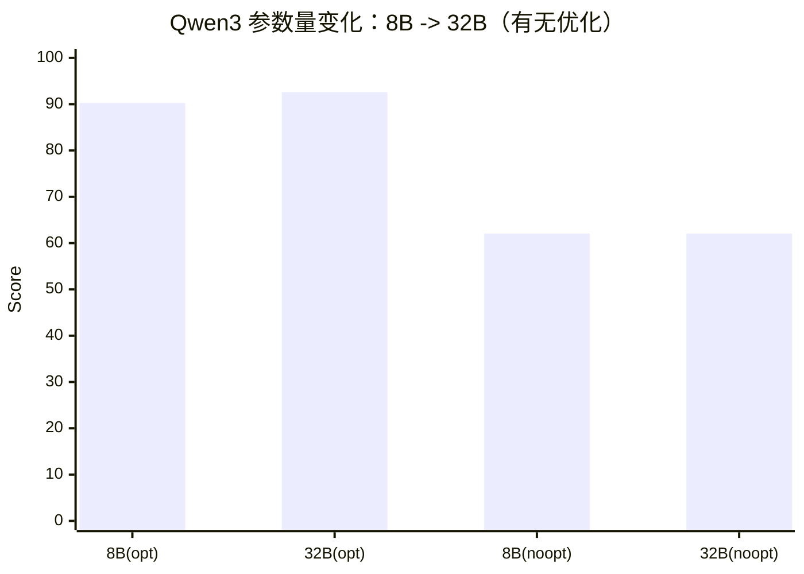

### 5.5 无优化 vs 有优化（32B 关键行为对比）

```mermaid
xychart-beta
  title "无优化 vs 有优化（32B 对比）"
  x-axis ["hallucination","partial_precision","missing_negation","must_answer_focus"]
  y-axis "Rate" 0 --> 1
  bar [0.6667,0.5385,0.7222,0.5556]
  bar [0.1111,0.8889,0.1111,1.0000]
```

## 6. 真实对标结论

1. 在严格无泄漏评测集上，`工程优化 + LoRA + 1.7B` 依然保持显著优势，不是只靠数据重叠“刷满分”。  
2. `1.7B+LoRA(opt)` 与 `32B(opt)` 已处在同一竞争档位，综合分分别为 `98.89 vs 97.54`。  
3. “只增参数、不做工程与任务化微调”效果明显不足：`32B(no-opt)` 综合分约 `62`，远低于 `1.7B+LoRA(opt)`。  
4. 在 1.7B 四象限里，工程优化与 LoRA 都是强增益，但“LoRA + 工程”叠加效果最显著：  
   `Base+NoOpt 54.59 -> Base+Opt 76.65 -> LoRA+Opt 98.89`。  
5. 真实可执行结论：在当前 BrainDance 问答场景中，优先级应是  
   `工程链路` > `任务化微调` > `盲目增大参数量`。

## 6.1 从严格集看本地部署选择（新增）

如果把当前本地可部署版本继续展开到 GGUF 新候选：

- `1.7B LoRA`：仍是严格集上的质量上界
- `0.6B LoRA`：严格集表现比预期更稳，是很强的轻量端侧候选
- `0.6B full`：严格集任务正确性与 `0.6B LoRA` 基本打平，但自然度明显更高
- `1.7B merged`：任务正确性和 `1.7B LoRA` 基本对齐，但聚焦度与自然度更弱
- `1.7B Q4 GGUF`：严格集下正确性还能接受，但体验侧弱于未量化版本
- `1.7B Q5 + imatrix GGUF`：在 strict 集关键任务指标上已追平 `Q4 GGUF`，自然度更好，是新的量化候选主线

因此当前可以拆成两类判断：

1. 如果目标是**本地质量上界**，还是 `1.7B LoRA / 1.7B merged`
2. 如果目标是**端侧可部署版本**，当前应优先比较 `0.6B LoRA / 0.6B full` 与 `1.7B Q5 + imatrix GGUF`
3. `1.7B Q4 + imatrix GGUF` 不建议继续推进

## 7. 产物清单

- 严格集构建脚本：`ai_engine/finetune_qwen3/scripts/build_strict_no_leak_benchmark.py`
- 严格集数据：
  - `ai_engine/finetune_qwen3/data/braindance_qwen3_benchmark_strict_no_leak_ood_20260322_v3.jsonl`
  - `ai_engine/finetune_qwen3/data/braindance_qwen3_benchmark_strict_no_leak_ood_20260322_v3_summary.json`
- 严格集评测结果：
  - `ai_engine/finetune_qwen3/logs/benchmark_strict_v3_base_20260322.json`
  - `ai_engine/finetune_qwen3/logs/benchmark_strict_v3_lora_20260322.json`
  - `ai_engine/finetune_qwen3/logs/benchmark_strict_v3_qwen3_0p6b_lora_gpu1.json`
  - `ai_engine/finetune_qwen3/logs/benchmark_strict_v3_qwen3_1p7b_merged_gpu1.json`
  - `ai_engine/finetune_qwen3/logs/benchmark_strict_v3_qwen3_1p7b_q4_gguf_gpu1.json`
  - `ai_engine/finetune_qwen3/logs/benchmark_strict_v3_qwen3_1p7b_q5_gguf_gpu1.json`
  - `ai_engine/finetune_qwen3/logs/benchmark_strict_v3_qwen3_1p7b_q4_gguf_imatrix_v1_gpu1.json`
  - `ai_engine/finetune_qwen3/logs/benchmark_strict_v3_qwen3_1p7b_q5_gguf_imatrix_v1_gpu1.json`
  - `ai_engine/finetune_qwen3/logs/benchmark_strict_v3_base_local_noopt_20260322.json`
  - `ai_engine/finetune_qwen3/logs/benchmark_strict_v3_lora_local_noopt_20260322.json`
  - `ai_engine/finetune_qwen3/logs/benchmark_cloud_qwen3_8b_strictv3.json`
  - `ai_engine/finetune_qwen3/logs/benchmark_cloud_qwen3_32b_strictv3.json`
  - `ai_engine/finetune_qwen3/logs/benchmark_cloud_qwen2.5_32b_instruct_strictv3.json`
  - `ai_engine/finetune_qwen3/logs/benchmark_cloud_qwen_turbo_strictv3.json`
  - `ai_engine/finetune_qwen3/logs/benchmark_cloud_no_opt_qwen3_8b_strictv3_noopt.json`
  - `ai_engine/finetune_qwen3/logs/benchmark_cloud_no_opt_qwen3_32b_strictv3_noopt.json`
  - `ai_engine/finetune_qwen3/logs/benchmark_cloud_no_opt_qwen2.5_32b_instruct_strictv3_noopt.json`
  - `ai_engine/finetune_qwen3/logs/q4_vs_q5_strict_regression_analysis.json`
  - `ai_engine/finetune_qwen3/logs/q5_vs_q5_imatrix_strict_analysis.json`
  - `ai_engine/finetune_qwen3/logs/q4_vs_q5_imatrix_strict_analysis.json`
  - `ai_engine/finetune_qwen3/logs/q4_vs_q4_imatrix_strict_analysis.json`
