# Qwen3-1.7B+LoRA 对标评测报告（2026-03-22）

## 0. 执行摘要

在 BrainDance 当前高约束、证据驱动 benchmark（80 题）上，`工程优化 + LoRA + Qwen3-1.7B` 已达到接近或超过多个 `8B~32B` 未任务化云端模型的任务表现，尤其在 `partial_hallucination`、`partial_precision`、`partial_missing_negation` 等核心任务指标上领先。  
但该结果高度依赖当前任务分布与工程链路，不应直接外推为开放域通用泛化能力。  
对比 no-opt（只喂原始问题）可见：仅靠参数放大无法替代检索、路由、formatter 与任务化微调。  
当前阶段“继续加训练轮次”不是最高优先级，建议优先投入：`retrieval/route 稳定性`、`formatter 体验打磨`、`去重+改写+OOD benchmark`。

## 1. 评测目标与问题定义

本次在同一份 80 题固定 benchmark 上完成三类对比：

1. 云端大/中/小模型横向对比（DashScope OpenAI 兼容接口）。
2. 本地 `Qwen3-1.7B` 微调前后对比（Base vs LoRA）。
3. 工程优化前后对比（Part17d 检索策略 + Part18 formatter 路由）。

该 benchmark 的目标是验证 BrainDance 本地问答链路中的“证据驱动回答行为”，不是开放域问答或长链推理能力评测。

## 2. 评测设置与边界

- 日期：2026-03-22
- 数据集：`ai_engine/finetune_qwen3/data/braindance_qwen3_benchmark.jsonl`（80 cases）
- 本地模型：
  - Base：`Qwen/Qwen3-1.7B`
  - LoRA：`ai_engine/finetune_qwen3/outputs/qwen3_1p7b_lora_sft_round4_1_patch_mixed`
- 云端模型：
  - `qwen3-0.6b`
  - `qwen3-1.7b`
  - `qwen2.5-3b-instruct`
  - `qwen-turbo`
  - `qwen-plus`
  - `qwen-max`
  - `qwen2.5-7b-instruct`
  - `qwen3-8b`
  - `qwen2.5-14b-instruct`
  - `qwen3-14b`
  - `qwen2.5-32b-instruct`
  - `qwen3-32b`

### 2.1 Benchmark 结构（本报告口径）

- 样本总量：80
- 组别结构（各 16）：
  - `recent_hit`：最近记录命中
  - `must_answer`：命中后必须给出聚焦答案
  - `partial_coverage`：部分命中，要求正确区分“有/无”
  - `stability`：同类问题稳定输出
  - `no_hit`：无命中时拒答正确
- 输入形式：`messages`（system + user）；user 包含结构化 `question + retrieval + evidence`

### 2.2 指标分层（核心指标 vs 体验指标）

A. 核心任务指标（决定“能不能用”）

- 低为好：`false_no_answer_rate`、`partial_hallucination_rate`、`partial_false_negative_rate`、`partial_missing_negation_rate`
- 高为好：`evidence_utilization_rate`、`partial_hit_precision`

B. 体验指标（决定“像不像产品”）

- `must_answer_focus_rate`
- `natural_style_rate`

补充：`must_answer_focus_rate` 表示“命中后是否围绕用户真正问的对象/主题回答”，而不是泛泛罗列相关对象。

### 2.3 阅读边界（核心提醒）

- 本报告结论适用于“任务内高约束 benchmark”。
- benchmark 与训练集问题文本存在较高重叠（精确问题重叠约 `46.25%`，`37/80`）。
- 高分更适合解释为“对当前任务分布拟合充分”。
- 不应直接外推为开放域通用泛化能力。

### 2.4 适用范围

本报告结论主要适用于：

- 结构化 evidence 注入问答
- BrainDance 本地记忆问答链路
- 高约束 partial coverage / must-answer / no-hit 场景

本报告不覆盖：

- 开放域知识问答
- 长链推理
- 无检索自由聊天

## 3. 核心结论总表（先看这张）

为降低首屏信息密度，主表仅保留最关键模型（本地 Base/LoRA + 云端小/中/大代表）。

| 模型 | false_no_answer | partial_hallucination | evidence_utilization | partial_precision | partial_false_negative | partial_missing_negation | must_answer_focus | natural_style |
|---|---:|---:|---:|---:|---:|---:|---:|---:|
| 本地 LoRA(Qwen3-1.7B) | **0.0000** | **0.0000** | **1.0000** | **1.0000** | **0.0000** | **0.0000** | 0.8125 | 0.8500 |
| 本地 Base(Qwen3-1.7B) | 0.0312 | 0.3125 | 0.9688 | 0.7500 | 0.0625 | 0.8125 | **1.0000** | 0.9625 |
| 云端 qwen3-1.7b | 0.0312 | 0.1875 | 0.9688 | 0.8333 | 0.0625 | 0.8750 | **1.0000** | 0.9750 |
| 云端 qwen3-8b | 0.0312 | 0.0625 | 0.9688 | 0.9333 | 0.1250 | 0.0625 | 0.9375 | 0.9250 |
| 云端 qwen-turbo | **0.0000** | 0.0625 | 0.9531 | 0.9333 | 0.1250 | 0.6875 | **1.0000** | 0.9875 |
| 云端 qwen3-32b | 0.0156 | 0.1250 | 0.9688 | 0.8750 | 0.1250 | 0.1250 | **1.0000** | **1.0000** |

### 3.1 本地部署变体补充总表（新增）

上表主要服务于“本地 LoRA vs 云端模型”的主叙事。  
如果从部署角度看，本地现在实际上已经有 4 个重要版本：

1. `Qwen3-1.7B + LoRA` 当前最佳 adapter
2. `Qwen3-0.6B + LoRA`
3. `Qwen3-0.6B full SFT`
4. `Qwen3-1.7B full SFT`
5. `Qwen3-1.7B merged` 独立 HF 模型
6. `Qwen3-1.7B Q4_K_M GGUF`

它们在**原始 80 题 benchmark**上的结果如下：

| 本地版本 | false_no_answer | partial_hallucination | evidence_utilization | partial_precision | partial_false_negative | partial_missing_negation | must_answer_focus | natural_style | 备注 |
|---|---:|---:|---:|---:|---:|---:|---:|---:|---|
| 1.7B LoRA（历史主报告口径） | **0.0000** | **0.0000** | **1.0000** | **1.0000** | **0.0000** | **0.0000** | 0.8125 | 0.8500 | 当前主报告基线 |
| 0.6B LoRA | **0.0000** | 0.0625 | 0.9844 | 0.9375 | 0.0625 | 0.1875 | 0.6875 | 0.8000 | 小模型端侧候选 |
| 0.6B full SFT | **0.0000** | 0.1250 | **1.0000** | 0.8824 | 0.0625 | 0.0625 | 0.8125 | **0.9250** | 小模型 full 对照实验版本 |
| 1.7B full SFT（round1, lr=8e-6） | **0.0000** | 0.0625 | **1.0000** | 0.9375 | 0.0625 | 0.1250 | 0.7500 | 0.9125 | 1.7B full 可行性实验版本 |
| 1.7B merged | **0.0000** | 0.0625 | **1.0000** | 0.9375 | 0.0625 | 0.0625 | 0.6875 | 0.8250 | 当前最稳 HF 部署版本 |
| 1.7B Q4 GGUF | **0.0000** | 0.2500 | **1.0000** | 0.8000 | **0.0000** | 0.2500 | 0.5000 | 0.8375 | `llama.cpp` + CUDA 量化版本 |

补充说明：

- `0.6B LoRA` 日志：`ai_engine/finetune_qwen3/logs/benchmark_qwen3_0p6b_round1_gpu1.json`
- `0.6B full` 日志：`ai_engine/finetune_qwen3/logs/benchmark_qwen3_0p6b_full_round1_gpu1.json`
- `1.7B full` 日志：`ai_engine/finetune_qwen3/logs/benchmark_qwen3_1p7b_full_round1_gpu1.json`
- `1.7B merged` 日志：`ai_engine/finetune_qwen3/logs/benchmark_qwen3_1p7b_merged_round4_1_patch_mixed_gpu1.json`
- `1.7B Q4 GGUF` 日志：`ai_engine/finetune_qwen3/logs/benchmark_qwen3_1p7b_q4_gguf_round4_1_patch_mixed_gpu1.json`

另有一轮更保守的 `1.7B full` 复验：

- `lr=5e-6` 日志：`ai_engine/finetune_qwen3/logs/benchmark_qwen3_1p7b_full_round1_lr5e6_gpu1.json`

该轮结果虽然把 `natural_style_rate` 提到 `0.9500`，但同时带来：

- `false_no_answer_rate`: `0.0156`
- `partial_hallucination_rate`: `0.1875`
- `partial_precision`: `0.8333`
- `partial_missing_negation_rate`: `0.3125`

因此没有纳入主表，而是作为“full 学习率保守复验失败”的补充证据保留。

就这 5 个本地版本看，可以得到更细的部署判断：

- 如果优先看**任务正确性**，当前最强仍是 `1.7B LoRA`
- `1.7B full` 在 `natural_style` 上优于当前 `1.7B LoRA / merged`，但 `partial_false_negative / partial_missing_negation / must_answer_focus` 没有形成明确优势，暂不适合替代 LoRA 主线
- 如果优先看**独立 HF 部署稳定性**，`1.7B merged` 最平衡
- `0.6B full` 相比 `0.6B LoRA`，明显提升了 `natural_style / must_answer_focus / partial_missing_negation`，但 `partial_hallucination` 反而升高，当前更适合作为“小模型风格增强对照版本”，还不适合直接替代 `0.6B LoRA`
- 如果优先看**体积与端侧可运行性**，`0.6B LoRA / 0.6B full / 1.7B Q4 GGUF` 才是更现实候选
- 但当前 `1.7B Q4 GGUF` 在 `partial_hallucination / partial_precision / must_answer_focus` 上回退明显，不能直接视作 `merged` 的无损替代

把 `1.7B full` 加进来后，本地部署口径可以进一步明确为：

- `1.7B full` 已验证“能训通、能评通、风格更自然”
- 但当前并没有打赢 `1.7B LoRA` 的关键纪律指标
- 因而它更适合作为**备用研究方向**，而不是新主线

#### 3.1.1 本地 4 版本综合分图

这里沿用正文已有综合分公式，单独把本地 4 个版本放在一张图里：

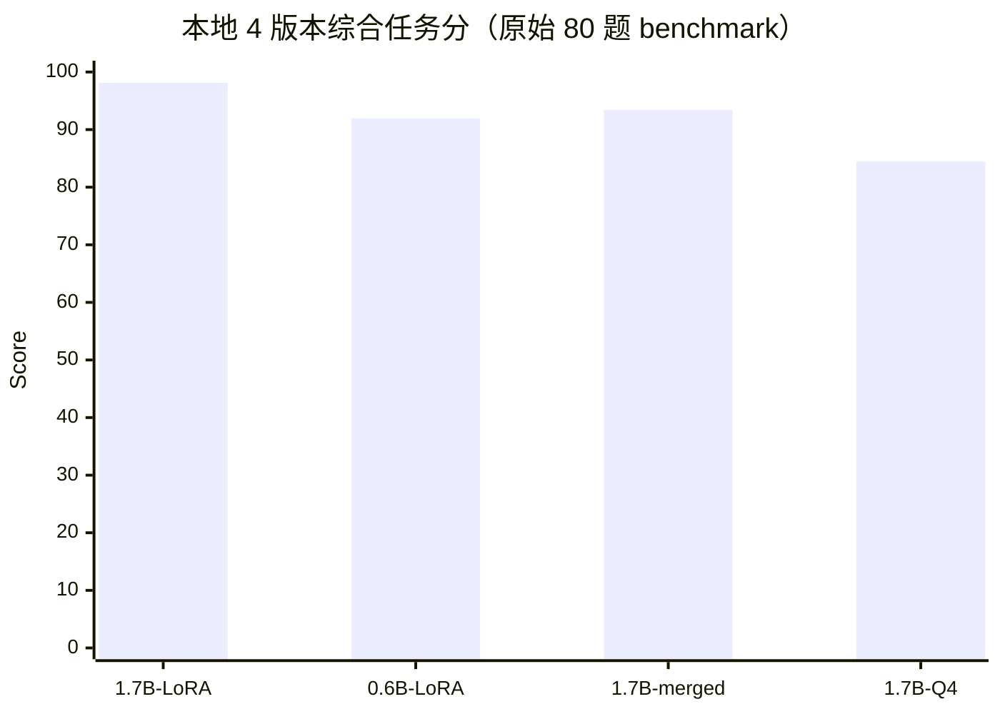

#### 3.1.2 本地 4 版本关键指标图

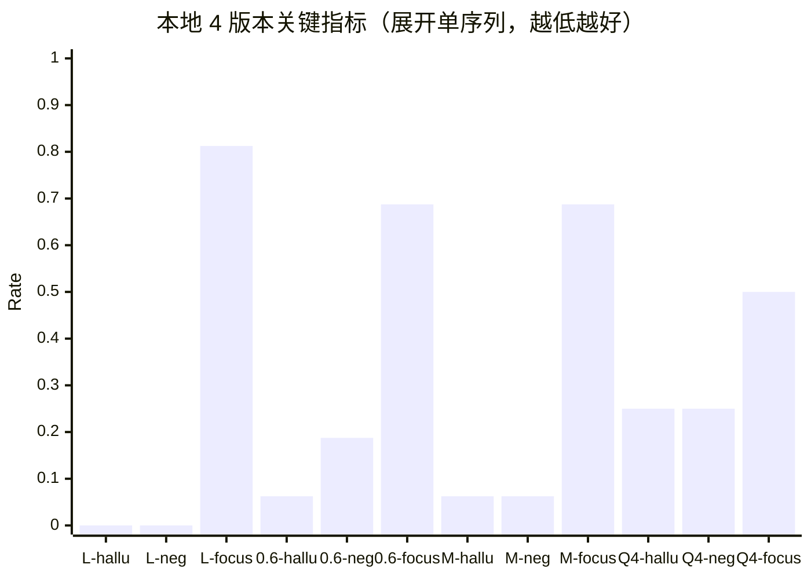

注：

- `hallu` = `partial_hallucination_rate`
- `neg` = `partial_missing_negation_rate`
- `focus` = `must_answer_focus_rate`
- `L` = `1.7B LoRA`
- `M` = `1.7B merged`

#### 3.1.3 Q4_K_M vs Q5_K_M 补测（新增）

在 `1.7B GGUF` 线上，又额外补测了 `Q5_K_M`：

| 量化版本 | 文件大小 | false_no_answer | partial_hallucination | partial_precision | partial_missing_negation | must_answer_focus | natural_style | 综合分 |
|---|---:|---:|---:|---:|---:|---:|---:|---:|
| Q4_K_M | `1.1G` | 0.0000 | 0.2500 | 0.8000 | 0.2500 | 0.5000 | 0.8375 | 84.50 |
| Q5_K_M | `1.2G` | 0.0156 | 0.1250 | 0.8824 | 0.2500 | 0.8750 | 0.9500 | 90.82 |

原始 80 题 benchmark 下，`Q5_K_M` 相比 `Q4_K_M` 的确有改善，尤其是：

- `partial_hallucination`: `0.2500 -> 0.1250`
- `partial_precision`: `0.8000 -> 0.8824`
- `must_answer_focus`: `0.5000 -> 0.8750`

但它也不是纯收益：

- `false_no_answer_rate`: `0.0000 -> 0.0156`
- `partial_missing_negation_rate`: 仍然维持 `0.2500`

因此在原始 benchmark 口径下，可以说 `Q5_K_M` 比 `Q4_K_M` 更像一个“有一定修复效果”的版本。

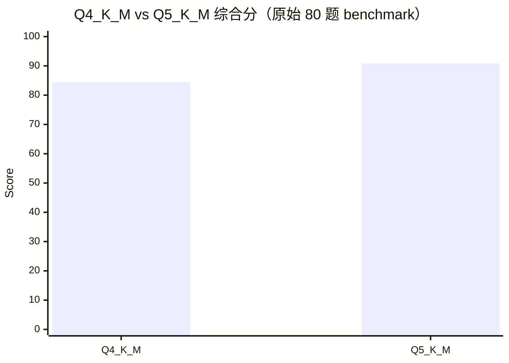

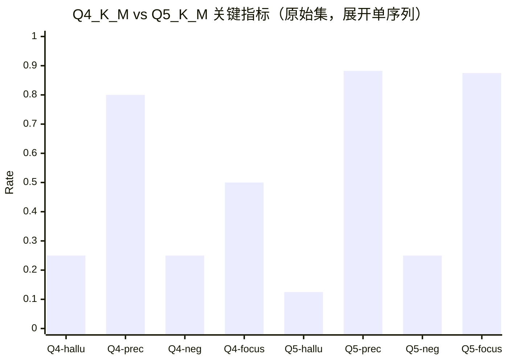

注：

- `hallu` = `partial_hallucination_rate`
- `prec` = `partial_hit_precision`
- `neg` = `partial_missing_negation_rate`
- `focus` = `must_answer_focus_rate`

#### 3.1.4 importance matrix 量化补测（新增）

为了确认 `Q5` 在 strict 集上的回退是否能通过更稳定的量化方式修复，又补做了一轮 `importance matrix` 量化。

本轮使用：

- 校准语料：`benchmark + strict benchmark + sft_train`
- 语料规模：`256` 条
- `llama-imatrix`：`128 chunks`
- 量化产物：
  - `Q4_K_M + imatrix`
  - `Q5_K_M + imatrix`

原始 80 题 benchmark 结果如下：

| 量化版本 | false_no_answer | partial_hallucination | partial_precision | partial_missing_negation | must_answer_focus | natural_style | 综合分 |
|---|---:|---:|---:|---:|---:|---:|---:|
| Q4_K_M | 0.0000 | 0.2500 | 0.8000 | 0.2500 | 0.5000 | 0.8375 | 84.50 |
| Q5_K_M | 0.0156 | 0.1250 | 0.8824 | 0.2500 | 0.8750 | 0.9500 | 90.82 |
| Q4_K_M + imatrix | 0.0000 | 0.1250 | 0.8889 | 0.1875 | 0.4375 | 0.7250 | 88.33 |
| Q5_K_M + imatrix | 0.0000 | 0.0625 | 0.9412 | 0.0625 | 0.6875 | 0.8375 | 94.12 |

这里最值得注意的是：

- `Q5_K_M + imatrix` 把 `partial_missing_negation` 从 `0.2500` 进一步压到 `0.0625`
- `Q5_K_M + imatrix` 同时把 `partial_hallucination` 压到了 `0.0625`
- `Q4_K_M + imatrix` 虽然比原始 `Q4` 好，但仍然明显弱于 `Q5_K_M + imatrix`

因此在原始集口径下，当前最强的量化版本已经从 `Q5_K_M` 变成了 `Q5_K_M + imatrix`。

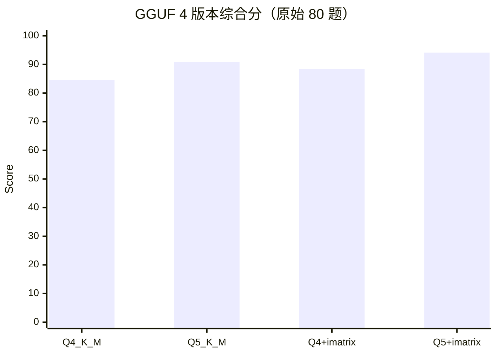

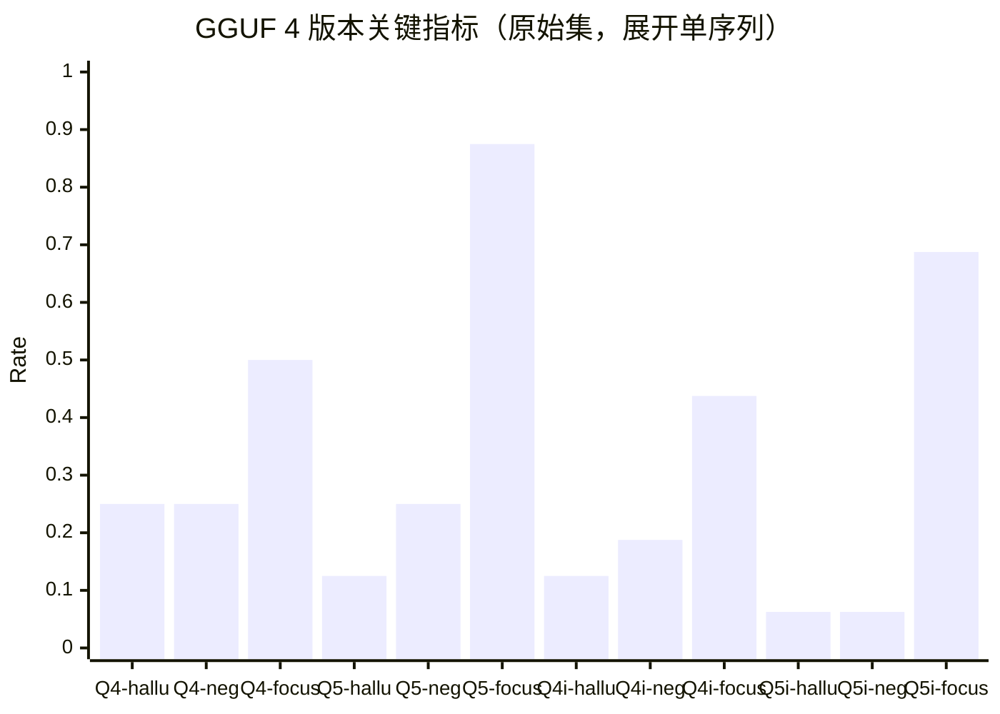

注：

- `Q4i` = `Q4_K_M + imatrix`
- `Q5i` = `Q5_K_M + imatrix`
- `hallu` = `partial_hallucination_rate`
- `neg` = `partial_missing_negation_rate`
- `focus` = `must_answer_focus_rate`

但这轮实验的真正判定标准仍然是 strict 集，详细结果见严格报告中的新增章节。

## 4. 关键对比

### 4.1 Base vs LoRA（同基座）

Base -> LoRA 的核心任务指标变化：

- `partial_hallucination`: `0.3125 -> 0.0000`
- `partial_hit_precision`: `0.7500 -> 1.0000`
- `partial_missing_negation`: `0.8125 -> 0.0000`
- `evidence_utilization`: `0.9688 -> 1.0000`

观察：任务正确性显著提升；代价是 `natural_style` 从 `0.9625` 降到 `0.8500`（输出更任务化）。

### 4.2 LoRA vs 云端同量级/中大模型

- 同量级：当前 LoRA 明显超过 `qwen3-1.7b`（尤其 partial coverage 相关指标）。
- 中大模型：对比 `qwen3-8b`、`qwen3-32b`、`qwen-turbo`，LoRA 在当前高约束任务指标上仍有领先项，云端模型在 `natural_style` 更优。
- 结论：LoRA 更像“任务最优解”，云端中大模型更像“表达更自然、开放泛化更强”的折中解。

### 4.2.1 LoRA / 0.6B / merged / Q4 的部署向对比

如果只在当前本地可部署与可实验版本之间做选择：

- `1.7B LoRA`：质量上界最高，但部署时仍依赖 adapter 机制
- `0.6B LoRA`：小模型里表现已经可用，适合作为端侧第一候选
- `0.6B full`：回答风格更自然，`must_answer_focus` 与 `partial_missing_negation` 更稳，但 partial hallucination 仍未压住
- `1.7B merged`：部署最直接，质量也明显强于 `0.6B`
- `1.7B Q4 GGUF`：已经能在 `llama.cpp` CUDA 上稳定跑，但当前质量仍低于 `1.7B merged`

从工程角度，当前更准确的路线判断是：

1. 想保质量：优先 `1.7B merged`
2. 想上手机/端侧：优先比较 `0.6B LoRA / 0.6B full` 与 `1.7B Q4 GGUF`
3. 不要把 `Q4` 直接当作 `merged` 的等价部署版本

### 4.3 no-opt 对照（仅参数放大是否足够）

为验证“参数增大是否可替代工程+微调”，新增 no-opt 对照：只给 `question`，不注入 retrieval/evidence，也不走本地 LoRA。

| 模型（no-opt） | false_no_answer | partial_hallucination | evidence_utilization | partial_precision | partial_false_negative | partial_missing_negation | must_answer_focus | natural_style |
|---|---:|---:|---:|---:|---:|---:|---:|---:|
| qwen2.5-7b-instruct | 0.0000 | 0.8125 | 0.6875 | 0.4348 | 0.3750 | 0.6250 | 0.3125 | 0.5000 |
| qwen3-8b | 0.0000 | 0.9375 | 0.6875 | 0.5000 | 0.0625 | 0.8750 | 0.1250 | 0.3125 |
| qwen2.5-32b-instruct | 0.0000 | 0.7500 | 0.6406 | 0.5000 | 0.2500 | 0.7500 | 0.1875 | 0.4250 |
| qwen3-32b | 0.0000 | 0.8750 | 0.6875 | 0.5172 | 0.0625 | 0.8750 | 0.3750 | 0.5000 |

结论：仅靠参数放大无法替代工程链路与任务化微调。

### 4.4 工程优化贡献拆解（独立结论）

#### 4.4.1 检索层收益（Part17d）

- `object_lookup_hit_rate`: `0.9444 -> 1.0000`
- `object_lookup_bad_rate`: `0.0556 -> 0.0000`
- `retrieval_miss_bad_count`: `2 -> 0`
- `post_filter_empty_count`: `6 -> 1`

#### 4.4.2 formatter/路由层收益（Part18）

- `formatter_answer_rate`: `1.0000`
- `natural_style_rate`: `1.0000`
- `must_answer_focus_rate`: `1.0000`

结论：本报告收益不能归因于 LoRA 单一因素，更准确是“工程优化 + LoRA”的系统性收益。

## 5. 可视化（聚焦“云端大小模型 vs 本地 LoRA”）

### 5.1 综合任务分总览（同场对比）

说明：综合分用于排序，不替代单项指标。加权公式（0-100）：  
`0.2*(1-false_no) + 0.2*(1-hallucination) + 0.15*evidence + 0.15*partial_precision + 0.1*(1-partial_false_negative) + 0.1*(1-partial_missing_negation) + 0.1*must_answer_focus`

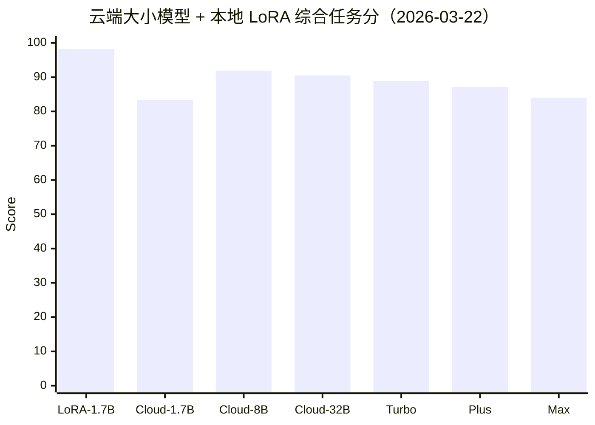

### 5.2 关键任务指标分组对比

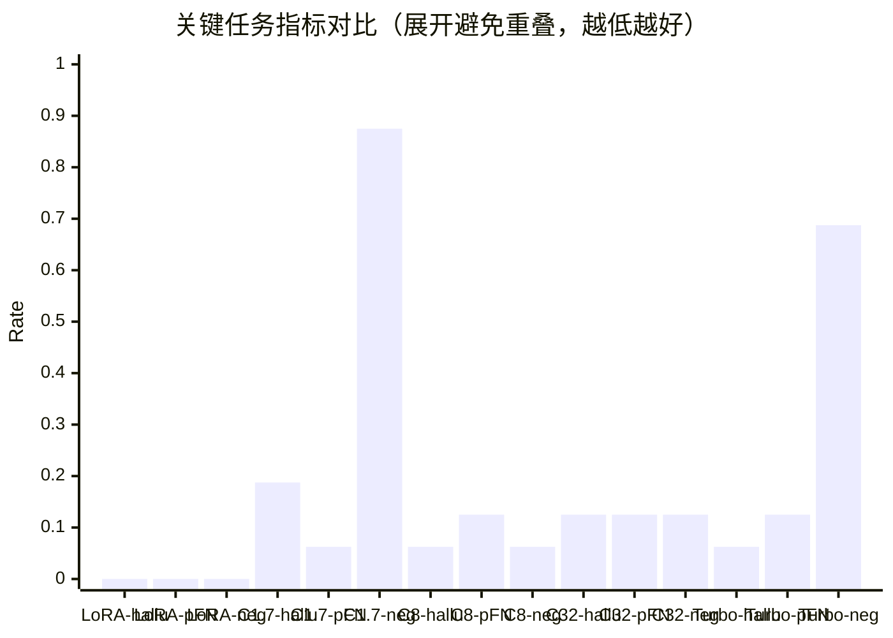

注：为避免 `xychart-beta` 多 bar 系列重叠，改为“模型-指标展开”的单序列柱图。`neg` 表示 `partial_missing_negation`。

### 5.3 参数量与关键指标趋势（扩展模型）

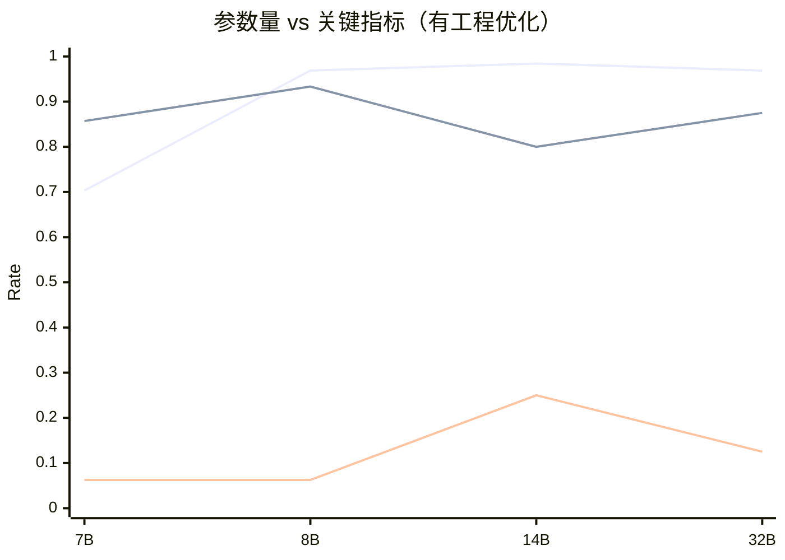

注：三条折线依次为 `evidence_utilization_rate`（高好）、`partial_hit_precision`（高好）、`partial_hallucination_rate`（低好）。

### 5.4 有/无工程优化并排对比（同模型）

说明：下图统一使用第 5.1 的综合任务分公式，对同一模型比较 `opt`（有工程优化）与 `no-opt`（无工程优化）。

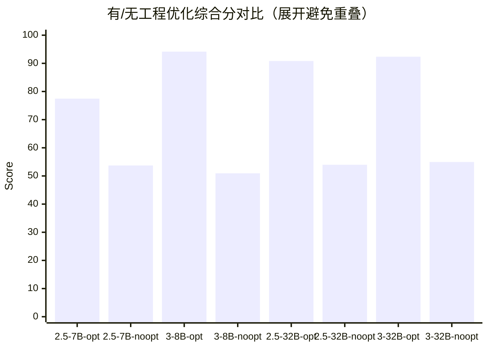

注：为避免 `xychart-beta` 多 bar 系列重叠，改为展开单序列。

### 5.5 有/无工程优化关键指标变化

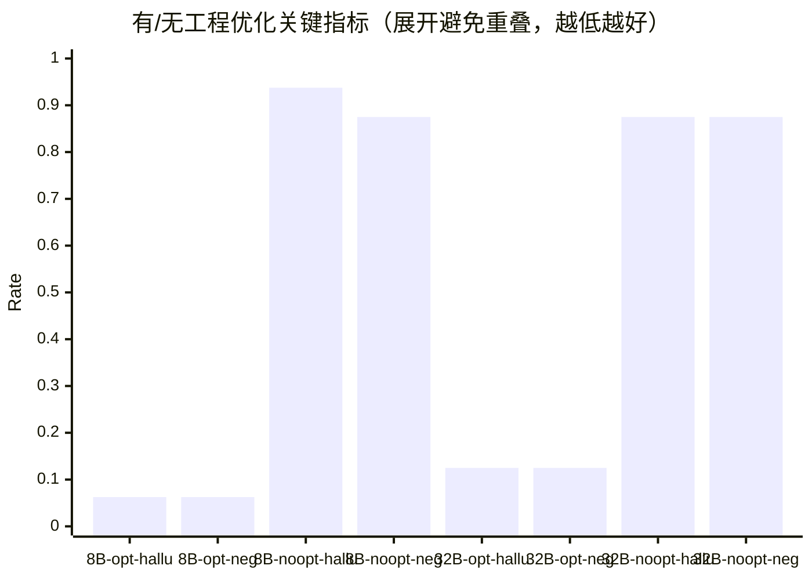

注：为避免 `xychart-beta` 多 bar 系列重叠，改为展开单序列。`neg` 表示 `partial_missing_negation`。

## 6. 结论与决策建议

### 6.1 主结论（一句话）

在当前高约束、证据驱动的 BrainDance benchmark 上，`工程优化 + LoRA + Qwen3-1.7B` 已达到接近或超过多个 `8B~32B` 未任务化模型的任务表现；但该结果高度依赖任务分布与工程链路，不应直接外推为通用泛化能力。

### 6.2 能力结论

- 当前 1.7B+LoRA 在任务内表现显著强于同量级未微调云端模型。
- 与部分中大参数云端模型相比，仍在高约束任务指标上具备优势。
- no-opt 结果表明“仅加参数”不足以支撑本场景可用性。

### 6.3 工程意义

- 本轮收益是系统性收益，不是单点收益。
- 检索、路由、formatter 与 LoRA 共同决定最终表现，任一环缺失都会显著掉分。

### 6.4 风险与边界

- 训练/评测问题重叠约 `46.25%`，结果存在任务内拟合偏高风险。
- 不宜据此宣称开放域、长链推理或无检索对话能力同等提升。

### 6.5 下一步建议（优先级）

1. 优先做 `retrieval/route` 稳定性治理，降低链路抖动。  
2. 持续打磨 formatter 的体验层（自然度与聚焦度平衡）。  
3. 建立“去重 + 改写 + OOD”评测集，作为后续升级 gate。  
4. 训练侧以小步迭代为主，不把“继续堆训练”作为当前第一优先项。

### 6.6 当前 LoRA 严格集复测（2026-03-22 实跑）

为避免正文只引用历史结果，补充对当前本地模型进行了 `strict_no_leak_ood_v3`（64 题）实跑复测：

| 模型 | false_no_answer | partial_hallucination | evidence_utilization | partial_precision | partial_false_negative | partial_missing_negation | must_answer_focus | natural_style |
|---|---:|---:|---:|---:|---:|---:|---:|---:|
| Base(Qwen3-1.7B) | 0.0545 | 0.3889 | 0.9455 | 0.6818 | 0.1667 | 0.7222 | **1.0000** | **0.9688** |
| 当前 LoRA(round4_1_patch_mixed) | **0.0000** | **0.0000** | **1.0000** | **1.0000** | **0.0000** | **0.0000** | 0.8889 | 0.8281 |

观察：

- `strict v3` 下，当前 LoRA 仍然把 `partial_hallucination / partial_false_negative / partial_missing_negation` 压到 `0.0000`。
- 相比 Base，LoRA 在严格集上的正确性优势依旧明显，没有因为 benchmark 更严而消失。
- 代价仍然主要体现在体验侧：`natural_style_rate` 从 `0.9688` 降到 `0.8281`，`must_answer_focus_rate` 从 `1.0000` 降到 `0.8889`。
- 本次复测结果与仓库内已有 `benchmark_strict_v3_*_20260322.json` 一致，可视为复现实验通过。

### 6.7 响应时延与路由观察（轻量抽样）

按“正确性优先、速度次优先”的原则，只做了小样本真实链路观测。

#### 6.7.1 formatter 路由抽样（9 条）

抽样范围：

- `object_lookup` 3 条
- `recent_capture` 3 条
- `inventory` 3 条

结果：

| query_class | answer_route | avg_retrieval_latency_sec | avg_generation_latency_sec | avg_total_latency_sec | samples |
|---|---|---:|---:|---:|---:|
| object_lookup | must_answer_focus_formatter | 9.621 | 0.000 | 9.621 | 3 |
| recent_capture | recent_answer_formatter | 3.347 | 0.000 | 3.347 | 3 |
| inventory | inventory_formatter | 3.426 | 0.000 | 3.426 | 3 |

观察：

- 这 9 条里全部命中了 formatter 路由，没有进入 `lora_generation`，所以生成耗时均为 `0.0s`。
- 当前链路下，真正拉长体验的主要是检索，不是文本生成。
- `object_lookup` 明显慢于 `recent_capture / inventory`，说明后续如果要做时延优化，优先看 `vector_plus_filter / lexical_fallback` 链路更有价值。

#### 6.7.2 semantic formatter 抽样（3 条）

补测了 3 条更抽象的问题，观察 `semantic_summary_formatter`：

| question | answer_route | retrieval_route | retrieval_latency_sec | generation_latency_sec | total_latency_sec |
|---|---|---|---:|---:|---:|
| 最近拍到过计算机科学相关内容吗？ | semantic_summary_formatter | lexical_fallback | 12.482 | 0.000 | 12.482 |
| 最近有哪些学习相关的内容？ | semantic_summary_formatter | vector_only | 12.507 | 0.000 | 12.507 |
| 最近拍到过算法相关内容吗？ | must_answer_focus_formatter | lexical_fallback | 6.270 | 0.000 | 6.270 |

结论：

- 本轮抽样中，当前系统依然优先把问题收敛到 formatter，而不是 `lora_generation`。
- 因此现阶段更值得记录的速度指标是 `retrieval_latency` 和 `total_latency`，而不是把注意力放在 token 级生成吞吐。
- 如果后续要专门评估 `lora_generation`，应单独构造会稳定触发生成路由的 query 集，再测 `time_to_first_token` 与 `output_tokens_per_sec`。

### 6.8 本地回归测试结果

补跑本地问答相关回归：

```bash
pytest -q \
  tests/test_part17_object_lookup.py \
  tests/test_part18_formatters.py \
  tests/test_local_qa_cli.py \
  tests/test_part20_local_qa_regressions.py
```

结果：`24 passed, 1 warning in 1.44s`。

说明：

- 警告来自 `torch.cuda` 对 `pynvml` 的弃用提示，不影响本次模型测试结论。
- `qwen3_ft` conda 环境内未安装 `pytest`，因此这里使用系统已安装的 `pytest 8.1.1` 执行回归。

## 附录 A：扩展参数量明细表（有工程优化口径）

| 模型 | false_no_answer | partial_hallucination | evidence_utilization | partial_precision | partial_false_negative | partial_missing_negation | must_answer_focus | natural_style |
|---|---:|---:|---:|---:|---:|---:|---:|---:|
| 本地 LoRA(Qwen3-1.7B) | **0.0000** | **0.0000** | **1.0000** | **1.0000** | **0.0000** | **0.0000** | 0.8125 | 0.8500 |
| 云端 qwen2.5-7b-instruct | 0.2969 | 0.0625 | 0.7031 | 0.8571 | 0.6250 | 0.0625 | 0.8125 | 0.9625 |
| 云端 qwen3-8b | 0.0312 | 0.0625 | 0.9688 | 0.9333 | 0.1250 | 0.0625 | 0.9375 | 0.9250 |
| 云端 qwen2.5-14b-instruct | 0.0156 | 0.1250 | 0.9844 | 0.8889 | **0.0000** | 0.1250 | 0.9375 | 0.8250 |
| 云端 qwen3-14b | 0.0156 | 0.2500 | 0.9844 | 0.8000 | **0.0000** | 0.2500 | 0.9375 | 0.9000 |
| 云端 qwen2.5-32b-instruct | 0.0156 | 0.1875 | 0.9844 | 0.8421 | **0.0000** | 0.1875 | 0.9375 | 0.8875 |
| 云端 qwen3-32b | 0.0156 | 0.1250 | 0.9688 | 0.8750 | 0.1250 | 0.1250 | **1.0000** | **1.0000** |

## 附录 B：脚本与实验产物索引

正文只保留关键入口：

- 云端评测脚本：`ai_engine/finetune_qwen3/scripts/evaluate_cloud_benchmark.py`
- no-opt 云端评测脚本：`ai_engine/finetune_qwen3/scripts/evaluate_cloud_no_opt_benchmark.py`
- 当前本地最佳 adapter：`ai_engine/finetune_qwen3/outputs/qwen3_1p7b_lora_sft_round4_1_patch_mixed`
- benchmark：`ai_engine/finetune_qwen3/data/braindance_qwen3_benchmark.jsonl`

详细产物列表：

- `ai_engine/finetune_qwen3/logs/benchmark_20260322_base.json`
- `ai_engine/finetune_qwen3/logs/benchmark_20260322_round4_1_patch_mixed.json`
- `ai_engine/finetune_qwen3/logs/benchmark_cloud_qwen3_0.6b_20260322.json`
- `ai_engine/finetune_qwen3/logs/benchmark_cloud_qwen3_1.7b_20260322.json`
- `ai_engine/finetune_qwen3/logs/benchmark_cloud_qwen2.5_3b_instruct_20260322.json`
- `ai_engine/finetune_qwen3/logs/benchmark_cloud_qwen_turbo_20260322.json`
- `ai_engine/finetune_qwen3/logs/benchmark_cloud_qwen_plus_20260322.json`
- `ai_engine/finetune_qwen3/logs/benchmark_cloud_qwen_max_20260322.json`
- `ai_engine/finetune_qwen3/logs/benchmark_cloud_qwen2.5_7b_instruct_20260322_ext.json`
- `ai_engine/finetune_qwen3/logs/benchmark_cloud_qwen3_8b_20260322_ext.json`
- `ai_engine/finetune_qwen3/logs/benchmark_cloud_qwen2.5_14b_instruct_20260322_ext.json`
- `ai_engine/finetune_qwen3/logs/benchmark_cloud_qwen3_14b_20260322_ext.json`
- `ai_engine/finetune_qwen3/logs/benchmark_cloud_qwen2.5_32b_instruct_20260322_ext.json`
- `ai_engine/finetune_qwen3/logs/benchmark_cloud_qwen3_32b_20260322_ext.json`
- `ai_engine/finetune_qwen3/logs/benchmark_cloud_no_opt_qwen2.5_7b_instruct_20260322_noopt.json`
- `ai_engine/finetune_qwen3/logs/benchmark_cloud_no_opt_qwen3_8b_20260322_noopt.json`
- `ai_engine/finetune_qwen3/logs/benchmark_cloud_no_opt_qwen2.5_32b_instruct_20260322_noopt.json`
- `ai_engine/finetune_qwen3/logs/benchmark_cloud_no_opt_qwen3_32b_20260322_noopt.json`
- `ai_engine/finetune_qwen3/logs/benchmark_strict_v3_base_20260322_rerun.json`
- `ai_engine/finetune_qwen3/logs/benchmark_strict_v3_lora_20260322_rerun.json`
- `ai_engine/finetune_qwen3/logs/benchmark_qwen3_1p7b_q4_gguf_round4_1_patch_mixed_gpu1.json`
- `ai_engine/finetune_qwen3/logs/benchmark_qwen3_1p7b_q5_gguf_round4_1_patch_mixed_gpu1.json`
- `ai_engine/finetune_qwen3/logs/benchmark_qwen3_1p7b_q4_gguf_imatrix_v1_round4_1_patch_mixed_gpu1.json`
- `ai_engine/finetune_qwen3/logs/benchmark_qwen3_1p7b_q5_gguf_imatrix_v1_round4_1_patch_mixed_gpu1.json`
- `ai_engine/finetune_qwen3/logs/q4_vs_q5_strict_regression_analysis.json`
- `ai_engine/finetune_qwen3/logs/latency_observation_20260322.jsonl`
- `ai_engine/finetune_qwen3/logs/latency_generation_observation_20260322.jsonl`
