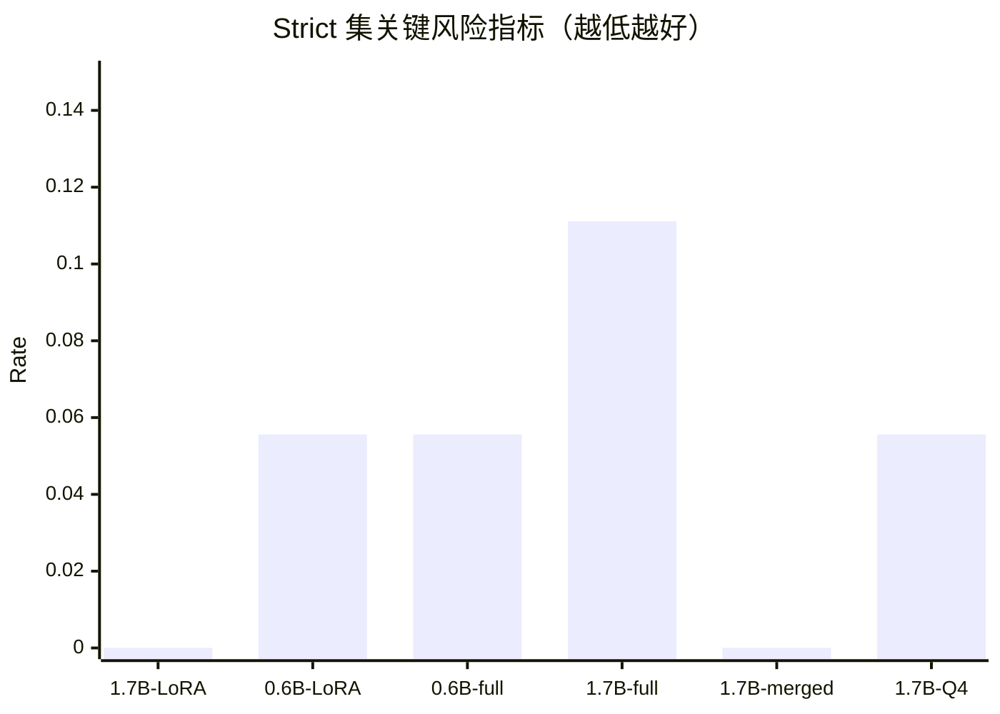
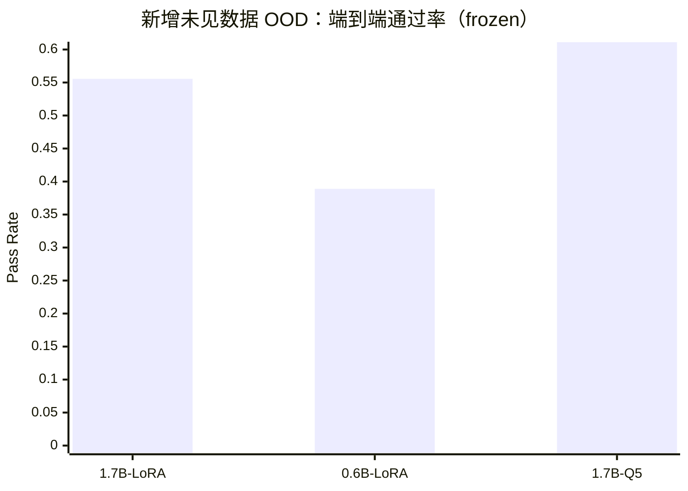
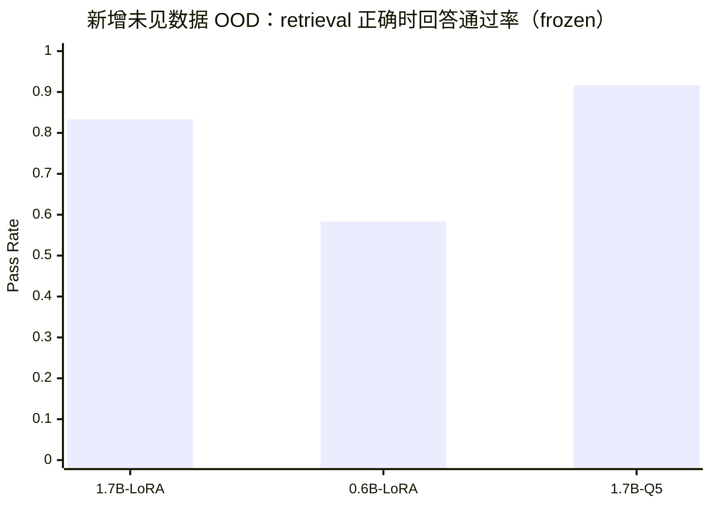
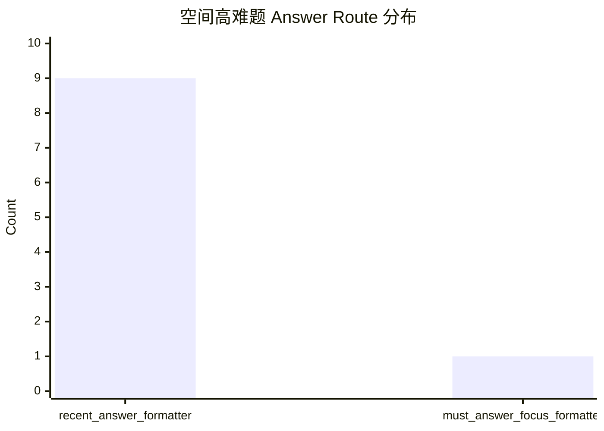
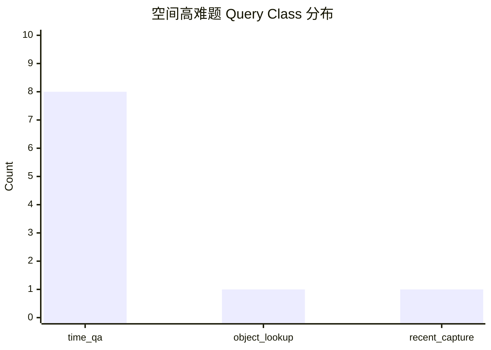

# Qwen3 本地问答模型综合横评总览（2026-03-24）

## 1. 这份总览回答什么

这份文档把今天已经实际跑完的 3 类评测合在一起看，并且同时补上了 `frozen retrieval snapshot` 复跑结果，以及今天新补齐的 **扩容覆盖审计**：

1. `strict_no_leak_ood_v3`
2. `新增未见数据 OOD benchmark`
3. `空间关系高难 hardcases`
4. `recent scenes 覆盖扩容审计 + 本地版本矩阵`

目的不是只看某一轮单点分数，而是把当前本地候选模型放到同一张图景里，回答三个更实际的问题：

- 哪些模型在老 benchmark 上已经足够稳。
- 哪些模型面对 **训练后新增、没见过的新数据** 还能保持泛化。
- 当问题升级到 `左 / 右 / 远近 / 三者关系` 这种空间题时，当前瓶颈到底在模型，还是在链路更上游。

## 2. 评测范围说明

本次总览覆盖的是 **本地问答链路的候选模型**，不是 3DGS / 视频重建流水线本身。

也就是说，这里比较的是：

- `1.7B LoRA`
- `0.6B LoRA`
- `0.6B full SFT`
- `1.7B full SFT`
- `1.7B merged`
- `1.7B Q4 / Q5 GGUF + imatrix`

而不是：

- `video_3dgs`
- `da3_feed_forward_3dgs`
- `video_dual_chain`

这些视频/重建/运动相关 pipeline 应该单独走重建质量、速度、稳定性 benchmark，不能和问答模型打在一张表里。

这也是为什么这次不会再把 `3DGS` 主线工作混进这份总览。这里收尾的是 **Qwen3 本地问答微调与 benchmark**。

## 3. 本轮涉及的文档与日志

- 严格集对标：
  - [Qwen3-1.7B-LoRA-严格无泄漏对标评测报告-2026-03-22.md](/ltx-data/BrainDance/docs/04-本地问答与微调/Qwen3-1.7B-LoRA-严格无泄漏对标评测报告-2026-03-22.md)
- 新增未见数据 OOD：
  - [Qwen3-新增未见数据OOD基准评测报告-2026-03-24.md](/ltx-data/BrainDance/docs/04-本地问答与微调/Qwen3-新增未见数据OOD基准评测报告-2026-03-24.md)
  - [unseen_ood_benchmark_20260324_summary.json](/ltx-data/BrainDance/ai_engine/finetune_qwen3/logs/unseen_ood_benchmark_20260324_summary.json)
  - [unseen_ood_benchmark_20260324_frozen_summary.json](/ltx-data/BrainDance/ai_engine/finetune_qwen3/logs/unseen_ood_benchmark_20260324_frozen_summary.json)
- 空间关系高难横评：
  - [Qwen3-空间关系高难基准横评报告-2026-03-24.md](/ltx-data/BrainDance/docs/04-本地问答与微调/Qwen3-空间关系高难基准横评报告-2026-03-24.md)
  - [spatial_hardcases_candidates_20260324_summary.json](/ltx-data/BrainDance/ai_engine/finetune_qwen3/logs/spatial_hardcases_candidates_20260324_summary.json)
  - [spatial_hardcases_candidates_20260324_frozen_summary.json](/ltx-data/BrainDance/ai_engine/finetune_qwen3/logs/spatial_hardcases_candidates_20260324_frozen_summary.json)
- 新增 benchmark 云端对标：
  - [Qwen3-新增Benchmark云端与本地对标评测报告-2026-03-24.md](/ltx-data/BrainDance/docs/04-本地问答与微调/Qwen3-新增Benchmark云端与本地对标评测报告-2026-03-24.md)
  - `ai_engine/finetune_qwen3/logs/cloud_unseen_ood_benchmark_20260324_frozen_summary.json`
  - `ai_engine/finetune_qwen3/logs/cloud_spatial_hardcases_20260324_frozen_summary.json`
- 快照复现说明：
  - [Qwen3-评测快照复现说明-2026-03-24.md](/ltx-data/BrainDance/docs/04-本地问答与微调/Qwen3-评测快照复现说明-2026-03-24.md)
- 覆盖审计与扩容：
  - [Qwen3-基准覆盖审计与扩容建议-2026-03-24.md](/ltx-data/BrainDance/docs/04-本地问答与微调/Qwen3-基准覆盖审计与扩容建议-2026-03-24.md)
  - [Qwen3-新增Benchmark全量本地模型横评补全-2026-03-24.md](/ltx-data/BrainDance/docs/04-本地问答与微调/Qwen3-新增Benchmark全量本地模型横评补全-2026-03-24.md)
  - `ai_engine/finetune_qwen3/audit/local_version_matrix_20260324.json`
  - `ai_engine/finetune_qwen3/audit/local_version_matrix_dashboard_20260324.html`
  - `ai_engine/finetune_qwen3/data/braindance_qwen3_benchmark_expanded_20260324_local_summary.json`

## 4. 一页结论

如果把今天补齐后的本地与云端新增 benchmark 一起看，结论可以压缩成 8 句：

1. `1.7B LoRA` 仍然是当前最稳的本地 QA 质量基线。
2. `1.7B Q5_K_M + imatrix` 在 `frozen` 口径的 **新增未见数据 OOD** 上已经略微领先 `1.7B LoRA`，仍然是部署主线首选。
3. `0.6B` 系列在 strict 集还能打，但到了 **新数据 + partial_coverage** 明显开始掉队。
4. `新增未见数据 OOD` 上，`1.7B Q5_K_M + imatrix` 已经对到云端第一档，和 `qwen3-8b / qwen2.5-32b-instruct` 打平。
5. 空间关系高难题目前几乎没测出模型差异，因为本地和云端都在 route / formatter 层被压成同类输出，说明瓶颈不在模型本身。
6. benchmark 扩容已经不是“建议”，而是已经落地成一套 `146` 条的本地扩容总包，把 recent scene 覆盖率从 `22.5%` 拉到了 `92.5%`。
7. 新 benchmark 也已经补成了全量本地模型横评，并额外补齐了云端对照口径。
8. 本地候选版本也不再是分散日志状态，现在已经聚合成统一版本矩阵。

## 5. 总表

### 5.1 strict 集：任务纪律与风格

| 模型 | partial_hallucination | partial_missing_negation | must_answer_focus | natural_style |
| --- | ---: | ---: | ---: | ---: |
| 1.7B LoRA | **0.0000** | **0.0000** | 0.8889 | 0.8281 |
| 0.6B LoRA | 0.0556 | 0.0556 | **1.0000** | 0.8281 |
| 0.6B full SFT | 0.0556 | 0.0556 | **1.0000** | **0.9375** |
| 0.6B full SFT partial patch | 0.1111 | 0.1111 | **1.0000** | **0.9375** |
| 1.7B full SFT | 0.1111 | 0.1111 | 0.8889 | 0.8438 |
| 1.7B merged | **0.0000** | **0.0000** | 0.6667 | 0.7812 |
| 1.7B Q4 GGUF | 0.0556 | 0.0556 | 0.6667 | 0.7188 |

这里最值得记住的是：

- `1.7B LoRA` 仍是 strict 口径下最稳的纪律型选手。
- `0.6B full SFT` 的优势主要是表达更自然，不是任务正确性反超。
- `1.7B merged` 正确性接近 `LoRA`，但回答聚焦和自然度更弱。

### 5.2 新增未见数据 OOD：真实泛化能力

先看 `live` 口径：

| 模型 | 端到端通过率 | retrieval 正确时回答通过率 | 平均总时长(ms) |
| --- | ---: | ---: | ---: |
| 1.7B LoRA | **0.5000** | **0.8182** | 18859.95 |
| 0.6B LoRA | 0.3333 | 0.5455 | 18912.40 |
| 1.7B Q5_K_M + imatrix | **0.5000** | **0.8182** | 19338.97 |

再看 `frozen` 口径：

| 模型 | 端到端通过率 | retrieval 正确时回答通过率 | 平均总时长(ms) |
| --- | ---: | ---: | ---: |
| 1.7B LoRA | 0.5556 | 0.8333 | 18641.94 |
| 0.6B LoRA | 0.3889 | 0.5833 | 18702.56 |
| 1.7B Q5_K_M + imatrix | **0.6111** | **0.9167** | 19104.57 |

`frozen` 口径的 retrieval 侧信号也更稳：

- `retrieval_ok_rate = 0.6667`
- `blocked_case_count = 6 / 18`

这说明两件事：

- live 口径里确实存在数据库增量导致的漂移。
- 把 retrieval 固定后，`1.7B Q5` 在这套新增未见数据集上反而表现最好。

### 5.3 空间高难题：当前几乎还是链路题

先看 live 口径：

| 模型 | spatial_direct_rate | generic_scene_summary_rate | 平均总时长(ms) |
| --- | ---: | ---: | ---: |
| 1.7B LoRA | 0.0000 | 1.0000 | 13016.54 |
| 0.6B LoRA | 0.0000 | 1.0000 | 13016.54 |
| 0.6B full SFT | 0.0000 | 1.0000 | 13016.54 |
| 1.7B merged | 0.0000 | 1.0000 | 13016.54 |
| 1.7B Q4_K_M + imatrix | 0.0000 | 1.0000 | 13016.54 |
| 1.7B Q5_K_M + imatrix | 0.0000 | 1.0000 | 13016.54 |

再看 frozen 口径：

| 模型 | spatial_direct_rate | refusal_rate | generic_scene_summary_rate | 平均总时长(ms) |
| --- | ---: | ---: | ---: | ---: |
| 1.7B LoRA | 0.0000 | 0.1000 | 0.9000 | 13216.30 |
| 0.6B LoRA | 0.0000 | 0.1000 | 0.9000 | 13215.25 |
| 0.6B full SFT | 0.0000 | 0.1000 | 0.9000 | 13125.10 |
| 1.7B merged | 0.0000 | 0.1000 | 0.9000 | 13135.79 |
| 1.7B Q4_K_M + imatrix | 0.0000 | 0.1000 | 0.9000 | 13275.79 |
| 1.7B Q5_K_M + imatrix | 0.0000 | 0.1000 | 0.9000 | 13281.58 |

这张表不是在说“6 个模型一样强”，而是在说：

- 当前空间题几乎还没进入真正的模型比较阶段。
- 所有模型都被同一套 `retrieval + formatter` 压成了“列举场景物体”的回答。

### 5.4 扩容覆盖与版本矩阵：收尾已经变成实现

这一块是今天补齐的“把建议做完”的部分。

recent scene 扩容：

| 指标 | 数值 |
| --- | ---: |
| recent scene 总数 | 40 |
| 扩容前覆盖数 | 9 |
| 扩容后覆盖数 | 37 |
| 扩容前覆盖率 | 22.5% |
| 扩容后覆盖率 | 92.5% |
| 仍未覆盖 recent scene | 3 |

扩容总包结构：

| 指标 | 数值 |
| --- | ---: |
| 总题数 | 146 |
| 可打分题数 | 102 |
| unique scene_id | 37 |
| must_answer | 36 |
| partial_coverage | 62 |
| abstract_semantic | 30 |
| spatial_relation | 10 |

版本矩阵聚合：

| 维度 | 数值 |
| --- | ---: |
| 本地版本数 | 18 |
| 至少进入任一老 benchmark 的版本数 | 11 |
| 完全未进入两套老 benchmark 的版本数 | 7 |
| 聚合评测记录数 | 42 |
| 统一模型标签数 | 22 |

## 6. 图表

### 6.1 strict 集关键任务风险

图中取的是 `partial_hallucination_rate`，因为它最能代表 partial 题的纪律性。

### 6.2 新增未见数据 OOD 端到端通过率（frozen）

### 6.3 新增未见数据 OOD：retrieval 正确后的回答能力（frozen）

### 6.4 空间高难题 route 分布

## 7. 怎么解读这三套结果

### 7.1 strict 集看“内功”

strict 集本质上回答的是：

- 是否还会幻觉。
- partial 有没有纪律。
- must_answer 会不会跑偏。

在这条线上，`1.7B LoRA` 依然是最强基线，`1.7B merged` 接近，但体验弱一点；`0.6B full` 更像风格优化支线。

### 7.2 未见数据 OOD 看“真实泛化”

这套是今天最关键的新信息，因为它不再复用旧 benchmark 的老样本变体，而是直接从 **Supabase 新增真实数据** 出题。

这里出现了两个更清楚的事实：

- `live` 口径下，`1.7B LoRA` 和 `1.7B Q5` 已经非常接近。
- `frozen` 口径下，`1.7B Q5` 在这套新增未见数据集上已经略优于 `1.7B LoRA`。
- `0.6B LoRA` 一旦进入 `partial_coverage + 新 object 组合`，就明显开始不稳。

所以如果问题是“这些模型有没有泛化”，答案不是简单的有或没有，而是：

- `1.7B` 有明显保留。
- `0.6B` 只在简单题上还行，复杂组合已开始掉队。

### 7.3 空间 hardcase 看“链路上限”

空间题这轮最重要的价值不是分出输赢，而是帮我们确认：

- 当前 route 没有真正识别 `spatial_relation`
- formatter 也不会把 scene 描述转成空间判断

所以空间题的失败，本质不是哪一个模型弱，而是：

- 整条链路还没有把这类问题送到“能推理空间关系”的阶段

## 8. 当前推荐结论

如果现在要给出实际可执行的模型结论，我会这样定：

- 研发质量基线：`1.7B LoRA`
- 本地部署主线：`1.7B Q5_K_M + imatrix`
- 轻量备用：`0.6B LoRA`
- 风格化轻量支线：`0.6B full SFT round1`

理由很直接：

- `1.7B LoRA` 在 strict 集最稳。
- `1.7B Q5` 在 frozen 新增未见数据 OOD 已经略优于 `1.7B LoRA`。
- `0.6B` 仍然有价值，但更适合资源受限场景，不适合扛复杂 partial 泛化。
- 扩容 benchmark 现在已经足够大到能继续做多版本回归，而不是停留在“样本太少，先看感觉”的阶段。

## 9. 本轮已定位的核心瓶颈

这轮工作已经把最关键的问题定位得比较清楚：

1. `recent_*` 类题过去确实会受远端数据库持续新增影响，但这一点现在已经被 snapshot 机制冻结住了。
2. retrieval 的 alias / lexical 泛化仍然是未见数据泛化的第一瓶颈，尤其集中在 `猫咪 / 橘白猫`、`斑马涂鸦`、`手冲咖啡` 这类自然问法上。
3. 空间关系题当前不是模型参数量问题，而是 route / formatter 没有真正进入 `spatial_relation` 通道。
4. `0.6B` 与 `1.7B` 的真正差距，主要体现在“新增真实 scene + partial_coverage + 组合对象”这条线上。
5. 当前 benchmark 的主矛盾已经从“题太少”切换成“剩余 3 个空 objects/tags 场景需要上游结构化补齐，剩余 7 个本地版本需要补齐统一横评”。

## 10. 一句话收尾

今天这轮横评真正带来的新判断不是“某个模型突然反超了”，而是：

- `1.7B` 主线在未见数据上仍然站得住；
- `Q5` 作为部署版本没有掉队；
- benchmark 扩容和版本聚合已经真正做起来了；
- 真正拖后腿的第一瓶颈已经变成 retrieval / route / formatter 与上游结构化覆盖，而不是单纯再堆一点 SFT 样本。
