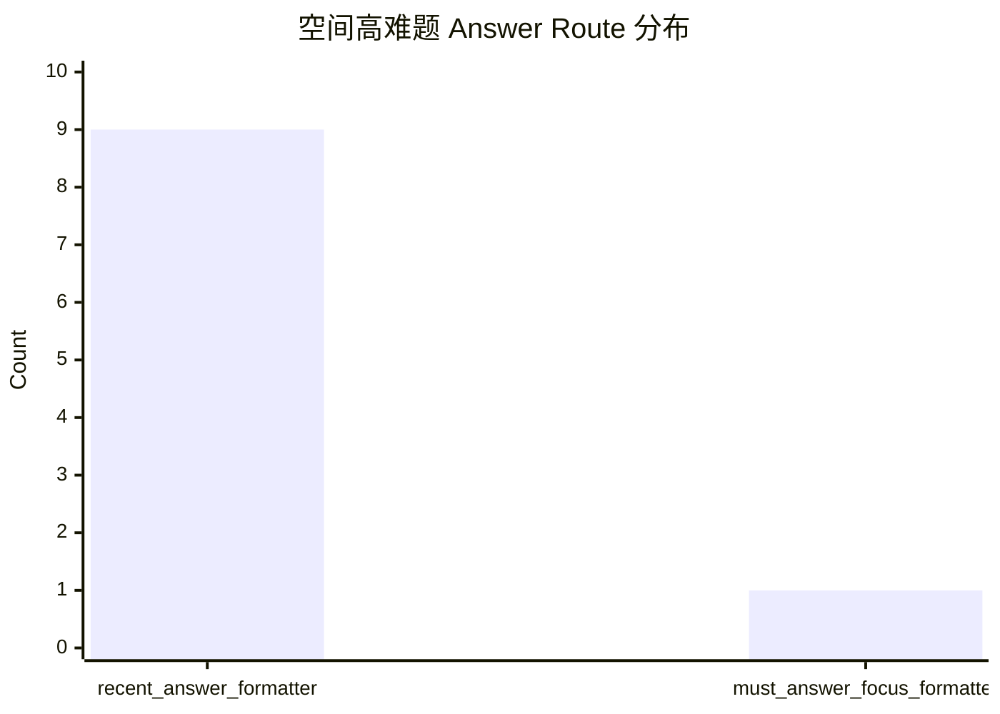
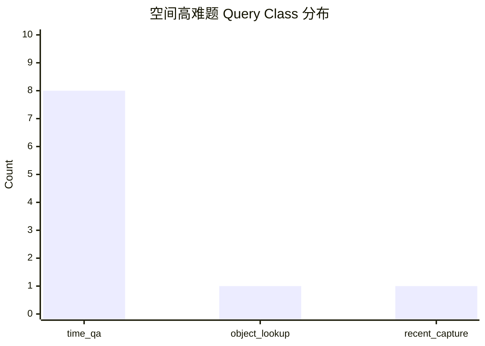

# Qwen3 空间关系高难基准横评报告（2026-03-24）

## 1. 目标

这轮评测不再问“有没有拍到某个物体”，而是专门测试更难的空间关系题，例如：

- `A 在 B 左边还是右边`
- `A 更靠近 B 还是 C`
- `A / B / C 从左到右是什么顺序`
- `谁位于另外两个之间`
- `A 和 B 离得近还是远`

目标不是简单比较哪一个模型“更会背答案”，而是看当前 BrainDance 本地问答链路，在这类高难空间题上到底会卡在哪一层。

---

## 2. 评测集

数据文件：

- `ai_engine/finetune_qwen3/data/braindance_qwen3_unseen_ood_spatial_hardcases_20260324.json`
  本地评测数据文件，不纳入 Git。

总题数：`10`

难度分布：

- `hard`: `4`
- `very_hard`: `4`
- `hell`: `2`

关系类型覆盖：

- `left_right_binary`
- `front_back_binary`
- `distance_comparison`
- `distance_bucket`
- `direction_multiclass`
- `relative_ordering`
- `triple_ordering`
- `triple_relation_summary`
- `between_relation`

---

## 3. 参评本地模型

这轮统一比较 6 个代表性本地版本：

1. `1.7B LoRA`
2. `0.6B LoRA`
3. `0.6B full SFT`
4. `1.7B merged`
5. `1.7B Q4_K_M + imatrix`
6. `1.7B Q5_K_M + imatrix`

评测脚本：

- [evaluate_spatial_hardcases_candidates.py](/ltx-data/BrainDance/ai_engine/finetune_qwen3/scripts/evaluate_spatial_hardcases_candidates.py)

日志产物：

- [spatial_hardcases_candidates_20260324_results.json](/ltx-data/BrainDance/ai_engine/finetune_qwen3/logs/spatial_hardcases_candidates_20260324_results.json)
- [spatial_hardcases_candidates_20260324_summary.json](/ltx-data/BrainDance/ai_engine/finetune_qwen3/logs/spatial_hardcases_candidates_20260324_summary.json)

---

## 4. 总结论

### 4.1 这轮几乎没有测出“模型差异”

最关键的结果是：

- 6 个模型在 10 题上几乎全部输出了**同一类答案**
- `spatial_direct_rate = 0.0000`
- `generic_scene_summary_rate = 1.0000`

也就是说，当前空间关系题还没有真正进入“模型推理比赛”，而是在更上游就被压扁成了：

- 命中一个相关 scene
- 然后输出一段 `recent_answer_formatter` 风格的对象摘要

不是“猫在风扇左边”，而是：

> 最近拍到的猫 风扇相关内容里，主要有白色台式电风扇、橘白猫和白色迷你冰箱。

这类回答对普通 `recent / object` 题还算合格，但对空间关系题几乎等于没答。

### 4.2 当前瓶颈不是模型，而是 route + formatter

这轮最重要的判断是：

1. 不是 `0.6B` 不会、`1.7B` 会
2. 也不是量化版本把空间能力磨掉了
3. 而是所有模型在进入生成前，就被同一个 retrieval / formatter 逻辑压成了相同输出

所以当前空间题的真实结论不是：

- “哪个模型更强”

而是：

- “当前链路还没有把空间题送到一个能真正比较模型的阶段”

---

## 5. 总表

| 模型 | spatial_direct_rate | generic_scene_summary_rate | 平均 retrieval(ms) | 平均 generation(ms) | 平均总时长(ms) |
| --- | ---: | ---: | ---: | ---: | ---: |
| 1.7B LoRA | 0.0000 | 1.0000 | 13016.54 | 0.00 | 13016.54 |
| 0.6B LoRA | 0.0000 | 1.0000 | 13016.54 | 0.00 | 13016.54 |
| 0.6B full SFT | 0.0000 | 1.0000 | 13016.54 | 0.00 | 13016.54 |
| 1.7B merged | 0.0000 | 1.0000 | 13016.54 | 0.00 | 13016.54 |
| 1.7B Q4_K_M + imatrix | 0.0000 | 1.0000 | 13016.54 | 0.00 | 13016.54 |
| 1.7B Q5_K_M + imatrix | 0.0000 | 1.0000 | 13016.54 | 0.00 | 13016.54 |

这里 `generation(ms)=0` 不是模型“瞬间回答”，而是因为答案几乎都直接走了 formatter / special answer，没有进入真正的自由生成。

---

## 6. 路由层观察

### 6.1 query_class 被压成了传统类目

10 题里：

- `time_qa`: `8`
- `object_lookup`: `1`
- `recent_capture`: `1`

没有一题被识别成真正独立的 `spatial_relation` 类。

### 6.2 answer_route 也几乎全部退成摘要

- `recent_answer_formatter`: `9`
- `must_answer_focus_formatter`: `1`

这解释了为什么所有模型答案几乎一样。

---

## 7. 逐题观察

### 7.1 猫 / 风扇 / 冰箱题

题目：

- `猫是在风扇左边还是右边`
- `风扇和猫哪个更靠左`
- `谁位于另外两个之间`

实际输出：

- 所有模型都只会返回 `白色台式电风扇、橘白猫、白色迷你冰箱`
- 不会回答 `左边 / 右边 / 中间`

这说明当前系统能找对 scene，但不会把 scene description 进一步转成空间关系。

### 7.2 奶茶桌面题

题目：

- `奶茶杯更靠近键盘还是笔记本`
- `奶茶杯是在键盘前面还是显示器前面`

实际问题：

- 第一题甚至检错到旧办公场景 `luosi`
- 第二题虽然命中了奶茶桌面，但回答仍只是在列对象

这说明这类题同时暴露了两层问题：

1. retrieval 还不够稳
2. formatter 不具备空间判断能力

### 7.3 手冲咖啡题

题目：

- `注水壶相对滤杯在上方、左侧还是右侧`
- `分享壶、滤杯、注水壶从左到右顺序`

实际输出：

- 全部只会说 `手、玻璃注水壶、玻璃滤杯`

也就是说，系统目前能做：

- object presence

但不能做：

- directional relation
- triple ordering

### 7.4 音乐练习室题

题目：

- `电吉他和架子鼓离得近，还是隔着明显一段距离`

实际输出：

- 所有模型都只列出 `红色电吉他、架子鼓、电吉他效果器`
- 而且还混入了另一张乐队插画场景

这说明当前“距离”题不仅没被当成 spatial，还会被多 scene 混检索污染。

### 7.5 斑马涂鸦题

题目：

- `番茄、茶壶和斑马三者的相对位置关系`

实际输出：

- 检索结果混进了 `初音未来夜景图`
- 回答里出现 `湿滑斑马线` 和 `初音未来`

这是最典型的空间 hardcase 污染案例：

- `斑马` 被扩成了 `斑马线`
- `涂鸦图` 被更晚的相似场景混入

---

## 8. 为什么 6 个模型几乎完全打平

这轮“打平”不是好消息，也不是坏消息，它的含义是：

- 现在还没轮到模型自己发挥

因为当前执行链条大致是：

1. 用户提空间题
2. 意图解析仍映射到 `time_qa / partial_coverage / recent_capture`
3. retrieval 找到若干 scene
4. `recent_answer_formatter` 直接把对象列表吐出来
5. 模型生成基本没机会介入

所以你看到的是：

- `1.7B LoRA`
- `0.6B LoRA`

---

## 9. 快照冻结复跑补充

为了把“数据库继续新增”这个变量排除掉，这套空间 hardcases 也已经补做了 retrieval snapshot，并实际冻结为：

- `ai_engine/finetune_qwen3/data/braindance_qwen3_unseen_ood_spatial_hardcases_retrieval_snapshot_20260324.json`
  本地冻结快照文件，不纳入 Git。

基于 snapshot 重跑得到：

- [spatial_hardcases_candidates_20260324_frozen_results.json](/ltx-data/BrainDance/ai_engine/finetune_qwen3/logs/spatial_hardcases_candidates_20260324_frozen_results.json)
- [spatial_hardcases_candidates_20260324_frozen_summary.json](/ltx-data/BrainDance/ai_engine/finetune_qwen3/logs/spatial_hardcases_candidates_20260324_frozen_summary.json)

冻结后，结论没有本质改变，但更准确了：

- `spatial_direct_rate = 0.0000`
- `generic_scene_summary_rate = 0.9000`
- `refusal_rate = 0.1000`

新的 route 分布也更清晰：

- `recent_answer_formatter`: `0.8`
- `must_answer_focus_formatter`: `0.1`
- `lora_generation`: `0.1`

新的 query_class 分布：

- `time_qa`: `0.7`
- `recent_capture`: `0.2`
- `object_lookup`: `0.1`

也就是说，哪怕把 retrieval 证据完全锁死，6 个模型依然没有真正给出空间判断。

这进一步说明：

1. 这不是“实时库漂移”导致的偶然现象
2. 而是当前 route / formatter 对 `spatial_relation` 没有建好专门通道
3. 所以空间题现在仍然主要是链路能力空白，不是模型参数量对决
- `0.6B full`
- `1.7B merged`
- `Q4+imatrix`
- `Q5+imatrix`

几乎全部输出相同句式。

这也意味着：

- 当前不能据此判断哪一个模型“空间推理更强”
- 只能判断“当前链路尚未支持空间推理”

---

## 9. 和之前 benchmark 的关系

和前面的未见数据 OOD benchmark 相比，这轮有一个本质区别：

- 前一轮还能把题拆成 `retrieval` 和 `answer`
- 而这轮空间题连 `answer` 阶段都还没真正打开

前一轮可以说：

- retrieval 对了以后，`1.7B LoRA / Q5+imatrix` 比 `0.6B` 更稳

这一轮只能说：

- 当前所有模型都被同一个空间能力缺口压平了

所以空间题是一个**更上游的系统瓶颈 benchmark**，不是现阶段的纯模型 benchmark。

---

## 10. 当前最准确的工程结论

### 10.1 已经具备的能力

- 能找到部分相关 scene
- 能抽取相关 objects
- 能做普通 scene summary

### 10.2 还不具备的能力

- `A 在 B 左/右/前/后`
- `A 更靠近 B 还是 C`
- `A/B/C 的顺序`
- `谁位于另外两个之间`

### 10.3 真正缺的不是更多 LoRA，而是这三层

1. `spatial_relation` 独立 query class
2. object-level grounding
3. spatial formatter

如果这三层不补，再继续测更多模型，结果大概率还是“统一退成 scene summary”。

---

## 11. 下一步建议

建议按这个顺序推进：

1. 先补 `spatial_relation` query class
   - 让空间题不再落到 `time_qa / recent_capture`
2. 先做最简单的 spatial formatter
   - `left_right_binary`
   - `distance_bucket`
3. 再做 object grounding
   - 至少要能在单帧上知道对象相对位置
4. 最后再测模型差异
   - 那时候才有意义比较 `1.7B / 0.6B / GGUF`

如果要一句话总结这轮横评：

- **当前空间关系题测出来的不是“哪一个本地模型最好”，而是“BrainDance 现在还没有真正进入空间关系问答阶段”。**

---

## 12. 相关文件

- 数据：
  - `ai_engine/finetune_qwen3/data/braindance_qwen3_unseen_ood_spatial_hardcases_20260324.json`（本地文件，不纳入 Git）
- 脚本：
  - [evaluate_spatial_hardcases_candidates.py](/ltx-data/BrainDance/ai_engine/finetune_qwen3/scripts/evaluate_spatial_hardcases_candidates.py)
- 日志：
  - [spatial_hardcases_candidates_20260324_results.json](/ltx-data/BrainDance/ai_engine/finetune_qwen3/logs/spatial_hardcases_candidates_20260324_results.json)
  - [spatial_hardcases_candidates_20260324_summary.json](/ltx-data/BrainDance/ai_engine/finetune_qwen3/logs/spatial_hardcases_candidates_20260324_summary.json)
