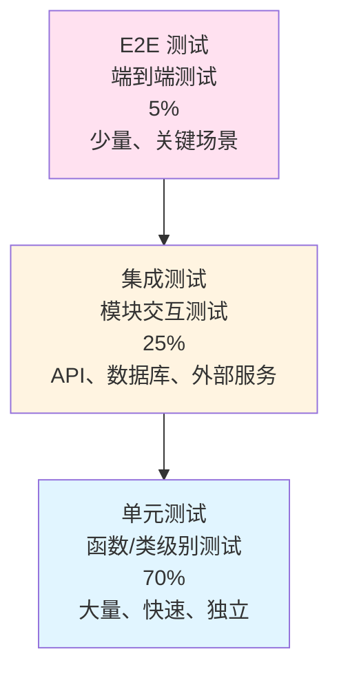

# 🧪 测试指南

> BrainDance 项目测试策略、规范与最佳实践

本文档定义 BrainDance 项目的测试标准、测试策略和最佳实践。通过遵循本文档的指导，开发者可以编写高质量的测试用例，确保代码的可靠性和可维护性。

---

## 📋 目录

- [测试策略概述](#测试策略概述)
- [测试金字塔](#测试金字塔)
- [测试环境配置](#测试环境配置)
- [单元测试](#单元测试)
- [集成测试](#集成测试)
- [端到端测试](#端到端测试)
- [性能测试](#性能测试)
- [AI 模型测试](#ai-模型测试)
- [测试工具与框架](#测试工具与框架)
- [测试覆盖率要求](#测试覆盖率要求)
- [持续集成](#持续集成)
- [测试最佳实践](#测试最佳实践)

---

## 🎯 测试策略概述

### 测试目标

BrainDance 项目致力于通过全面的测试确保以下目标：

1. **功能正确性**：确保所有功能按预期工作
2. **系统稳定性**：防止回归错误，保持系统稳定
3. **性能可靠**：确保系统性能满足要求
4. **用户体验**：确保端到端流程顺畅

### 测试原则

- **测试左移**：在开发早期引入测试
- **自动化优先**：优先使用自动化测试
- **快速反馈**：测试执行时间控制在可接受范围
- **测试隔离**：测试之间相互独立，不依赖执行顺序

### 测试范围

| 模块 | 测试类型 | 优先级 | 说明 |
|------|----------|--------|------|
| **AI Engine** | 单元测试 + 集成测试 | ⭐⭐⭐ | 核心算法逻辑 |
| **API 接口** | 集成测试 | ⭐⭐⭐ | 数据库交互 |
| **Edge Functions** | 单元测试 + 集成测试 | ⭐⭐ | 业务逻辑 |
| **数据流程** | E2E 测试 | ⭐⭐⭐ | 完整用户流程 |

---


## 📊 测试金字塔


### 测试分层说明

| 层级 | 占比 | 执行频率 | 目标 | 示例 |
|------|------|----------|------|------|
| **单元测试** | 70% | 每次提交 | 快速反馈，验证逻辑正确性 | 测试 `ImageProcessor` 的图像处理函数 |
| **集成测试** | 25% | 每次 PR | 验证模块间交互 | 测试 Worker 与 Supabase 的交互 |
| **E2E 测试** | 5% | 每日构建 | 验证完整用户流程 | 测试从视频上传到模型生成的完整流程 |

---

## 🛠️ 测试环境配置

### 本地测试环境

#### 1. Supabase 测试实例

```bash
# 使用 Supabase 本地开发环境进行测试
cd supabase

# 启动 Supabase
supabase start

# 运行测试数据库迁移
supabase db reset
```

#### 2. 测试数据准备

```python
# tests/conftest.py
import pytest
from supabase import create_client, Client
from src.config import PipelineConfig

@pytest.fixture(scope="session")
def supabase_client():
    """创建 Supabase 测试客户端"""
    config = PipelineConfig()
    client: Client = create_client(
        config.SUPABASE_URL,
        config.SUPABASE_KEY
    )
    return client

@pytest.fixture(scope="function")
def test_task(supabase_client):
    """创建测试任务"""
    task_data = {
        "user_id": "test_user",
        "scene_id": f"test_scene_{uuid.uuid4().hex[:8]}",
        "status": "pending"
    }
    result = supabase_client.table("processing_tasks").insert(task_data).execute()
    yield result.data[0]
    
    # 清理测试数据
    supabase_client.table("processing_tasks").delete().eq("id", result.data[0]["id"]).execute()
```

#### 3. 测试配置文件

```ini
# pytest.ini
[pytest]
testpaths = tests
python_files = test_*.py
python_classes = Test*
python_functions = test_*
addopts = -v --tb=short
filterwarnings =
    ignore::DeprecationWarning
    ignore::UserWarning

# conftest.py 配置
supabase_url = http://127.0.0.1:54321
supabase_key = test_service_role_key
```

### 测试数据管理

#### 测试夹具 (Fixtures)

| 夹具名称 | 用途 | 作用域 |
|----------|------|--------|
| `supabase_client` | Supabase 测试客户端 | session |
| `test_user` | 测试用户数据 | function |
| `test_task` | 测试任务数据 | function |
| `test_video` | 测试视频文件 | function |
| `test_image` | 测试图片文件 | function |
| `mock_embedding` | Mock 向量数据 | function |

---

## 🔬 单元测试

### 测试范围

单元测试主要覆盖以下模块：

| 模块 | 测试重点 | 关键测试场景 |
|------|----------|--------------|
| **utils/** | 工具函数 | 路径处理、文件操作、日期格式化 |
| **modules/image_proc.py** | 图像处理 | 抽帧、模糊检测、尺寸调整 |
| **modules/glomap_runner.py** | 位姿解算 | COLMAP 调用、结果解析 |
| **modules/nerf_engine.py** | 3D 训练 | 参数配置、训练启动、结果验证 |
| **modules/knowledge_base.py** | 向量存储 | 向量插入、相似度搜索 |
| **core/pipeline.py** | 流水线 | 流程编排、错误处理 |
| **core/worker.py** | 任务处理 | 任务抢占、状态更新、日志同步 |

### 测试示例

#### 1. 工具函数测试

```python
# tests/utils/test_common.py
import pytest
from src.utils.common import (
    generate_scene_id,
    format_timestamp,
    sanitize_filename,
    parse_task_params
)

class TestGenerateSceneId:
    """测试场景 ID 生成"""
    
    def test_generate_scene_id_format(self):
        """验证 ID 格式"""
        scene_id = generate_scene_id()
        assert scene_id.startswith("scene_")
        assert len(scene_id) == 27  # scene_YYYYMMDD_HHMMSS_XXXX
    
    def test_generate_scene_id_unique(self):
        """验证 ID 唯一性"""
        ids = [generate_scene_id() for _ in range(100)]
        assert len(ids) == len(set(ids))  # 所有 ID 唯一

class TestFormatTimestamp:
    """测试时间戳格式化"""
    
    def test_format_timestamp(self):
        """验证格式化输出"""
        timestamp = 1704067200
        result = format_timestamp(timestamp)
        assert "2024" in result
        assert ":" in result  # 包含时间
    
    def test_format_timestamp_empty(self):
        """空值处理"""
        assert format_timestamp(None) == ""

class TestSanitizeFilename:
    """测试文件名清理"""
    
    def test_sanitize_filename(self):
        """清理特殊字符"""
        assert sanitize_filename("my video.mp4") == "my_video.mp4"
        assert sanitize_filename("../../etc/passwd") == "etc_passwd"
    
    def test_sanitize_filename_empty(self):
        """空文件名处理"""
        assert sanitize_filename("") == "unnamed"

class TestParseTaskParams:
    """测试任务参数解析"""
    
    def test_parse_task_params_valid(self):
        """有效参数解析"""
        params = '{"task_type": "video_3dgs", "max_images": 500}'
        result = parse_task_params(params)
        assert result["task_type"] == "video_3dgs"
        assert result["max_images"] == 500
    
    def test_parse_task_params_empty(self):
        """空参数处理"""
        result = parse_task_params("")
        assert result == {}
    
    def test_parse_task_params_invalid(self):
        """无效 JSON 处理"""
        with pytest.raises(ValueError):
            parse_task_params("invalid json")
```

#### 2. 模块测试

```python
# tests/modules/test_image_proc.py
import pytest
import tempfile
import os
from pathlib import Path
from src.modules.image_proc import ImageProcessor

class TestImageProcessor:
    """图像处理器测试"""
    
    @pytest.fixture
    def image_processor(self):
        """创建测试用的 ImageProcessor"""
        temp_dir = tempfile.mkdtemp()
        return ImageProcessor(output_dir=temp_dir)
    
    @pytest.fixture
    def test_image(self, tmp_path):
        """创建测试图片"""
        import cv2
        import numpy as np
        
        # 创建 640x480 的测试图片
        img = np.random.randint(0, 255, (480, 640, 3), dtype=np.uint8)
        img_path = tmp_path / "test.jpg"
        cv2.imwrite(str(img_path), img)
        return str(img_path)
    
    def test_extract_frames_video_not_found(self, image_processor):
        """视频文件不存在测试"""
        with pytest.raises(FileNotFoundError):
            image_processor.extract_frames("/nonexistent/video.mp4")
    
    def test_extract_frames_output_dir(self, image_processor, test_image):
        """输出目录创建测试"""
        output_dir = "/tmp/test_output"
        if os.path.exists(output_dir):
            shutil.rmtree(output_dir)
        
        frames = image_processor.extract_frames(test_image, output_dir=output_dir)
        
        assert os.path.exists(output_dir)
        assert len(frames) > 0
    
    def test_detect_blur(self, image_processor):
        """模糊检测测试"""
        # 清晰图片
        sharp_img = np.random.randint(0, 255, (100, 100, 3), dtype=np.uint8)
        is_sharp, score = image_processor.detect_blur(sharp_img)
        assert isinstance(is_sharp, bool)
        assert isinstance(score, float)
        
        # 模糊图片 (高斯模糊)
        from scipy.ndimage import gaussian_filter
        blurred_img = gaussian_filter(sharp_img.astype(float), sigma=5)
        is_blur, _ = image_processor.detect_blur(blurred_img.astype(np.uint8))
        assert is_blur  # 模糊图片应该被检测为模糊
```

#### 3. Worker 测试

```python
# tests/core/test_worker.py
import pytest
from unittest.mock import Mock, patch, MagicMock
from src.core.worker import CloudWorker
from src.config import PipelineConfig

class TestCloudWorker:
    """CloudWorker 测试类"""
    
    @pytest.fixture
    def mock_config(self):
        """模拟配置"""
        config = Mock(spec=PipelineConfig)
        config.SUPABASE_URL = "http://test:54321"
        config.SUPABASE_KEY = "test_key"
        config.SUPABASE_TABLE = "processing_tasks"
        return config
    
    def test_worker_initialization(self, mock_config):
        """Worker 初始化测试"""
        with patch('src.core.worker.create_client') as mock_create:
            mock_client = Mock()
            mock_create.return_value = mock_client
            
            worker = CloudWorker(config=mock_config)
            
            assert worker.config == mock_config
            assert worker.client == mock_client
            mock_create.assert_called_once_with(
                mock_config.SUPABASE_URL,
                mock_config.SUPABASE_KEY
            )
    
    def test_task_polling(self, mock_config):
        """任务轮询测试"""
        with patch('src.core.worker.create_client') as mock_create:
            mock_client = Mock()
            mock_create.return_value = mock_client
            
            # 模拟无任务情况
            mock_client.rpc().execute.return_value.data = []
            
            worker = CloudWorker(config=mock_config)
            result = worker._poll_tasks()
            
            assert result is None  # 无任务时返回 None
```

### 单元测试运行

```bash
# 运行所有单元测试
cd ai_engine/3dgs
python -m pytest tests/ -v

# 运行特定模块测试
python -m pytest tests/utils/ -v
python -m pytest tests/modules/ -v
python -m pytest tests/core/ -v

# 运行单个测试文件
python -m pytest tests/core/test_worker.py::TestCloudWorker::test_worker_initialization -v

# 生成测试覆盖率报告
python -m pytest tests/ --cov=src --cov-report=html
```

---

## 🔗 集成测试

### 测试范围

集成测试主要验证以下模块间的交互：

| 测试场景 | 涉及模块 | 说明 |
|----------|----------|------|
| **任务生命周期** | Worker → Supabase | 任务创建、处理、完成 |
| **文件上传/下载** | Worker → Storage | 大文件传输 |
| **语义搜索** | Edge Function → pgvector | 向量存储与检索 |
| **AI 场景分析** | Worker → DashScope | API 调用与响应 |

### 测试示例

#### 1. 任务生命周期测试

```python
# tests/integration/test_task_lifecycle.py
import pytest
import time
from supabase import create_client

class TestTaskLifecycle:
    """任务生命周期集成测试"""
    
    @pytest.fixture
    def supabase_client(self):
        """创建 Supabase 客户端"""
        return create_client(
            "http://127.0.0.1:54321",
            "test_service_role_key"
        )
    
    def test_task_create_and_poll(self, supabase_client):
        """任务创建与轮询测试"""
        # 1. 创建任务
        task_data = {
            "user_id": "integration_test_user",
            "scene_id": f"integration_test_{int(time.time())}",
            "status": "pending",
            "task_type": "video_3dgs"
        }
        
        result = supabase_client.table("processing_tasks").insert(task_data).execute()
        task_id = result.data[0]["id"]
        
        try:
            # 2. 验证任务创建成功
            fetched = supabase_client.table("processing_tasks").select("*").eq("id", task_id).execute()
            assert len(fetched.data) == 1
            assert fetched.data[0]["status"] == "pending"
            
            # 3. 更新任务状态
            supabase_client.table("processing_tasks").update({
                "status": "processing"
            }).eq("id", task_id).execute()
            
            # 4. 验证状态更新
            updated = supabase_client.table("processing_tasks").select("status").eq("id", task_id).execute()
            assert updated.data[0]["status"] == "processing"
            
        finally:
            # 5. 清理测试数据
            supabase_client.table("processing_tasks").delete().eq("id", task_id).execute()
    
    def test_model_asset_creation(self, supabase_client):
        """模型资产创建测试"""
        # 1. 创建测试资产
        asset_data = {
            "scene_id": f"asset_test_{int(time.time())}",
            "user_id": "test_user",
            "description": "Test asset for integration testing",
            "objects": ["table", "chair"],
            "tags": ["indoor", "office"],
            "ply_path": "test/path/model.ply"
        }
        
        result = supabase_client.table("model_assets").insert(asset_data).execute()
        asset_id = result.data[0]["id"]
        
        try:
            # 2. 验证资产创建
            fetched = supabase_client.table("model_assets").select("*").eq("id", asset_id).execute()
            assert len(fetched.data) == 1
            assert fetched.data[0]["description"] == "Test asset for integration testing"
            
        finally:
            # 3. 清理
            supabase_client.table("model_assets").delete().eq("id", asset_id).execute()
```

#### 2. 语义搜索测试

```python
# tests/integration/test_semantic_search.py
import pytest
import time
import numpy as np
from supabase import create_client

class TestSemanticSearch:
    """语义搜索集成测试"""
    
    @pytest.fixture
    def supabase_client(self):
        return create_client(
            "http://127.0.0.1:54321",
            "test_service_role_key"
        )
    
    def test_vector_insertion_and_search(self, supabase_client):
        """向量插入与搜索测试"""
        # 1. 准备测试数据
        scene_id = f"vector_test_{int(time.time())}"
        embedding = np.random.rand(1536).tolist()  # 1536 维向量
        
        # 2. 插入带向量的资产
        asset_data = {
            "scene_id": scene_id,
            "user_id": "test_user",
            "description": "A red cup on the wooden table",
            "objects": ["cup", "table"],
            "tags": ["indoor", "kitchen"],
            "embedding": embedding,
            "ply_path": "test/path/model.ply"
        }
        
        result = supabase_client.table("model_assets").insert(asset_data).execute()
        asset_id = result.data[0]["id"]
        
        try:
            # 3. 执行向量搜索
            search_embedding = np.random.rand(1536).tolist()
            
            # 注意：实际项目中应调用 match_model_assets RPC
            # 这里使用简单查询进行测试
            response = supabase_client.rpc("match_model_assets", {
                "query_embedding": search_embedding,
                "match_threshold": 0.5,
                "match_count": 10
            }).execute()
            
            # 4. 验证搜索结果
            assert response.data is not None
            
        finally:
            supabase_client.table("model_assets").delete().eq("id", asset_id).execute()
```

### 集成测试运行

```bash
# 运行集成测试
cd ai_engine/3dgs
python -m pytest tests/integration/ -v

# 运行所有测试
python -m pytest tests/ -v --tb=short
```

---

## 🌐 端到端测试

### 测试范围

E2E 测试覆盖完整的用户流程：

| 测试场景 | 测试步骤 | 验证点 |
|----------|----------|--------|
| **视频上传与处理** | 1. 上传视频 2. 创建任务 3. 等待处理 4. 下载模型 | 完整流程正确执行 |
| **单图 3DGS 生成** | 1. 上传图片 2. 创建任务 3. 生成模型 4. 验证结果 | 单图流程正确 |
| **语义搜索** | 1. 创建带标签资产 2. 执行搜索 3. 验证结果 | 搜索准确 |
| **多任务并发** | 1. 创建多个任务 2. 并发处理 3. 验证结果 | 并发处理正确 |

### 测试示例

```python
# tests/e2e/test_full_workflow.py
import pytest
import time
import os
from supabase import create_client

class TestFullWorkflow:
    """完整工作流 E2E 测试"""
    
    @pytest.fixture
    def supabase_client(self):
        return create_client(
            "http://127.0.0.1:54321",
            "test_service_role_key"
        )
    
    @pytest.mark.e2e
    def test_video_to_3dgs_workflow(self, supabase_client):
        """视频转 3DGS 完整流程测试"""
        
        # 注意：此测试需要实际的视频文件和较长的执行时间
        # 在 CI/CD 环境中通常跳过或使用 mock
        
        scene_id = f"e2e_test_{int(time.time())}"
        
        # 1. 模拟视频上传（实际项目中应上传真实文件）
        # 这里跳过，直接创建任务
        
        # 2. 创建处理任务
        task_data = {
            "user_id": "e2e_test_user",
            "scene_id": scene_id,
            "status": "pending",
            "task_type": "video_3dgs",
            "task_params": {
                "max_images": 50,  # 测试用小值
                "training_iterations": 100  # 测试用小值
            }
        }
        
        result = supabase_client.table("processing_tasks").insert(task_data).execute()
        task_id = result.data[0]["id"]
        
        try:
            # 3. 验证任务创建
            task = supabase_client.table("processing_tasks").select("*").eq("id", task_id).execute()
            assert task.data[0]["status"] == "pending"
            
            # 4. 模拟任务处理完成（实际应由 Worker 执行）
            supabase_client.table("processing_tasks").update({
                "status": "completed",
                "logs": [
                    {"ts": time.time(), "msg": "测试：任务完成", "level": "info"}
                ]
            }).eq("id", task_id).execute()
            
            # 5. 验证最终状态
            final_task = supabase_client.table("processing_tasks").select("status").eq("id", task_id).execute()
            assert final_task.data[0]["status"] == "completed"
            
        finally:
            supabase_client.table("processing_tasks").delete().eq("id", task_id).execute()
    
    @pytest.mark.e2e
    def test_semantic_search_workflow(self, supabase_client):
        """语义搜索 E2E 测试"""
        
        # 1. 创建测试资产
        test_assets = [
            {
                "scene_id": f"search_test_1_{int(time.time())}",
                "description": "A red cup on wooden table",
                "objects": ["cup", "table"],
                "tags": ["indoor", "kitchen"],
                "ply_path": "test1.ply"
            },
            {
                "scene_id": f"search_test_2_{int(time.time())}",
                "description": "Blue sofa in living room",
                "objects": ["sofa", "living room"],
                "tags": ["indoor", "living room"],
                "ply_path": "test2.ply"
            }
        ]
        
        asset_ids = []
        for asset in test_assets:
            result = supabase_client.table("model_assets").insert(asset).execute()
            asset_ids.append(result.data[0]["id"])
        
        try:
            # 2. 执行搜索
            # 实际项目中应调用 Edge Function
            response = supabase_client.table("model_assets").select(
                "scene_id,description,objects,tags"
            ).execute()
            
            # 3. 验证结果
            assert len(response.data) >= 2
            
            # 4. 验证资产数据完整性
            for asset in response.data:
                assert "scene_id" in asset
                assert "description" in asset
                assert "objects" in asset
                
        finally:
            # 5. 清理
            for aid in asset_ids:
                supabase_client.table("model_assets").delete().eq("id", aid).execute()
```

### E2E 测试运行

```bash
# 运行 E2E 测试（标记为 e2e 的测试）
cd ai_engine/3dgs
python -m pytest tests/e2e/ -v -m e2e

# 运行所有标记测试
python -m pytest -v -m "integration or e2e"
```

---

## ⚡ 性能测试

### 测试范围

| 测试项 | 指标 | 目标 |
|--------|------|------|
| **任务处理时间** | 3DGS 训练时长 | < 30 分钟（标准视频） |
| **搜索响应时间** | API 响应延迟 | < 500ms |
| **并发任务数** | 同时处理任务数 | 取决于 GPU 数量 |
| **数据库查询** | 复杂查询耗时 | < 100ms |

### 测试工具

- **Locust**：负载测试
- **Pytest-benchmark**：性能基准测试
- **cProfile**：Python 代码性能分析

### 测试示例

```python
# tests/performance/test_benchmark.py
import pytest
import time
from src.modules.knowledge_base import KnowledgeBase

class TestPerformance:
    """性能测试类"""
    
    @pytest.mark.benchmark
    def test_vector_search_performance(self, benchmark, sample_embeddings):
        """向量搜索性能测试"""
        
        kb = KnowledgeBase()
        
        # 准备测试数据
        embeddings = sample_embeddings  # 1000 个测试向量
        
        def search_operation():
            query = [0.1] * 1536
            return kb.search(query, top_k=10)
        
        # 运行基准测试
        result = benchmark(search_operation)
        
        # 验证性能目标
        assert result.stats["mean"] < 0.5  # 平均耗时 < 500ms
    
    @pytest.mark.benchmark
    def test_pipeline_initialization(self, benchmark):
        """Pipeline 初始化性能测试"""
        
        from src.core.pipeline import Pipeline
        
        def init_pipeline():
            return Pipeline(config={"test": True})
        
        result = benchmark(init_pipeline)
        
        # 初始化应 < 1 秒
        assert result.stats["mean"] < 1.0
```

---

## 🤖 AI 模型测试

### 测试范围

| 模型 | 测试内容 | 验证点 |
|------|----------|--------|
| **Qwen-VL** | 场景理解准确率 | 描述相关性、物体识别 |
| **SAM 3D** | 单图重建质量 | 模型完整性、细节保留 |
| **Splatfacto** | 3DGS 训练质量 | PSNR、SSIM 指标 |
| **YOLO World** | 物体检测 | 召回率、精确率 |

### 测试示例

```python
# tests/ai/test_scene_analyzer.py
import pytest
from unittest.mock import Mock, patch
from src.modules.scene_analyzer import SceneAnalyzer

class TestSceneAnalyzer:
    """场景分析器测试"""
    
    @pytest.fixture
    def analyzer(self):
        """创建场景分析器实例"""
        return SceneAnalyzer(api_key="test_key")
    
    def test_analyze_image_success(self, analyzer):
        """图片分析成功测试"""
        # Mock API 响应
        mock_response = {
            "output": {
                "choices": [{
                    "message": {
                        "content": """这是一个明亮的客厅，有一张棕色沙发和一张咖啡桌。"""
                    }
                }]
            }
        }
        
        with patch('dashscope.Generation.call', return_value=mock_response):
            result = analyzer.analyze_image("/path/to/test.jpg")
            
            assert result is not None
            assert "description" in result
            assert "objects" in result
            assert "tags" in result
    
    def test_analyze_image_api_error(self, analyzer):
        """API 错误处理测试"""
        with patch('dashscope.Generation.call', side_effect=Exception("API Error")):
            result = analyzer.analyze_image("/path/to/test.jpg")
            
            # 应返回默认结构而非抛出异常
            assert result is not None
            assert "description" in result
```

---

### 本地问答微调回归（实验链路）

> 适用目录：`ai_engine/finetune_qwen3`  
> 状态说明：用于本地问答微调实验回归，尚未并入正式业务主流程。

```bash
# 检索逻辑 + formatter + CLI 回归
pytest -q tests/test_part17_object_lookup.py tests/test_part18_formatters.py tests/test_local_qa_cli.py

# 关键脚本语法检查
python -m py_compile \
  ai_engine/finetune_qwen3/scripts/run_real_chain_debug.py \
  ai_engine/finetune_qwen3/scripts/evaluate_experience_part18.py \
  ai_engine/finetune_qwen3/scripts/local_qa_cli.py
```

关联文档：

- `ai_engine/finetune_qwen3/README.md`
- `docs/04-本地问答与微调/本地问答微调文档补充说明.md`

---

## 🛠️ 测试工具与框架

### Python 测试工具

| 工具 | 用途 | 安装命令 |
|------|------|----------|
| **pytest** | 测试框架 | `pip install pytest` |
| **pytest-cov** | 覆盖率报告 | `pip install pytest-cov` |
| **pytest-mock** | Mock 支持 | `pip install pytest-mock` |
| **pytest-asyncio** | 异步测试 | `pip install pytest-asyncio` |
| **pytest-benchmark** | 性能基准 | `pip install pytest-benchmark` |
| **responses** | HTTP Mock | `pip install responses` |
| **factory_boy** | 测试数据工厂 | `pip install factory_boy` |

### Deno 测试工具

```bash
# Edge Functions 测试
deno test --allow-all supabase/functions/search-models/test.ts
```

### 测试配置示例

```ini
# pytest.ini
[pytest]
testpaths = tests
python_files = test_*.py
python_classes = Test*
python_functions = test_*
addopts = 
    -v
    --tb=short
    --cov=src
    --cov-report=term-missing
    --cov-report=html
filterwarnings =
    ignore::DeprecationWarning
    ignore::UserWarning

[tool:pytest]
asyncio_mode = auto
```

---

## 📈 测试覆盖率要求

### 覆盖率目标

| 模块 | 行覆盖率 | 分支覆盖率 | 函数覆盖率 |
|------|----------|------------|------------|
| **核心模块 (core/)** | ≥ 80% | ≥ 70% | ≥ 90% |
| **模块 (modules/)** | ≥ 70% | ≥ 60% | ≥ 85% |
| **工具 (utils/)** | ≥ 90% | ≥ 80% | ≥ 95% |
| **集成测试** | ≥ 50% | - | - |

### 覆盖率报告

```bash
# 生成 HTML 覆盖率报告
python -m pytest tests/ --cov=src --cov-report=html

# 生成 XML 报告（用于 CI）
python -m pytest tests/ --cov=src --cov-report=xml

# 查看控制台覆盖率摘要
python -m pytest tests/ --cov=src --cov-report=term-missing
```

### 覆盖率检查

```bash
# 在 CI 中检查覆盖率
python -m pytest tests/ --cov=src --cov-fail-under=70
```

---

## 🔄 持续集成

### GitHub Actions 工作流

```yaml
# .github/workflows/tests.yml
name: Tests

on:
  push:
    branches: [main, dev]
  pull_request:
    branches: [main, dev]

jobs:
  unit-tests:
    runs-on: ubuntu-latest
    steps:
      - uses: actions/checkout@v3
      
      - name: Set up Python
        uses: actions/setup-python@v4
        with:
          python-version: '3.10'
      
      - name: Install dependencies
        run: |
          pip install -r ai_engine/3dgs/requirements.txt
          pip install pytest pytest-cov pytest-mock
      
      - name: Run unit tests
        run: |
          cd ai_engine/3dgs
          python -m pytest tests/ --cov=src -v --ignore=tests/e2e/
      
      - name: Upload coverage
        uses: codecov/codecov-action@v3
        with:
          files: ./coverage.xml

  integration-tests:
    runs-on: ubuntu-latest
    steps:
      - uses: actions/checkout@v3
      
      - name: Set up Python
        uses: actions/setup-python@v4
        with:
          python-version: '3.10'
      
      - name: Set up Docker
        uses: docker/setup-buildx-action@v2
      
      - name: Start Supabase
        run: |
          cd supabase
          docker compose up -d
      
      - name: Run integration tests
        run: |
          cd ai_engine/3dgs
          python -m pytest tests/integration/ -v
```

---

## 💡 测试最佳实践

### 1. 测试命名规范

```python
# ✅ 好的命名
def test_user_registration_with_valid_email():
    pass

def test_payment_processing_handles_insufficient_funds():
    pass

# ❌ 避免的命名
def test_reg():
    pass

def test_payment2():
    pass
```

### 2. 测试应该

| 规范 | 说明 |
|------|------|
| **独立** | 每个测试独立运行，不依赖其他测试 |
| **快速** | 单元测试 < 100ms |
| **可重复** | 多次运行结果一致 |
| **自验证** | 断言清晰，结果明确 |
| **及时** | 随代码一起提交 |

### 3. 测试不应该

| 避免 | 说明 |
|------|------|
| **网络调用** | 使用 Mock 替代外部 API |
| **文件操作** | 使用临时文件和 Mock |
| **时间依赖** | Mock 时间相关函数 |
| **随机数据** | 使用固定测试数据 |
| **外部服务** | 使用测试替身 |

### 4. 测试数据管理

```python
# 使用 fixture 管理测试数据
@pytest.fixture
def sample_users():
    """创建测试用户数据"""
    return [
        {"id": 1, "name": "Alice", "email": "alice@test.com"},
        {"id": 2, "name": "Bob", "email": "bob@test.com"},
    ]

@pytest.fixture
def sample_vector():
    """创建测试向量"""
    import numpy as np
    return np.random.rand(1536).tolist()
```

### 5. Mock 使用

```python
from unittest.mock import Mock, patch, MagicMock
import pytest

class TestWithMocks:
    """Mock 使用示例"""
    
    def test_external_api_call(self):
        """测试外部 API 调用"""
        with patch('requests.get') as mock_get:
            # 设置 Mock 返回值
            mock_response = Mock()
            mock_response.status_code = 200
            mock_response.json.return_value = {"result": "success"}
            mock_get.return_value = mock_response
            
            # 调用被测试函数
            result = some_function_that_calls_api()
            
            # 验证结果
            assert result == {"result": "success"}
            mock_get.assert_called_once()
```

---

## 📚 相关文档

- [API 接口文档](../03-API参考/API接口指南.md) - API 测试用例参考
- [数据库设计](../03-API参考/数据库设计.md) - 数据库测试数据
- [Supabase 后端文档](../supabase/README.md) - Supabase 测试配置
- [AI Engine 文档](../ai_engine/README.md) - AI 模块测试说明

---

## 🔗 外部资源

- [Pytest 官方文档](https://docs.pytest.org/)
- [Pytest 最佳实践](https://docs.pytest.org/en/stable/explanation/goodpractices.html)
- [Mock 测试指南](https://docs.python.org/3/library/unittest.mock.html)
- [测试覆盖率指南](https://coverage.py/)

---

## ❓ 获取帮助

如果遇到测试相关问题：

1. **查看测试示例**：参考 `tests/` 目录下的现有测试
2. **查看文档**：本文档的测试最佳实践章节
3. **搜索 Issues**：https://github.com/tianxingleo/BrainDance/issues
4. **联系维护者**：tianxingleo@gmail.com

---

<div align="center">

**BrainDance 测试指南**

*确保代码质量，从测试开始*

</div>
