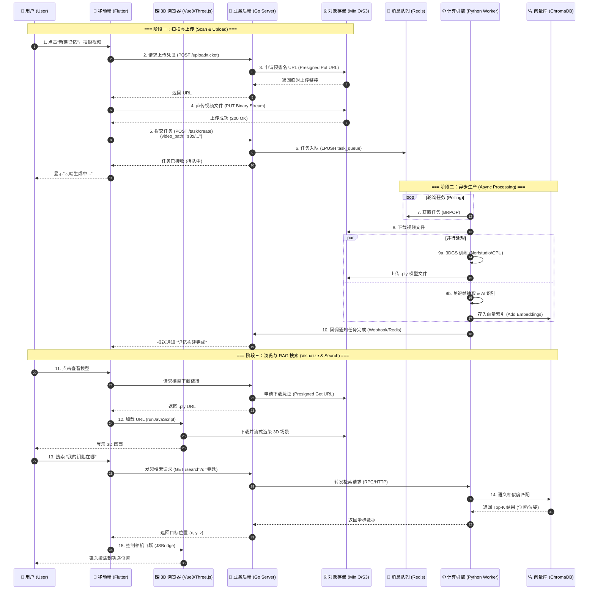
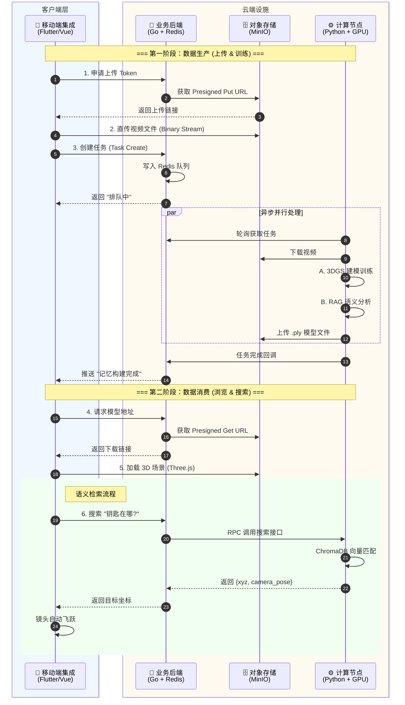
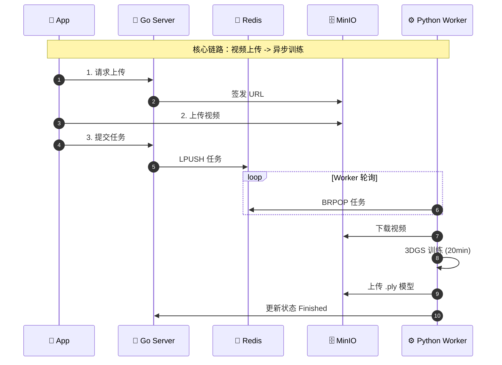
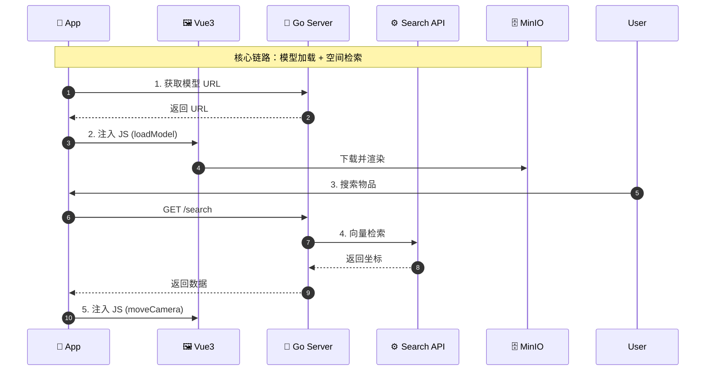

- - ### 一、 详细技术栈清单 (The Tech Stack)

    #### 1. 移动端 (Mobile Client)

    负责用户交互、文件上传、以及承载 3D 浏览器。

    - **开发框架**: **Flutter** (Dart)
      - *理由*: 一套代码跨 Android/iOS，性能接近原生。
    - **网络通信**: **Dio**
      - *用途*: 处理 REST API 请求、大文件分片上传（支持断点续传）、拦截器管理。
    - **Web 容器**: **webview_flutter**
      - *用途*: 嵌入 Vue3 页面，建立 JSBridge 通信通道。
    - **UI 组件库**: Material Design 3 (Flutter 原生)

    #### 2. Web 3D 浏览器 (Embedded 3D Viewer)

    嵌入在 Flutter 中的网页，专门负责渲染 3DGS 模型。

    - **前端框架**: **Vue 3** (Composition API)
    - **3D 引擎**: **Three.js** + **WebGL**
      - *核心加载器*: `KSplatLoader` 或 `LumaSplatsSemantics` (用于加载 .ply/.splat 文件)。
    - **构建工具**: **Vite** (打包成静态 HTML/JS/CSS 资源供 Flutter 加载)。

    #### 3. 业务后端 (Business Server)

    系统的“大脑”，负责轻量级逻辑、调度和元数据管理。

    - **语言**: **Go (Golang 1.20+)**
    - **Web 框架**: **Gin**
      - *理由*: 极简、高性能，适合构建 RESTful API。
    - **ORM 框架**: **GORM** (连接 MySQL)。
    - **Redis 客户端**: **go-redis** (用于生产任务消息)。
    - **对象存储 SDK**: **MinIO-go** (用于签发上传/下载的预签名 URL)。

    #### 4. 计算后端 (AI Engine / Worker)

    运行在 WSL/Linux GPU 服务器上，负责重计算。

    - **语言**: **Python 3.10+**
    - **3D 核心**:
      - **Nerfstudio**: 训练框架，提供完整的 Pipeline。
      - **Gsplat / Diff-Gaussian-Rasterization**: 底层 CUDA 加速的光栅化器。
      - **PyTorch**: 深度学习框架。
    - **RAG / 语义核心**:
      - **OpenCV-Python**: 视频抽帧、图像处理。
      - **ChromaDB**: 本地向量数据库（轻量级，无需独立部署服务）。
      - **DashScope SDK (阿里云)** / **ZhipuAI SDK**: 调用云端多模态大模型。
    - **任务队列**: **Redis-py** (监听任务)。

    #### 5. 基础设施与存储 (Infrastructure)

    - **对象存储**: **MinIO** (兼容 S3 协议，Docker 部署)。
      - *存储内容*: 用户上传的原始视频 (`.mp4`)、训练好的模型 (`.ply`)。
    - **关系型数据库**: **MySQL 8.0**。
      - *存储内容*: 用户表、任务表 (Task ID, Status, FilePath)、关联关系。
    - **消息队列**: **Redis**。
      - *用途*: 生产者-消费者模型的缓冲区。

    ------

    ### 二、 技术协同与数据流转 (Collaboration Flow)

    整个系统分为三条核心数据链路：**上传链路**、**加工链路**、**消费链路**。

    #### 1. 上传链路 (The Upload Flow)

    *核心目标：将大文件从手机高效传输到服务器，不阻塞业务网关。*

    1. **鉴权与申请 (Flutter -> Go)**:
       - 用户在 App 点击上传，Flutter 向 Go 发送 `POST /upload/ticket`。
       - Go 调用 **MinIO SDK** 生成一个 **PUT Presigned URL**（预签名链接，有效期 10 分钟），返回给 Flutter。
    2. **直传文件 (Flutter -> MinIO)**:
       - Flutter 使用 **Dio** 直接向该 URL 上传视频文件流。
       - *技术点*: 流量直接走存储网关，不经过 Go 业务服务器，避免内存溢出。
    3. **任务投递 (Flutter -> Go -> Redis)**:
       - 上传成功后，Flutter 通知 Go `POST /task/create`，带上文件在 MinIO 中的路径 (`s3://...`)。
       - Go 将任务信息序列化为 JSON (`{"task_id": 101, "path": "..."}`)，通过 `LPUSH` 写入 **Redis** 队列 `task_queue`。

    #### 2. 加工链路 (The Processing Flow)

    *核心目标：异步处理重计算任务，结合本地算力与云端智能。*

    1. **接单 (Python Worker <- Redis)**:
       - Python 脚本运行 `BRPOP task_queue`，阻塞等待。一旦有新任务，立即唤醒。
    2. **数据准备 (Python Worker <-> MinIO)**:
       - Python 解析 JSON，通过 **Boto3** (S3 SDK) 从 MinIO 下载视频到本地 SSD 临时目录。
    3. **并行处理 (Parallel Execution)**:
       - **分支 A (3D 重建)**:
         - 调用 `colmap` 命令行工具进行稀疏重建（计算相机位姿）。
         - 调用 `nerfstudio` API 启动 GPU 训练（约 20 分钟）。
         - 产出：`model.ply` 点云模型。
       - **分支 B (语义索引)**:
         - 使用 `OpenCV` 每隔 5 秒截取一帧图片。
         - 调用 **阿里云 Qwen-VL API** (HTTP)，发送图片 Base64，获取文本描述。
         - 将文本描述 + 视频 ID + 时间戳存入 **ChromaDB**（本地嵌入式存储）。
    4. **结果回传 (Python -> MinIO & Go)**:
       - 将 `model.ply` 上传回 MinIO。
       - 调用 Go 的内部接口（或修改 Redis 状态），更新任务状态为 `Finished`。

    #### 3. 消费与搜索链路 (The Consumption Flow)

    *核心目标：流畅浏览 3D 模型，并能通过文字定位空间坐标。*

    1. **模型加载 (Flutter <-> Vue <-> MinIO)**:
       - Flutter 请求 Go 获取模型下载链接 (GET Presigned URL)。
       - Flutter 通过 `WebViewController.runJavaScript` 将链接传给 Vue。
       - Vue 中的 **Three.js** 直接加载该链接，渲染 3D 场景。
    2. **空间搜索 (Flutter -> Go -> Python -> Flutter)**:
       - **用户输入**: "我的钥匙在哪？"
       - **Flutter**: 发送 `GET /search?q=钥匙` 给 Go。
       - **Go**: 转发请求给 Python 提供的微服务接口（可以用 FastAPI 写一个简单的内部只读接口）。
       - **Python**: 查询 **ChromaDB**，找到相似度最高的文本块（"桌子上有一把银色钥匙"），返回该帧对应的相机位姿 (Camera Pose) 和 3D 坐标中心。
       - **Flutter**: 拿到坐标，控制 WebView 里的摄像机飞向该坐标。

    ------

    ### 三、 关键协议总结

    | **通信端点**          | **协议/方式**         | **数据格式**      | **用途**                      |
    | --------------------- | --------------------- | ----------------- | ----------------------------- |
    | **Flutter ↔ Go**      | **HTTP / 1.1 (REST)** | JSON              | 业务指令 (登录, 查列表, 搜素) |
    | **Flutter ↔ MinIO**   | **HTTP (S3 Signed)**  | Binary Stream     | 视频上传, 模型下载            |
    | **Go ↔ Redis**        | **RESP (TCP)**        | String (JSON)     | 任务队列 (生产者)             |
    | **Python ↔ Redis**    | **RESP (TCP)**        | String (JSON)     | 任务队列 (消费者)             |
    | **Python ↔ Cloud AI** | **HTTPS**             | JSON (Base64 Img) | 视觉语义理解 API 调用         |
    | **Flutter ↔ Vue**     | **JavaScriptChannel** | String            | APP 与内嵌网页的交互控制      |

------

### 三、 数据流转

1. **上传流**：手机 (Flutter) -> **MinIO** (存视频)。
2. **指令流**：手机 -> **Go** (发任务) -> **Redis** (排队)。
3. **计算流 (混合)**：
   - **Python** 从 Redis 接单 -> 从 MinIO 下视频。
   - **分支 A (3DGS)**：本地 GPU  -> 生成 `.ply` -> 传回 MinIO。
   - **分支 B (RAG)**：本地 CPU 抽 10 张图 -> 发给 **阿里云 API** -> 拿到文字 -> 存入本地 **ChromaDB**。
4. **展示流**：
   - **看 3D**：手机从 MinIO 下载 `.ply` 渲染。
   - **搜物品**：手机搜“钥匙” -> Go 查 ChromaDB -> 返回坐标 -> 手机镜头飞过去。

### 场景定义：用户扫描房间并搜索“我的钥匙在哪？”

### 第一阶段：空间采集与上传 (Scan & Upload)

**1. 用户交互流程 (User Flow)**

- **动作**：用户打开 App，点击“新建记忆”，使用摄像头环绕拍摄房间（1-2分钟）。
- **界面**：屏幕显示引导界面，拍摄完成后点击“上传生成”。
- **反馈**：App 显示“上传中...”，随后进入“云端构建中（排队中）”状态。

**2. 数据协同与通信细节 (Data & Protocol)**

| **步骤**        | **源 (Source)**  | **目标 (Dest)** | **动作描述**                   | **协议/通信方式**                             | **数据内容**                                                 |
| --------------- | ---------------- | --------------- | ------------------------------ | --------------------------------------------- | ------------------------------------------------------------ |
| **1. 申请凭证** | Mobile (Flutter) | Server (Go)     | 请求上传授权                   | **HTTPS (REST)** `POST /api/v1/upload/ticket` | Header: Auth-Token Body: `{filename: "room.mp4", size: 500MB}` |
| **2. 签发链接** | Server (Go)      | MinIO (Local)   | 生成预签名 URL (Presigned URL) | **S3 SDK (Internal)**                         | 内部生成带签名的 URL，有效期 10分钟                          |
| **3. 直传文件** | Mobile (Flutter) | MinIO (Storage) | 视频流直接上传                 | **HTTPS (PUT)** *(不经过业务后端)*            | Binary Video Stream                                          |
| **4. 提交任务** | Mobile (Flutter) | Server (Go)     | 通知上传完成，触发任务         | **HTTPS (REST)** `POST /api/v1/tasks`         | `{video_path: "s3://bucket/room.mp4", task_type: "3dgs_rag"}` |
| **5. 任务入队** | Server (Go)      | Redis           | 将任务推入队列                 | **TCP (RESP协议)** `LPUSH task_queue`         | `{"id": 101, "path": "...", "uid": "user_1"}`                |

------

### 第二阶段：双流并行计算 (Parallel Processing)

此阶段用户无感知，主要在后台运行。**Python Worker** 从 Redis 拿到任务后，并行开启两个线程/进程。

**1. 分支 A：3D 重建 (3DGS Pipeline)**

| **步骤**        | **组件**      | **动作描述**                   | **涉及工具/库**     | **备注**              |
| --------------- | ------------- | ------------------------------ | ------------------- | --------------------- |
| **1. 下载视频** | Python Worker | 从 MinIO 下载视频到本地 SSD    | `boto3` (S3协议)    | 内网传输，极快        |
| **2. 稀疏重建** | 3DGS Engine   | 运行 COLMAP 提取相机位姿       | `colmap` (CLI)      | CPU 密集型            |
| **3. 模型训练** | 3DGS Engine   | 运行 Gaussian Splatting 训练   | `nerfstudio` / CUDA | **GPU 满载 (20分钟)** |
| **4. 结果回传** | Python Worker | 将生成的 `.ply` 模型上传 MinIO | `boto3` (S3协议)    | 生成约 100MB 文件     |

**2. 分支 B：语义理解 (Cloud RAG Pipeline)**

| **步骤**          | **组件**                | **动作描述**                    | **涉及 API / 协议**                 | **数据内容**                                                 |
| ----------------- | ----------------------- | ------------------------------- | ----------------------------------- | ------------------------------------------------------------ |
| **1. 关键帧提取** | Python RAG              | 使用 OpenCV 每隔 5 秒截取一张图 | `cv2` (Local)                       | 产生约 15 张图片 (JPG)                                       |
| **2. 视觉理解**   | Python -> **Cloud API** | **调用外部大模型 API**          | **HTTPS (POST)** OpenAI / 阿里 Qwen | Payload: `{image: Base64, prompt: "描述物体和位置"}`         |
| **3. 向量存储**   | Python -> ChromaDB      | 将 API 返回的文本存入本地向量库 | Internal Lib Call                   | 文本: "桌子上有把银色钥匙..." Meta: `{time: 10s, xyz: [1,2,3]}` |

**3. 任务完结**

- **动作**：Python Worker 完成所有步骤后，写入 Redis 状态或通过内部 HTTP 回调通知 Go Server。
- **Server**：更新 MySQL 任务状态为 `finished`，并向用户手机推送通知（通过 WebSocket 或 FCM）。

------

### 第三阶段：可视化与空间检索 (Visualize & Search)

**1. 用户交互流程**

- **查看**：用户点击任务，手机加载 3D 场景，可以自由拖拽视角。
- **搜索**：用户在搜索框输入“钥匙”，点击搜索。
- **反馈**：镜头自动飞跃并聚焦到桌子上的钥匙位置。

**2. 数据协同与通信细节**

| **步骤**        | **源 (Source)** | **目标 (Dest)**           | **动作描述**                 | **协议/通信方式**                       | **核心逻辑**                                     |
| --------------- | --------------- | ------------------------- | ---------------------------- | --------------------------------------- | ------------------------------------------------ |
| **1. 加载模型** | Mobile          | MinIO                     | 下载 `.ply` 3D 文件          | **HTTPS (GET)**                         | 边下边播 (Stream) 或 预加载                      |
| **2. 发起搜索** | Mobile          | Server (Go)               | 查询关键词                   | **HTTPS (GET)** `/api/v1/search?q=钥匙` |                                                  |
| **3. 语义检索** | Server (Go)     | **Python Search Service** | 请求向量匹配                 | **Internal HTTP / gRPC**                | Go 调 Python 的内部微服务接口 Python 查 ChromaDB |
| **4. 返回坐标** | Server (Go)     | Mobile                    | 返回物品的空间坐标与相机位姿 | **JSON Response**                       | `{target: "key", pos: [x,y,z], look_at: [...]}`  |
| **5. 镜头控制** | Mobile          | 渲染引擎                  | 驱动相机移动                 | **WebGL / Three.js**                    | 前端逻辑，无网络交互                             |

------

### 总结：关键技术栈速查表

- **对外通信协议**：HTTPS (REST API) + WebSocket (可选，用于进度推送)。
- **大文件传输协议**：S3 (Presigned URL) - **这是性能关键**，避免阻塞业务服务器。
- **内部协同协议**：
  - **任务调度**：Redis Protocol (TCP) - 生产者消费者模型。
  - **搜素服务**：Internal HTTP (FastAPI) 或 gRPC - Go 调用 Python 进行实时检索。
- **云端 AI 交互**：HTTPS API (OpenAI Schema) - 传输 Base64 图片，接收 JSON 文本。

# 流程图

## 宏观架构图

### 上传与构建流程

### 浏览与搜索流程

