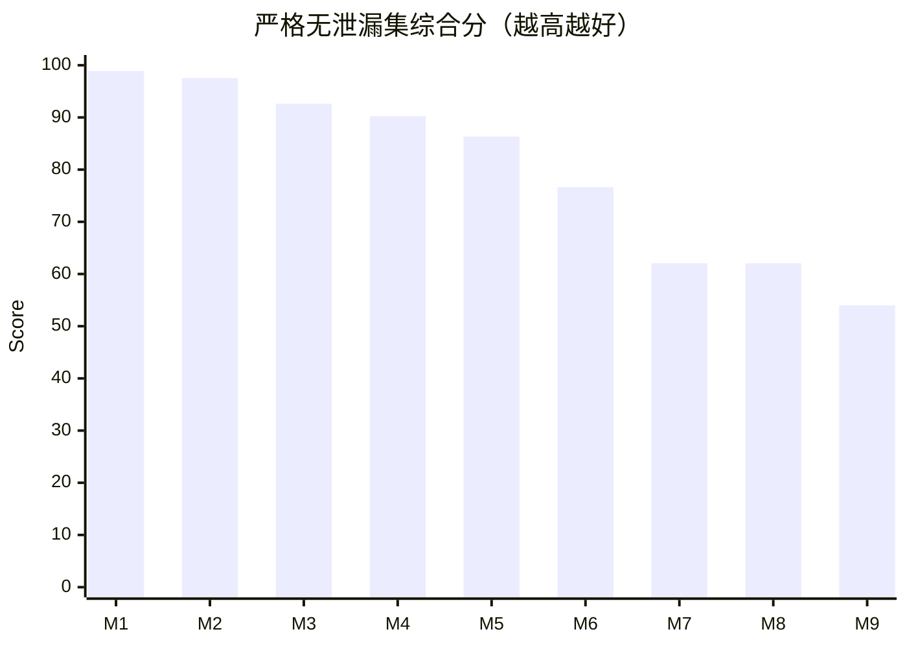
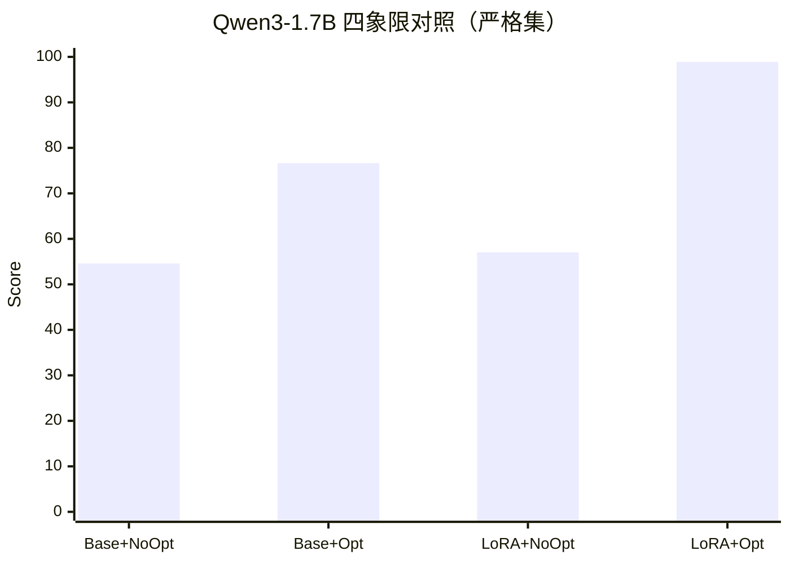
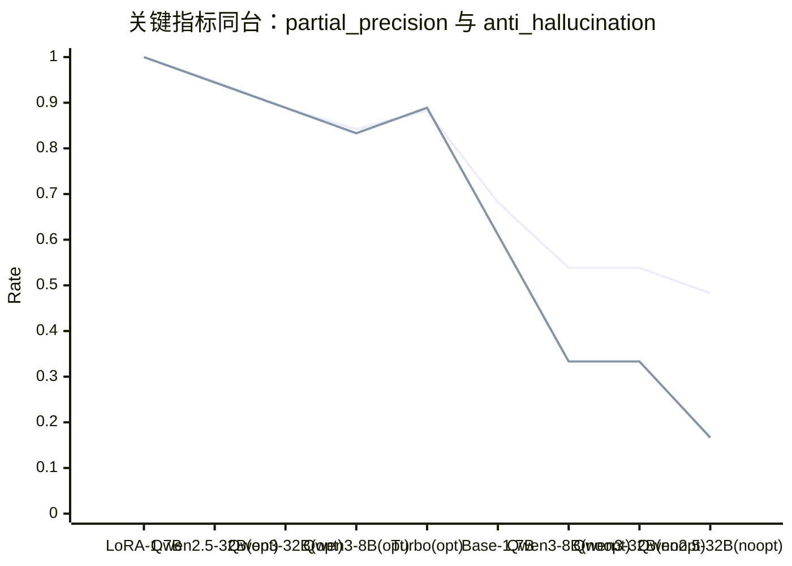
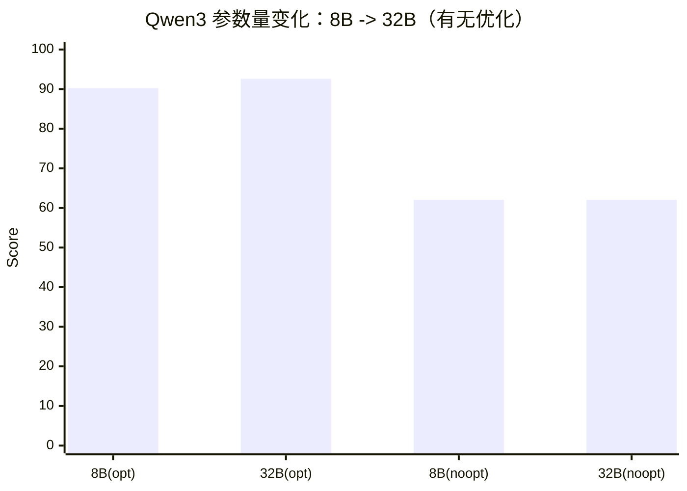

# Qwen3-1.7B+LoRA 严格无泄漏对标评测报告（2026-03-22）

## 1. 目标

本报告用于回答一个更严格的问题：  
在“去重 + 改写 + OOD”的无泄漏评测集上，`工程优化 + LoRA + 1.7B` 到底能对标到多大参数量模型。

## 2. 严格评测集说明

### 2.1 原始 benchmark

- 来源：`ai_engine/finetune_qwen3/data/braindance_qwen3_benchmark.jsonl`
- 原始规模：80 题
- 分组：`recent_hit` / `must_answer` / `partial_coverage` / `stability` / `no_hit`
- 评测侧重点：证据利用、错误拒答、partial coverage 正反判断、幻觉控制、回答聚焦

### 2.2 严格集构建流程（去重 + 改写 + OOD）

脚本：`ai_engine/finetune_qwen3/scripts/build_strict_no_leak_benchmark.py`

输入训练集（用于去重）：
- `ai_engine/finetune_qwen3/data/braindance_qwen3_round4_train.jsonl`
- `ai_engine/finetune_qwen3/data/braindance_qwen3_sft_train.jsonl`
- `ai_engine/finetune_qwen3/data/real_chain_failures_round4_1_patch_plus_round4_train.jsonl`

构建策略：
1. 先做精确去重：问题文本规范化后与训练集命中即剔除。  
2. 再做近似去重：`difflib` 相似度阈值 `0.95`。  
3. 对保留样本进行问题改写（同语义不同问法）。  
4. 对缺失组别做“强改写回填”（保证组别覆盖）。  
5. 再扩充 OOD 问法（口语化、噪声化、非标准表达）。  

严格集产物：
- 数据：`ai_engine/finetune_qwen3/data/braindance_qwen3_benchmark_strict_no_leak_ood_20260322_v3.jsonl`
- 摘要：`ai_engine/finetune_qwen3/data/braindance_qwen3_benchmark_strict_no_leak_ood_20260322_v3_summary.json`

构建统计（v3）：
- 原始 80 题
- 精确去重移除：37
- 近似去重移除：1
- 去重后保留：49
- 强改写回填：7
- OOD 扩充：15
- 最终规模：64
- 组别分布：
  - must_answer: 9
  - no_hit: 9
  - partial_coverage: 18
  - recent_hit: 9
  - stability: 19

## 3. 评测设置

- 评测脚本：
  - 本地：`ai_engine/finetune_qwen3/scripts/evaluate_benchmark.py`
  - 云端（有工程优化口径）：`ai_engine/finetune_qwen3/scripts/evaluate_cloud_benchmark.py`
  - 云端（无工程无微调口径）：`ai_engine/finetune_qwen3/scripts/evaluate_cloud_no_opt_benchmark.py`
- 关键指标：
  - 低为好：`false_no_answer_rate`、`partial_hallucination_rate`、`partial_false_negative_rate`、`partial_missing_negation_rate`
  - 高为好：`evidence_utilization_rate`、`partial_hit_precision`、`must_answer_focus_rate`

## 4. 结果总表（严格集 v3）

| 模型 | false_no_answer | partial_hallucination | evidence_utilization | partial_precision | partial_false_negative | partial_missing_negation | must_answer_focus | natural_style | composite |
|---|---:|---:|---:|---:|---:|---:|---:|---:|---:|
| Local LoRA 1.7B | **0.0000** | **0.0000** | **1.0000** | **1.0000** | **0.0000** | **0.0000** | 0.8889 | 0.8281 | **98.89** |
| Cloud qwen2.5-32b (opt) | **0.0000** | 0.0556 | **1.0000** | 0.9474 | **0.0000** | 0.0556 | **1.0000** | 0.9219 | 97.54 |
| Cloud qwen3-32b (opt) | 0.0364 | 0.1111 | 0.9636 | 0.8889 | 0.1111 | 0.1111 | **1.0000** | 0.9219 | 92.62 |
| Cloud qwen3-8b (opt) | 0.0364 | 0.1667 | 0.9636 | 0.8421 | 0.1111 | 0.1667 | **1.0000** | 0.8750 | 90.25 |
| Cloud qwen-turbo (opt) | **0.0000** | 0.1111 | 0.9091 | 0.8824 | 0.1667 | 0.5556 | 0.8889 | **1.0000** | 86.32 |
| Local Base 1.7B | 0.0545 | 0.3889 | 0.9455 | 0.6818 | 0.1667 | 0.7222 | **1.0000** | 0.9688 | 76.65 |
| Cloud qwen3-8b (no-opt) | **0.0000** | 0.6667 | 0.7091 | 0.5385 | 0.2222 | 0.6667 | 0.5556 | 0.5781 | 62.05 |
| Cloud qwen3-32b (no-opt) | **0.0000** | 0.6667 | 0.7455 | 0.5385 | 0.2222 | 0.7222 | 0.5556 | 0.5156 | 62.04 |
| Cloud qwen2.5-32b (no-opt) | **0.0000** | 0.8333 | 0.7091 | 0.4828 | 0.2222 | 0.7222 | 0.2222 | 0.4844 | 53.99 |

说明：`composite` 为任务导向加权分（0-100），用于排序，不替代单项指标。

## 4.1 1.7B 四象限对照（你要求的核心对比）

同一 `Qwen3-1.7B` 基座，做“微调前后 × 有无工程优化”四象限：

| 组合 | false_no_answer | partial_hallucination | evidence_utilization | partial_precision | partial_false_negative | partial_missing_negation | must_answer_focus | natural_style | composite |
|---|---:|---:|---:|---:|---:|---:|---:|---:|---:|
| Base + Opt | 0.0545 | 0.3889 | 0.9455 | 0.6818 | 0.1667 | 0.7222 | 1.0000 | 0.9688 | 76.65 |
| Base + NoOpt | 0.0000 | 0.6667 | 0.6182 | 0.4286 | 0.5000 | 0.5000 | 0.2222 | 0.2031 | 54.59 |
| LoRA + Opt | **0.0000** | **0.0000** | **1.0000** | **1.0000** | **0.0000** | **0.0000** | 0.8889 | 0.8281 | **98.89** |
| LoRA + NoOpt | 0.0000 | 0.7222 | 0.6727 | 0.5000 | 0.2778 | 0.6667 | 0.3333 | 0.0781 | 57.03 |

## 5. 图表

### 5.1 全模型同台竞技（综合分）

模型映射：
- `M1`: LoRA-1.7B
- `M2`: Qwen2.5-32B(opt)
- `M3`: Qwen3-32B(opt)
- `M4`: Qwen3-8B(opt)
- `M5`: Turbo(opt)
- `M6`: Base-1.7B
- `M7`: Qwen3-8B(noopt)
- `M8`: Qwen3-32B(noopt)
- `M9`: Qwen2.5-32B(noopt)

### 5.1.1 1.7B 四象限同台图（微调前后 × 有无工程）

```mermaid
xychart-beta
  title "Qwen3-1.7B 四象限关键指标"
  x-axis ["hallucination","partial_precision","must_answer_focus","natural_style"]
  y-axis "Rate" 0 --> 1
  bar [0.6667,0.4286,0.2222,0.2031]
  bar [0.3889,0.6818,1.0000,0.9688]
  bar [0.7222,0.5000,0.3333,0.0781]
  bar [0.0000,1.0000,0.8889,0.8281]
```

注：四组柱依次对应 `Base+NoOpt`、`Base+Opt`、`LoRA+NoOpt`、`LoRA+Opt`。

### 5.2 有无优化同台竞技（同模型正面对打）

```mermaid
xychart-beta
  title "同模型有无优化对打（综合分）"
  x-axis ["Qwen3-8B","Qwen3-32B","Qwen2.5-32B"]
  y-axis "Score" 0 --> 100
  bar [90.25,92.62,97.54]
  bar [62.05,62.04,53.99]
```

注：第一组柱为 `opt`，第二组柱为 `no-opt`。

### 5.3 多模型关键指标同台（精度与抗幻觉）

注：第二条线 `anti_hallucination = 1 - partial_hallucination_rate`（越高越好）。

### 5.4 参数量维度竞技（Qwen3 系列）

### 5.5 无优化 vs 有优化（32B 关键行为对比）

```mermaid
xychart-beta
  title "无优化 vs 有优化（32B 对比）"
  x-axis ["hallucination","partial_precision","missing_negation","must_answer_focus"]
  y-axis "Rate" 0 --> 1
  bar [0.6667,0.5385,0.7222,0.5556]
  bar [0.1111,0.8889,0.1111,1.0000]
```

## 6. 真实对标结论

1. 在严格无泄漏评测集上，`工程优化 + LoRA + 1.7B` 依然保持显著优势，不是只靠数据重叠“刷满分”。  
2. `1.7B+LoRA(opt)` 与 `32B(opt)` 已处在同一竞争档位，综合分分别为 `98.89 vs 97.54`。  
3. “只增参数、不做工程与任务化微调”效果明显不足：`32B(no-opt)` 综合分约 `62`，远低于 `1.7B+LoRA(opt)`。  
4. 在 1.7B 四象限里，工程优化与 LoRA 都是强增益，但“LoRA + 工程”叠加效果最显著：  
   `Base+NoOpt 54.59 -> Base+Opt 76.65 -> LoRA+Opt 98.89`。  
5. 真实可执行结论：在当前 BrainDance 问答场景中，优先级应是  
   `工程链路` > `任务化微调` > `盲目增大参数量`。

## 7. 产物清单

- 严格集构建脚本：`ai_engine/finetune_qwen3/scripts/build_strict_no_leak_benchmark.py`
- 严格集数据：
  - `ai_engine/finetune_qwen3/data/braindance_qwen3_benchmark_strict_no_leak_ood_20260322_v3.jsonl`
  - `ai_engine/finetune_qwen3/data/braindance_qwen3_benchmark_strict_no_leak_ood_20260322_v3_summary.json`
- 严格集评测结果：
  - `ai_engine/finetune_qwen3/logs/benchmark_strict_v3_base_20260322.json`
  - `ai_engine/finetune_qwen3/logs/benchmark_strict_v3_lora_20260322.json`
  - `ai_engine/finetune_qwen3/logs/benchmark_strict_v3_base_local_noopt_20260322.json`
  - `ai_engine/finetune_qwen3/logs/benchmark_strict_v3_lora_local_noopt_20260322.json`
  - `ai_engine/finetune_qwen3/logs/benchmark_cloud_qwen3_8b_strictv3.json`
  - `ai_engine/finetune_qwen3/logs/benchmark_cloud_qwen3_32b_strictv3.json`
  - `ai_engine/finetune_qwen3/logs/benchmark_cloud_qwen2.5_32b_instruct_strictv3.json`
  - `ai_engine/finetune_qwen3/logs/benchmark_cloud_qwen_turbo_strictv3.json`
  - `ai_engine/finetune_qwen3/logs/benchmark_cloud_no_opt_qwen3_8b_strictv3_noopt.json`
  - `ai_engine/finetune_qwen3/logs/benchmark_cloud_no_opt_qwen3_32b_strictv3_noopt.json`
  - `ai_engine/finetune_qwen3/logs/benchmark_cloud_no_opt_qwen2.5_32b_instruct_strictv3_noopt.json`
