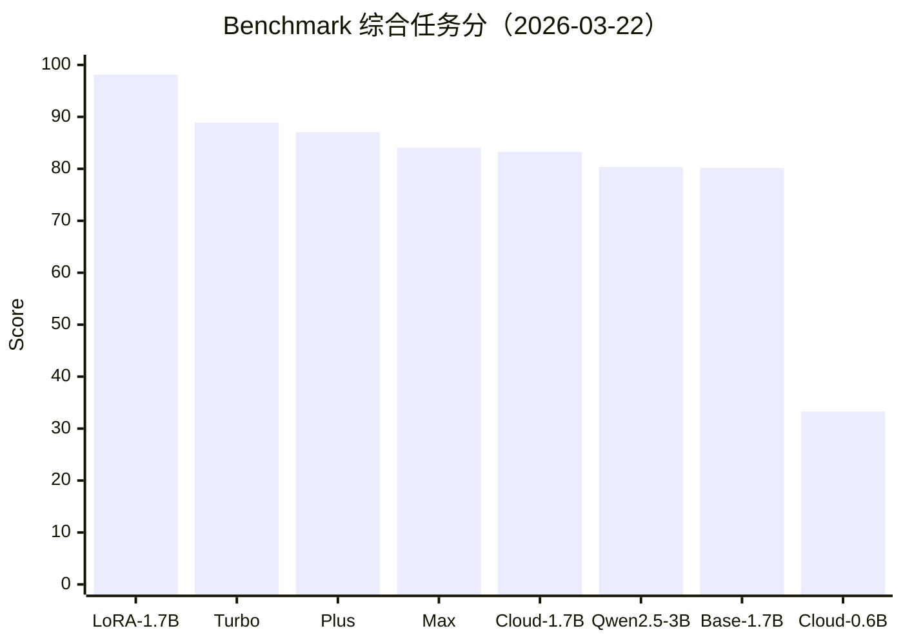

# Qwen3-1.7B+LoRA 对标评测报告（2026-03-22）

## 1. 评测目标

本次在 **同一份 80 题固定 benchmark** 上，完成三类对比：

1. 云端大/中/小模型横向对比（DashScope OpenAI 兼容接口）。
2. 本地 `Qwen3-1.7B` 微调前后对比（Base vs LoRA）。
3. 工程优化前后对比（Part17d 检索策略 + Part18 formatter 路由）。

## 2. 评测设置

- 日期：2026-03-22
- 数据集：`ai_engine/finetune_qwen3/data/braindance_qwen3_benchmark.jsonl`（80 cases）
- 本地模型：
  - Base：`Qwen/Qwen3-1.7B`
  - LoRA：`ai_engine/finetune_qwen3/outputs/qwen3_1p7b_lora_sft_round4_1_patch_mixed`
- 云端模型：
  - `qwen3-0.6b`
  - `qwen3-1.7b`
  - `qwen2.5-3b-instruct`
  - `qwen-turbo`
  - `qwen-plus`
  - `qwen-max`
- 关键口径：
  - 低为好：`false_no_answer_rate`、`partial_hallucination_rate`、`partial_false_negative_rate`、`partial_missing_negation_rate`
  - 高为好：`evidence_utilization_rate`、`partial_hit_precision`、`must_answer_focus_rate`、`natural_style_rate`

## 3. 总表（同口径）

| 模型 | false_no_answer | partial_hallucination | evidence_utilization | partial_precision | partial_false_negative | partial_missing_negation | must_answer_focus | natural_style |
|---|---:|---:|---:|---:|---:|---:|---:|---:|
| 本地 LoRA(Qwen3-1.7B) | **0.0000** | **0.0000** | **1.0000** | **1.0000** | **0.0000** | **0.0000** | 0.8125 | 0.8500 |
| 本地 Base(Qwen3-1.7B) | 0.0312 | 0.3125 | 0.9688 | 0.7500 | 0.0625 | 0.8125 | **1.0000** | 0.9625 |
| 云端 qwen3-0.6b | 0.9062 | 0.0000 | 0.0938 | 0.0000 | 1.0000 | 0.0000 | 0.0000 | **1.0000** |
| 云端 qwen3-1.7b | 0.0312 | 0.1875 | 0.9688 | 0.8333 | 0.0625 | 0.8750 | **1.0000** | 0.9750 |
| 云端 qwen2.5-3b-instruct | 0.1875 | 0.1875 | 0.7969 | 0.7692 | 0.3750 | 0.1250 | 0.9375 | 0.9000 |
| 云端 qwen-turbo | **0.0000** | 0.0625 | 0.9531 | 0.9333 | 0.1250 | 0.6875 | **1.0000** | 0.9875 |
| 云端 qwen-plus | 0.0156 | 0.2500 | 0.9844 | 0.8000 | **0.0000** | 0.2500 | 0.8125 | 0.8875 |
| 云端 qwen-max | **0.0000** | 0.3750 | **1.0000** | 0.7273 | **0.0000** | 0.3750 | 0.9375 | 0.8625 |

## 4. 图表

### 4.1 综合任务分（越高越好）

说明：综合分用于排序，不替代单项指标。  
加权公式（0-100）：  
`0.2*(1-false_no) + 0.2*(1-hallucination) + 0.15*evidence + 0.15*partial_precision + 0.1*(1-partial_false_negative) + 0.1*(1-partial_missing_negation) + 0.1*must_answer_focus`

### 4.2 微调前后核心差异（Base vs LoRA）

```mermaid
xychart-beta
  title "微调前后对比（Qwen3-1.7B 本地）"
  x-axis ["false_no","hallucination","evidence","partial_precision","partial_FN","missing_negation"]
  y-axis "Rate" 0 --> 1
  bar [0.0312,0.3125,0.9688,0.7500,0.0625,0.8125]
  bar [0.0000,0.0000,1.0000,1.0000,0.0000,0.0000]
```

## 5. 结论

### 5.1 小模型 vs 当前 LoRA

- `qwen3-0.6b` 在本场景明显不足（高拒答/低证据利用/几乎无 partial precision）。
- `qwen3-1.7b` 与 `qwen2.5-3b-instruct` 可用，但在 partial coverage 相关指标上明显弱于当前 LoRA。
- 结论：**当前 1.7B+LoRA 已明显超过“同量级未微调云端小模型”**。

### 5.2 与云端中大模型对标

- 对比 `qwen-turbo/plus/max`，当前 LoRA 在本 benchmark 上的结构化任务指标更强（尤其 hallucination、partial precision、missing negation）。
- 云端模型在 `natural_style` 往往更高，尤其 `qwen-turbo`。
- 结论：**在当前任务定义下，LoRA 更像“高约束任务最优解”；云端大模型更像“表达风格更自然、泛化更强”**。

### 5.3 微调前后（同基座）

- Base -> LoRA 的提升非常明显：
  - `partial_hallucination`: 0.3125 -> 0.0000
  - `partial_hit_precision`: 0.7500 -> 1.0000
  - `partial_missing_negation`: 0.8125 -> 0.0000
  - `evidence_utilization`: 0.9688 -> 1.0000
- 代价：`natural_style` 从 0.9625 降到 0.8500（更“任务化/模板化”）。

### 5.4 工程优化前后

以 Part17d 检索链路为例（`object_lookup`）：

- `object_lookup_hit_rate`: 0.9444 -> **1.0000**
- `object_lookup_bad_rate`: 0.0556 -> **0.0000**
- `retrieval_miss_bad_count`: 2 -> **0**
- `post_filter_empty_count`: 6 -> **1**

以 Part18 formatter 体验层为例：

- `formatter_answer_rate`: **1.0000**
- `natural_style_rate`: **1.0000**
- `must_answer_focus_rate`: **1.0000**

结论：**工程优化（检索路由 + formatter）对可用性和稳定性有直接大幅收益**，并且是 LoRA 效果能稳定落地的关键前提。

## 6. 文件与产物

- 云端评测脚本：`ai_engine/finetune_qwen3/scripts/evaluate_cloud_benchmark.py`
- 本地新评测结果：
  - `ai_engine/finetune_qwen3/logs/benchmark_20260322_base.json`
  - `ai_engine/finetune_qwen3/logs/benchmark_20260322_round4_1_patch_mixed.json`
- 云端新评测结果：
  - `ai_engine/finetune_qwen3/logs/benchmark_cloud_qwen3_0.6b_20260322.json`
  - `ai_engine/finetune_qwen3/logs/benchmark_cloud_qwen3_1.7b_20260322.json`
  - `ai_engine/finetune_qwen3/logs/benchmark_cloud_qwen2.5_3b_instruct_20260322.json`
  - `ai_engine/finetune_qwen3/logs/benchmark_cloud_qwen_turbo_20260322.json`
  - `ai_engine/finetune_qwen3/logs/benchmark_cloud_qwen_plus_20260322.json`
  - `ai_engine/finetune_qwen3/logs/benchmark_cloud_qwen_max_20260322.json`

